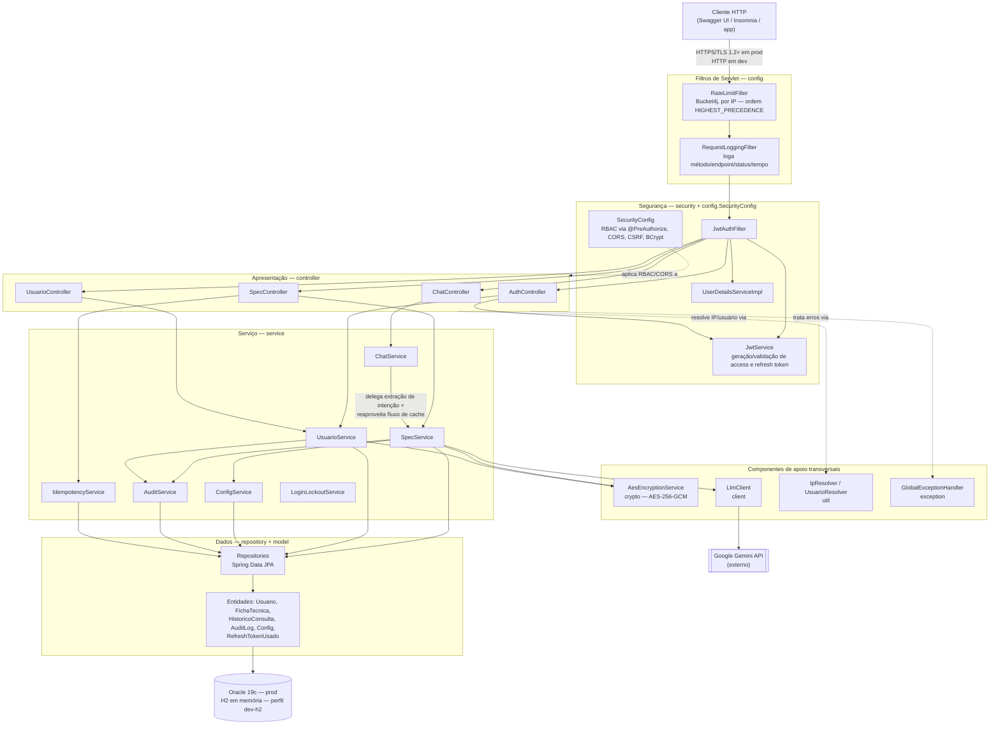
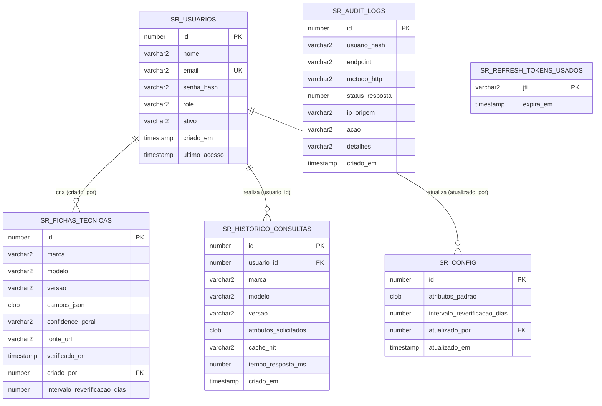

# SpecRadar

> Plataforma de inteligência competitiva automotiva — consulta, cacheia e compara especificações técnicas de veículos concorrentes via IA, com repositório histórico acumulativo. Desenvolvida para o Challenge Ford × FIAP 2026.

---

## Sumário

- [Sobre o projeto](#sobre-o-projeto)
  - [O problema](#o-problema)
  - [A solução](#a-solução)
  - [Caso de validação oficial (Ford Ranger Raptor)](#caso-de-validação-oficial-ford-ranger-raptor)
  - [Impacto esperado](#impacto-esperado)
- [Documentação por disciplina (Cybersecurity e SOA)](#documentação-por-disciplina-cybersecurity-e-soa)
- [Stack tecnológica](#stack-tecnológica)
- [Arquitetura](#arquitetura)
  - [Visão geral em camadas](#visão-geral-em-camadas)
  - [Diagrama de arquitetura](#diagrama-de-arquitetura)
  - [Estrutura de pacotes](#estrutura-de-pacotes)
  - [Fluxo de uma requisição](#fluxo-de-uma-requisição)
- [Como rodar o projeto](#como-rodar-o-projeto)
  - [Pré-requisitos](#pré-requisitos)
  - [Variáveis de ambiente](#variáveis-de-ambiente)
  - [Perfis disponíveis](#perfis-disponíveis)
  - [Subindo em dev (Oracle)](#subindo-em-dev-oracle)
  - [Subindo em dev-h2 (H2 em memória)](#subindo-em-dev-h2-h2-em-memória)
  - [Subindo em prod (HTTPS + Oracle)](#subindo-em-prod-https--oracle)
  - [Gerando o certificado SSL](#gerando-o-certificado-ssl)
  - [Resetando o banco do zero](#resetando-o-banco-do-zero)
  - [Armadilhas conhecidas de configuração](#armadilhas-conhecidas-de-configuração)
- [Banco de dados](#banco-de-dados)
  - [Modelo de dados](#modelo-de-dados)
  - [Diagrama de relacionamento](#diagrama-de-relacionamento)
  - [Migrações Flyway](#migrações-flyway)
  - [Portabilidade Oracle/H2](#portabilidade-oracleh2)
- [Autenticação e autorização](#autenticação-e-autorização)
  - [Fluxo de login](#fluxo-de-login)
  - [Access token e refresh token](#access-token-e-refresh-token)
  - [Rotação e revogação de refresh token](#rotação-e-revogação-de-refresh-token)
  - [RBAC](#rbac)
  - [Bloqueio por força bruta](#bloqueio-por-força-bruta)
- [Endpoints da API](#endpoints-da-api)
  - [Autenticação](#autenticação)
  - [Especificações técnicas](#especificações-técnicas)
  - [Chat em linguagem natural](#chat-em-linguagem-natural)
  - [Usuários](#usuários)
  - [Formato padrão de erro](#formato-padrão-de-erro)
  - [Documentação interativa (Swagger)](#documentação-interativa-swagger)
- [Consulta e cache de especificações técnicas](#consulta-e-cache-de-especificações-técnicas)
  - [Estratégia cache-primeiro](#estratégia-cache-primeiro)
  - [Níveis de confiança](#níveis-de-confiança)
  - [Reverificação periódica](#reverificação-periódica)
  - [Comparação entre veículos](#comparação-entre-veículos)
  - [Consulta via PDF anexado](#consulta-via-pdf-anexado)
  - [Consulta via chat em linguagem natural](#consulta-via-chat-em-linguagem-natural)
  - [Idempotência](#idempotência)
- [Integração com o Google Gemini](#integração-com-o-google-gemini)
  - [Como a extração funciona](#como-a-extração-funciona)
  - [Cliente HTTP dedicado para chamadas multimodais](#cliente-http-dedicado-para-chamadas-multimodais)
  - [Limitações conhecidas da integração](#limitações-conhecidas-da-integração)
- [Segurança](#segurança)
  - [Validação e sanitização de entrada](#validação-e-sanitização-de-entrada)
  - [Rate limiting](#rate-limiting)
  - [HTTPS/TLS](#httpstls)
  - [CORS](#cors)
  - [Criptografia de dados em repouso](#criptografia-de-dados-em-repouso)
  - [Pseudonimização](#pseudonimização)
  - [LGPD](#lgpd)
  - [Tratamento centralizado de erros](#tratamento-centralizado-de-erros)
  - [Trilha de auditoria](#trilha-de-auditoria)
- [Testes automatizados](#testes-automatizados)
  - [Suíte e cobertura](#suíte-e-cobertura)
  - [Como rodar](#como-rodar)
  - [Limitações conhecidas da suíte](#limitações-conhecidas-da-suíte)
- [Decisões técnicas importantes](#decisões-técnicas-importantes)
- [Limitações conhecidas e itens não implementados](#limitações-conhecidas-e-itens-não-implementados)
- [Equipe](#equipe)

---

## Sobre o projeto

### O problema

Hoje, o processo de coleta de especificações técnicas de veículos concorrentes — potência, torque, transmissão, tração, preço, itens de série — é feito manualmente por analistas: navegando em sites de fabricantes, catálogos em PDF e material de marketing de cada concorrente. Cada versão consultada consome cerca de **1 hora de trabalho manual**, com alto risco de imprecisão, ausência de padronização entre fontes e dificuldade real de comparar um veículo contra outro de forma consistente. Para uma linha completa de concorrentes com dezenas de versões, isso representa dias de trabalho improdutivo sobre dados que já nascem desatualizados.

### A solução

O SpecRadar centraliza essa inteligência competitiva numa API que consulta, armazena e compara especificações técnicas de veículos, com dois modos de interação sobre a mesma base:

- **Consulta estruturada** — o analista informa marca, modelo, versão e a lista de atributos que quer conhecer (motor, potência, torque, e assim por diante), e recebe uma ficha técnica padronizada, no mesmo formato independentemente do veículo consultado.
- **Consulta em linguagem natural** — o mesmo resultado pode ser obtido conversando com a API (`POST /chat/message`), que extrai marca/modelo/versão/atributos da mensagem do analista antes de delegar para o mesmo fluxo da consulta estruturada.

Quando um veículo é consultado pela primeira vez, a API usa o Google Gemini para extrair as especificações a partir do próprio conhecimento do modelo — não há scraping nem busca ao vivo (ver [limitações conhecidas](#limitações-conhecidas-e-itens-não-implementados)). O resultado é armazenado de forma cifrada, e consultas futuras pelo mesmo veículo — mesmo que pedindo atributos diferentes dentro do conjunto já coberto — são respondidas direto do banco, sem gastar uma nova chamada ao modelo. Cada campo retornado vem acompanhado de um nível de confiança e da fonte declarada, e o mesmo veículo consultado por múltiplos analistas ao longo do tempo forma um repositório histórico acumulativo, reaproveitado inclusive pela comparação direta entre dois veículos.

Um terceiro modo de entrada, `POST /specs/from-pdf`, aceita um catálogo em PDF anexado pelo próprio analista como fonte da extração, reaproveitando o mesmo fluxo de cache das outras duas vias.

### Caso de validação oficial (Ford Ranger Raptor)

O brief do Challenge define a Ford Ranger Raptor como o caso de teste oficial da solução: *"a solução deve conseguir entregar corretamente todas as especificações técnicas apresentadas no slide da Ranger Raptor"*, e considera a solução operando corretamente se os dados forem entregues "de forma clara, organizada e consistente". Esse é o cenário usado como referência de validação ponta a ponta do SpecRadar — da consulta inicial (cache miss, chamada real ao Gemini) à consulta subsequente (cache hit, sem nova chamada ao modelo).

### Impacto esperado

Com o SpecRadar, o tempo de consulta de especificações de um veículo concorrente já conhecido cai de cerca de 1 hora para uma resposta de cache em milissegundos — e mesmo uma consulta nova (cache miss, com chamada ao Gemini) é resolvida em segundos, não em horas. A padronização do formato de saída elimina a inconsistência entre fontes, o nível de confiança por campo torna explícito quando um dado é inferido em vez de verificado, e o repositório histórico acumulativo transforma cada consulta individual num ativo reutilizável por toda a equipe, em vez de um resultado descartado após o uso.

---

## Documentação por disciplina (Cybersecurity e SOA)

Cada disciplina tem um documento técnico dedicado, com evidência extraída diretamente do código-fonte real do projeto — requisitos formais exigidos, o que foi implementado para atendê-los, e como isso pode ser conferido:

- 🔒 **[Cybersecurity — Segurança da API](docs/Sprint1/documentacao-cyber-sprint1.md)**
- 🏛 **[Arquitetura Orientada a Serviços (SOA)](docs/Sprint1/documentacao-soa-sprint1.md)**

---

## Stack tecnológica

| Camada | Tecnologia | Versão |
|---|---|---|
| Linguagem | Java | 21 |
| Framework | Spring Boot | 3.5.14 |
| Segurança | Spring Security (JWT, RBAC via `@PreAuthorize`, CORS) | gerenciada pelo Spring Boot |
| Persistência | Spring Data JPA | gerenciada pelo Spring Boot |
| Banco de dados | Oracle (produção, instância FIAP) / H2 em memória (perfil `dev-h2`) | Oracle 19c · driver `ojdbc11` |
| Migrações de schema | Flyway (`flyway-core` + `flyway-database-oracle`) | 11.8.2 |
| Autenticação | JWT — `jjwt-api`/`jjwt-impl`/`jjwt-jackson` | 0.12.6 |
| Rate limiting | Bucket4j | 8.10.1 |
| Documentação da API | springdoc-openapi (Swagger UI) | 2.8.9 |
| Validação de entrada | Jakarta Bean Validation | gerenciada pelo Spring Boot |
| Modelo de linguagem | Google Gemini (`gemini-3.7-flash`, configurável via `LLM_MODEL`) — API `v1beta` | REST direto via `RestTemplate` |
| Variáveis de ambiente | springboot3-dotenv | 5.1.0 |
| Redução de boilerplate | Lombok | 1.18.38 |
| Testes | JUnit 5 + Mockito + JUnit Platform Suite (`@Suite`/`@SelectPackages`) | gerenciados pelo Spring Boot |
| Build | Maven | — |

Duas bibliotecas de criptografia da própria JDK (`javax.crypto`), sem dependência externa adicional, cobrem os dois usos de segurança de dados do projeto: **AES-256-GCM** para os dados sensíveis das fichas técnicas em repouso, e **HMAC-SHA256** para a pseudonimização de identificadores de usuário nos logs de auditoria — ambos detalhados na seção [Segurança](#segurança).

---

## Arquitetura

### Visão geral em camadas

O SpecRadar segue arquitetura em camadas: apresentação (`controller`) → segurança (filtros de servlet + Spring Security) → serviço (`service`) → dados (`repository` + `model`), com um pequeno conjunto de componentes de apoio transversais — criptografia, cliente do Gemini, utilitários de resolução de IP/usuário, tratamento centralizado de erros — usados por mais de uma camada sem pertencer estruturalmente a nenhuma delas.

A regra que a estrutura de pacotes impõe na prática: um `controller` nunca acessa um `repository` diretamente, sempre via `service`; um `service` nunca constrói uma `ResponseEntity` nem lê dados de `HttpServletRequest` além do que precisa (IP, usuário autenticado) — a tradução para HTTP é responsabilidade do controller e do `GlobalExceptionHandler`; um `repository` é só interface Spring Data JPA, sem regra de negócio.

### Diagrama de arquitetura



A requisição entra pelos filtros de servlet (`RateLimitFilter`, registrado com `Ordered.HIGHEST_PRECEDENCE` em `FilterConfig`, roda antes de qualquer autenticação — mesmo uma tentativa de força bruta no login é barrada por IP antes de chegar ao Spring Security), passa pela cadeia de segurança (`JwtAuthFilter` → `SecurityConfig`), chega ao controller correspondente, que delega a regra de negócio ao service. Os componentes de apoio (`AesEncryptionService`, `LlmClient`, `IpResolver`/`UsuarioResolver`, `GlobalExceptionHandler`) são usados por mais de uma camada — exatamente o papel de um componente transversal numa arquitetura em camadas.

### Estrutura de pacotes

```
com.icers.ford
├── client/            LlmClient, LlmRequest, LlmResponse — chamada REST ao Gemini
├── config/            SecurityConfig, RateLimitFilter, FilterConfig, RequestLoggingFilter,
│                       OpenApiConfig, RestTemplateConfig, FlywayConfig
├── controller/         AuthController, SpecController, ChatController, UsuarioController
├── crypto/            AesEncryptionService — AES-256-GCM
├── dto/
│   ├── request/        DTOs de entrada, todos com Bean Validation declarativa
│   └── response/        DTOs de saída — nunca expõem dado sensível (ex.: senha)
├── exception/         GlobalExceptionHandler + exceções de domínio
│                       (FichaNaoEncontradaException, EmailJaCadastradoException, etc.)
├── model/
│   ├── converter/       CamposJsonEncryptedConverter — cifra/decifra campos_json de forma
│   │                     transparente via AttributeConverter do JPA
│   ├── enums/           Role (ADMIN/ANALYST), ConfidenceLevel
│   └── (entidades)      Usuario, FichaTecnica, HistoricoConsulta, AuditLog, Config,
│                         RefreshTokenUsado
├── repository/        Interfaces Spring Data JPA, uma por entidade
├── security/           JwtAuthFilter, JwtService, UserDetailsServiceImpl
├── service/            SpecService, UsuarioService, ChatService, ConfigService, AuditService,
│                        IdempotencyService, LoginLockoutService
├── util/              IpResolver, UsuarioResolver — reutilizados por múltiplos
│                       controllers/filtros
├── GerarHashSenha.java  utilitário de linha de comando (fora do fluxo HTTP) — gera os hashes
│                         BCrypt dos usuários semeados pela migração inicial
└── SprintFordApiApplication.java
```

### Fluxo de uma requisição

Usando `POST /specs/query` como exemplo, do primeiro byte recebido até a resposta:

1. **`RateLimitFilter`** (filtro de servlet, `HIGHEST_PRECEDENCE`) consome um token do bucket por IP; se excedido, responde `429` com `Retry-After` sem chegar a nenhuma camada seguinte.
2. **`RequestLoggingFilter`** registra método, endpoint e IP da requisição (nunca headers sensíveis).
3. **`JwtAuthFilter`** valida o access token (assinatura, expiração, tipo `ACCESS`) e popula o contexto de segurança via `UserDetailsServiceImpl`; sem token válido, a cadeia do Spring Security responde `401` antes de qualquer controller ser alcançado.
4. **`SecurityConfig`** aplica CORS e a regra de autenticação obrigatória por padrão; a autorização fina por papel acontece no `@PreAuthorize` do método do controller (`SpecController.query`, neste exemplo, exige `ANALYST` ou `ADMIN`).
5. **`SpecController`** valida o corpo da requisição via Bean Validation (`422` se inválido) e delega para **`SpecService`**, aplicando primeiro o rate limit por usuário autenticado (independente do rate limit por IP do passo 1).
6. **`SpecService`** resolve a partir do cache (`FichaTecnicaRepository`): se a ficha já cobre os atributos pedidos e não está expirada, monta a resposta direto do banco — os campos vêm de `campos_json`, decifrados de forma transparente pelo `CamposJsonEncryptedConverter` ao carregar a entidade. Em cache miss ou parcial, `SpecService` chama **`LlmClient`**, que faz a requisição REST ao Gemini e devolve os campos extraídos.
7. **`AuditService`** registra a consulta de forma assíncrona (`@Async`), com o usuário identificado por hash pseudonimizado — sem bloquear a resposta ao cliente.
8. Qualquer exceção lançada em qualquer um dos passos acima (validação, regra de negócio, falha do Gemini) é interceptada pelo **`GlobalExceptionHandler`**, que nunca deixa vazar stack trace ou detalhe interno na resposta.

---

## Como rodar o projeto

### Pré-requisitos

- **JDK 21**
- **Maven** — o projeto já traz o wrapper (`mvnw`/`mvnw.cmd`), então uma instalação própria do Maven não é obrigatória
- Acesso a uma instância **Oracle** (schema FIAP do aluno) — necessário para os perfis `dev` e `prod`; **não é necessário** para o perfil `dev-h2` (ver abaixo)
- Uma chave de API do **Google Gemini** válida, com cota disponível (Google AI Studio)

### Variáveis de ambiente

Copie `.env.example` para `.env` e preencha (o arquivo `.env` nunca deve ser commitado — já está no `.gitignore`):

```env
ORACLE_URL=jdbc:oracle:thin:@oracle.fiap.com.br:1521:orcl
ORACLE_USER=seu_rm_aqui
ORACLE_PASSWORD=sua_senha_aqui

# JWT — gere com: openssl rand -base64 64
JWT_SECRET=gere-uma-chave-de-pelo-menos-64-caracteres-aqui

# AES-256 para criptografar campos_json (specs) em repouso.
# Gere a sua com: openssl rand -base64 32
AES_SECRET_KEY=gere-com-openssl-rand-base64-32

# Salt secreto para o hash HMAC do usuario_hash nos logs de auditoria
# (pseudonimização). Gere o seu com o mesmo comando acima.
PSEUDONYMIZATION_SALT=gere-com-openssl-rand-base64-32

# LLM — Google Gemini
LLM_API_KEY=sua-chave-do-google-ai-studio-aqui
LLM_API_URL=https://generativelanguage.googleapis.com/v1beta/models
LLM_MODEL=gemini-3.7-flash

# CORS — separar múltiplas origens por vírgula
CORS_ALLOWED_ORIGINS=http://localhost:3000,http://localhost:8081

# SSL / HTTPS (perfil prod) — senha do keystore gerado com keytool.
# Gere a sua com: openssl rand -base64 24
SSL_KEYSTORE_PASSWORD=
```

Todas as chaves simétricas (`JWT_SECRET`, `AES_SECRET_KEY`, `PSEUDONYMIZATION_SALT`, `SSL_KEYSTORE_PASSWORD`) devem ser geradas localmente com `openssl rand -base64 <n>` — nenhuma delas tem valor padrão de fallback no código; sem elas preenchidas, a aplicação não sobe.

### Perfis disponíveis

| Perfil | Banco | Protocolo | Quando usar |
|---|---|---|---|
| `dev` (padrão) | Oracle (schema FIAP) | HTTP, porta 8080 | Desenvolvimento com o Oracle da FIAP disponível |
| `dev-h2` | H2 em memória | HTTP, porta 8080 | Desenvolvimento sem acesso ao Oracle da FIAP — banco descartável, recriado a cada boot |
| `prod` | Oracle (schema FIAP) | HTTPS, porta 8443 | Execução com TLS habilitado |

**Importante:** o perfil ativo é controlado **exclusivamente** por uma variável de ambiente real (do sistema operacional ou da run configuration da IDE) — `SPRING_PROFILES_ACTIVE`. Não existe nenhuma variável de perfil dentro do `.env`; isso é intencional (ver [Armadilhas conhecidas de configuração](#armadilhas-conhecidas-de-configuração) abaixo). Sem essa variável definida, o padrão do `application.properties` (`spring.profiles.active=dev`) vale normalmente.

### Subindo em dev (Oracle)

1. Garanta que o schema Oracle está acessível (o valor default de `spring.jpa.properties.hibernate.default_schema` é `RM558540` — ajuste se o seu RM for outro).
2. Rode a aplicação — nenhuma variável de perfil extra é necessária, `dev` já é o padrão:
   ```bash
   ./mvnw spring-boot:run
   ```
3. O Flyway aplica as migrations `V1` a `V9` automaticamente na inicialização.
4. Acesse a documentação interativa em `http://localhost:8080/swagger-ui.html`.

### Subindo em dev-h2 (H2 em memória)

Alternativa para quem não tem acesso ao Oracle da FIAP — útil, por exemplo, para outro integrante do grupo testar localmente sem credenciais próprias.

1. Defina a variável de ambiente real `SPRING_PROFILES_ACTIVE=dev-h2` (nunca no `.env`):
   ```bash
   SPRING_PROFILES_ACTIVE=dev-h2 ./mvnw spring-boot:run
   ```
   Na IntelliJ: na run configuration, aba **Environment variables** → `SPRING_PROFILES_ACTIVE=dev-h2`.
2. As mesmas 9 migrations Flyway rodam do zero contra o H2, recriando inclusive os usuários semeados pela `V5`.
3. Acesse o **H2 Console** em `http://localhost:8080/h2-console` — JDBC URL `jdbc:h2:mem:specradar`, usuário `sa`, senha em branco.
4. O banco é descartável: reiniciar a aplicação zera todos os dados (`DB_CLOSE_DELAY=-1` só mantém o banco vivo **enquanto** a aplicação estiver de pé).

### Subindo em prod (HTTPS + Oracle)

1. Gere o certificado SSL (ver seção seguinte) antes de subir — sem `specradar-ssl.p12` presente, o boot falha.
2. Defina `SSL_KEYSTORE_PASSWORD` no `.env` com a mesma senha usada ao gerar o certificado.
3. Defina a variável de ambiente real `SPRING_PROFILES_ACTIVE=prod`:
   ```bash
   SPRING_PROFILES_ACTIVE=prod ./mvnw spring-boot:run
   ```
4. Com `server.ssl.enabled=true`, o Spring Boot desabilita o HTTP por completo — a aplicação responde **apenas** em HTTPS na porta 8443.
5. Acesse `https://localhost:8443/swagger-ui.html` — como o certificado é self-signed, o navegador exibirá um aviso de segurança ("não confiável"). Isso é esperado: confirma que o HTTPS está ativo, com um certificado que não foi emitido por uma autoridade certificadora reconhecida. Clique em **"Avançado"** → **"Prosseguir assim mesmo"**.
6. No Insomnia, desabilite a validação de certificado em **Settings → Security → Validate certificates** para aceitar o certificado self-signed.
7. Em `prod`, o Swagger e o `/v3/api-docs` ficam **desabilitados** por padrão (`springdoc.swagger-ui.enabled=false`) — reduz a superfície exposta num ambiente que se pretende mais próximo de produção real.

### Gerando o certificado SSL

O certificado é PKCS12, RSA 2048 bits, assinado com `SHA384withRSA`, gerado localmente via `keytool` (nunca commitado — está no `.gitignore`) em `src/main/resources/specradar-ssl.p12`, com alias `specradar` (precisa bater com `server.ssl.key-alias` em `application-prod.properties`):

```bash
keytool -genkeypair \
  -alias specradar \
  -keyalg RSA -keysize 2048 -sigalg SHA384withRSA \
  -storetype PKCS12 \
  -keystore src/main/resources/specradar-ssl.p12 \
  -validity 365 \
  -dname "CN=localhost, OU=SpecRadar, O=ICERS, L=Sao Paulo, ST=SP, C=BR"
```

O comando pede a senha do keystore interativamente — use a mesma que for preenchida em `SSL_KEYSTORE_PASSWORD` no `.env`. `-validity 365` e o `-dname` são livres para ajustar; os parâmetros que **precisam** bater com a configuração do projeto são o algoritmo (`RSA`/2048/`SHA384withRSA`), o tipo (`PKCS12`), o caminho do arquivo e o alias.

### Resetando o banco do zero

Para um ambiente limpo (útil durante o desenvolvimento contra o Oracle), derrube as tabelas e o controle do Flyway antes de reiniciar:

```sql
DROP TABLE sr_audit_logs PURGE;
DROP TABLE sr_historico_consultas PURGE;
DROP TABLE sr_fichas_tecnicas PURGE;
DROP TABLE sr_config PURGE;
DROP TABLE sr_refresh_tokens_usados PURGE;
DROP TABLE sr_usuarios PURGE;

DROP TABLE "flyway_schema_history_llm" PURGE;
```

(O nome da tabela de controle do Flyway é `flyway_schema_history_llm`, não o padrão `flyway_schema_history` — configurado explicitamente via `spring.flyway.table`, para não colidir com o de outros projetos que eventualmente dividam o mesmo schema Oracle.) Esse reset não é necessário no perfil `dev-h2` — o banco em memória já nasce vazio a cada reinício.

### Armadilhas conhecidas de configuração

**O perfil ativo não pode ser controlado pelo `.env`.** A biblioteca que lê o `.env` (`springboot3-dotenv`) roda como o `EnvironmentPostProcessor` de **menor prioridade** do Spring Boot — ou seja, ela só injeta os valores do `.env` *depois* que o Spring já decidiu, com base nas variáveis de ambiente reais do sistema, qual `application-{perfil}.properties` carregar. Colocar uma variável de perfil só no `.env` engana apenas o `Environment` quando consultado depois (inclusive o banner de inicialização), mas nunca a decisão real de bootstrap — o perfil efetivamente aplicado continua sendo `dev`. Para rodar de fato em `prod` (ou `dev-h2`), a variável precisa existir como **variável de ambiente real** — do sistema operacional ou da run configuration da IDE — nunca só no `.env`.

**Qualquer variável no `.env` tem prioridade *maior* que `application-{perfil}.properties`.** Isso é *relaxed binding* padrão do Spring Boot — por exemplo, uma variável `SERVER_PORT` no `.env` casaria com a property `server.port` e sobrescreveria silenciosamente o que o perfil ativo tentou definir. É por isso que `server.port` neste projeto é um valor fixo dentro de cada `application-{perfil}.properties` (`8080` no base/dev, `8443` só em `application-prod.properties`), nunca uma variável `${SERVER_PORT:...}` no `application.properties` — nenhuma propriedade que precisa variar por perfil (porta, SSL) pode depender de uma variável de `.env`, ou o `.env` vence silenciosamente.

**IntelliJ pode continuar mostrando `application.properties` com acentos corrompidos mesmo com o arquivo correto em UTF-8.** Se isso acontecer mesmo com os bytes do arquivo confirmadamente corretos (verificável fora da IDE) e todas as configurações de encoding da IDE já em UTF-8, o problema é a IntelliJ mantendo, só para aquele arquivo específico, uma decisão de encoding cacheada de uma versão anterior do arquivo. Correção: **File → Invalidate Caches → Invalidate and Restart**.

---

## Banco de dados

### Modelo de dados

| Tabela | Propósito |
|---|---|
| `sr_usuarios` | Usuários da plataforma (`ADMIN`/`ANALYST`) — nome, email, senha (BCrypt), papel, status ativo/inativo, último acesso |
| `sr_fichas_tecnicas` | Cache de especificações técnicas por veículo (`marca`+`modelo`+`versao`) — `campos_json` cifrado em AES-256-GCM; controla também confiança geral, fonte e o intervalo de reverificação periódica daquela ficha |
| `sr_historico_consultas` | Registro de toda consulta feita à plataforma (cache hit ou miss), com usuário, veículo, atributos pedidos e tempo de resposta |
| `sr_audit_logs` | Trilha de auditoria de segurança (login, falhas, ações administrativas) — usuário identificado apenas por hash pseudonimizado, nunca por email/nome |
| `sr_config` | Configuração editável em runtime pelo `ADMIN` — atributos padrão usados quando o chat não identifica nenhum na mensagem, e o intervalo global de reverificação |
| `sr_refresh_tokens_usados` | Refresh tokens já rotacionados, identificados por `jti` — impede reuso de um token já trocado, mesmo antes da expiração natural |

Todos os nomes de tabela, constraint e índice usam o prefixo `sr_` (SpecRadar) — o schema Oracle do RM é compartilhado entre disciplinas/projetos diferentes, e nomes de constraint/índice são únicos por schema no Oracle, não por tabela; um nome genérico como `pk_usuario` colidiria facilmente com outra tabela de usuário já existente no mesmo schema.

### Diagrama de relacionamento



`sr_audit_logs` e `sr_refresh_tokens_usados` são deliberadamente **sem foreign key** para `sr_usuarios`, por motivos diferentes: `sr_audit_logs.usuario_hash` guarda um hash HMAC-SHA256 pseudonimizado, não o `id` real, então uma FK não seria nem tecnicamente possível; `sr_refresh_tokens_usados` só precisa do `jti` (UUID embutido no token) para rejeitar reuso — associá-la a um usuário específico não muda a regra de rejeição.

Um índice único case-insensitive sobre `sr_fichas_tecnicas(marca, modelo, versao)` impede ficha duplicada para o mesmo veículo (ex.: "Ford"/"ford" não geram duas fichas diferentes) — ver [Migrações Flyway](#migrações-flyway), `V7`, para como esse índice é implementado de forma portável entre Oracle e H2.

### Migrações Flyway

| Migration | Escopo |
|---|---|
| `V1__create_usuarios.sql` | Tabela `sr_usuarios` |
| `V2__create_fichas_tecnicas.sql` | Tabela `sr_fichas_tecnicas` (cache de especificações) |
| `V3__create_historico_consultas.sql` | Tabela `sr_historico_consultas` |
| `V4__create_audit_logs.sql` | Tabela `sr_audit_logs` |
| `V5__insert_usuarios_iniciais.sql` | Usuários semente `admin@specradar.com`/`analyst@specradar.com` (senha BCrypt) |
| `V6__create_config.sql` | Tabela `sr_config`, com a linha inicial dos 16 atributos padrão do sistema |
| `V7__idempotencia_ficha_tecnica.sql` | Índice único case-insensitive (`marca_ci`/`modelo_ci`/`versao_ci`) contra ficha duplicada |
| `V8__reverificacao_periodica.sql` | Coluna `intervalo_reverificacao_dias` em `sr_config` e `sr_fichas_tecnicas` |
| `V9__revogacao_refresh_token.sql` | Tabela `sr_refresh_tokens_usados` |

`spring.flyway.table=flyway_schema_history_llm` — o controle de versão do Flyway usa um nome de tabela próprio, não o padrão `flyway_schema_history`, para não colidir com o de outro projeto que eventualmente divida o mesmo schema Oracle.

### Portabilidade Oracle/H2

O schema roda, sem modificação nenhuma, tanto contra o Oracle de produção quanto contra o H2 em memória do perfil `dev-h2` — o que exigiu três ajustes deliberados nas migrations, todos escritos em sintaxe ANSI SQL suportada nativamente pelos dois bancos:

**Geração de chave primária via `IDENTITY`, não sequence manual.** Todas as 5 tabelas com chave surrogate usam `NUMBER GENERATED BY DEFAULT AS IDENTITY` — sintaxe ANSI, suportada por Oracle 12c+ e H2 sem nenhuma reescrita — em vez de uma sequence Oracle-específica (`sequence.NEXTVAL`) combinada com um bloco PL/SQL defensivo de criação, que o H2 não suporta. Nas entidades JPA correspondentes, isso é `@GeneratedValue(strategy = GenerationType.IDENTITY)`. `sr_refresh_tokens_usados` é a exceção — usa `jti` como chave natural, não precisa de geração de id nenhuma.

**Índice de idempotência via colunas computadas, não índice funcional direto.** A primeira versão de `V7` criava o índice único diretamente sobre `UPPER(marca)`, `UPPER(modelo)`, `UPPER(versao)` — um índice funcional, que parecia portável só por leitura do SQL. Só ao subir de fato contra um H2 real ficou evidente que o parser de `CREATE INDEX` do H2 não aceita expressão nenhuma na lista de colunas, apenas identificadores simples. A correção final adiciona 3 colunas computadas (`GENERATED ALWAYS AS (UPPER(...))`, sem a palavra-chave `VIRTUAL` — testado contra o Oracle real da FIAP antes de assumir que seria opcional lá) e cria o índice único sobre essas colunas simples, em vez de sobre a expressão.

**`NUMERIC` explícito via `@JdbcTypeCode` em 6 campos, só necessário sob H2.** `NUMBER`/`NUMBER(n)` do Oracle e do H2 sempre reportam como `NUMERIC` via JDBC — mas o `H2Dialect` espera `BIGINT`/`INTEGER` por padrão para campos Java `Long`/`Integer`, enquanto o `OracleDialect` já esperava `NUMERIC` (por isso o mesmo mapeamento nunca deu problema contra o Oracle). Com `spring.jpa.hibernate.ddl-auto=validate` ativo nos dois perfis, essa divergência de expectativa faria o boot falhar só sob H2. Correção: `@JdbcTypeCode(SqlTypes.NUMERIC)` no `id` das 5 entidades com `IDENTITY`, mais em `HistoricoConsulta.tempoRespostaMs`, `AuditLog.statusResposta` e os dois campos `intervaloReverificacaoDias` (`Config` e `FichaTecnica`) — força o Hibernate a validar como `NUMERIC` nos dois bancos, sem alterar nenhuma migration.

`spring.jpa.hibernate.ddl-auto=validate` é mantido em todos os perfis — o schema em runtime nunca pode divergir silenciosamente do que o Flyway aplicou; qualquer incompatibilidade real (como as duas descritas acima) derruba o boot da aplicação em vez de deixar a divergência passar despercebida.

---

## Autenticação e autorização

### Fluxo de login

`POST /auth/login` recebe email e senha, autentica via `AuthenticationManager` do Spring Security (que valida a senha com BCrypt através do `UserDetailsServiceImpl`) e, se bem-sucedido, gera um par de tokens (access + refresh), atualiza o `ultimo_acesso` do usuário e registra o evento em auditoria. Falhas de credencial retornam sempre a mesma mensagem genérica (`"Email ou senha inválidos."`) — o endpoint nunca revela se o problema foi o email não existir ou a senha estar errada, o que impediria um atacante de usar o login para descobrir quais emails são contas válidas.

### Access token e refresh token

Dois tokens JWT, cada um com uma claim `type` própria (`ACCESS`/`REFRESH`) — um não pode ser usado no lugar do outro, porque a validação checa o tipo explicitamente antes de aceitar o token. O algoritmo de assinatura **não é fixado explicitamente no código** — `JwtService` constrói a chave com `Keys.hmacShaKeyFor(secret...)` e assina com `.signWith(signingKey)` (sem informar um algoritmo), então o próprio JJWT seleciona automaticamente o HMAC mais forte que o tamanho da chave permite. Com o `JWT_SECRET` gerado como o projeto recomenda (`openssl rand -base64 64`), isso resulta em **HS512** na prática — confirmado decodificando o header de um token emitido de verdade (`{"alg":"HS512"}`), não apenas inferido do código:

```java
// JwtService.java
this.signingKey = Keys.hmacShaKeyFor(secret.getBytes(StandardCharsets.UTF_8));
// ...
return Jwts.builder()
        .claims(extraClaims)
        .subject(subject)
        .issuedAt(now)
        .expiration(expiresAt)
        .signWith(signingKey)   // sem algoritmo explícito — JJWT escolhe HS512 pela força da chave
        .compact();
```

| Token | Expiração | Claims | Uso |
|---|---|---|---|
| Access | 8 horas (`28800000` ms) | `userId`, `role`, `type=ACCESS` | Enviado em `Authorization: Bearer <token>` em toda requisição autenticada |
| Refresh | 7 dias (`604800000` ms) | `jti` (UUID único), `type=REFRESH` | Usado só em `POST /auth/refresh` para obter um par novo |

```java
// JwtService.java
public String generateAccessToken(Long userId, String email, String role) {
    return buildToken(Map.of("userId", userId, "role", role, "type", "ACCESS"),
            email, accessTokenExpiration);
}

public String generateRefreshToken(String email) {
    return buildToken(Map.of("type", "REFRESH", "jti", UUID.randomUUID().toString()),
            email, refreshTokenExpiration);
}
```

O access token carrega o `role` do usuário — qualquer cliente (inclusive um app mobile) pode ler a permissão do usuário sem uma requisição extra.

### Rotação e revogação de refresh token

`POST /auth/refresh` implementa rotação real: cada chamada emite um par de tokens inteiramente novo e **invalida permanentemente** o refresh token apresentado, mesmo que ele ainda não tivesse expirado naturalmente. A revogação é feita registrando o `jti` (o identificador único do token, um UUID) na tabela `sr_refresh_tokens_usados` — reapresentar o mesmo `jti` depois é rejeitado:

```java
// AuthController.java — POST /auth/refresh
String jti = jwtService.extractJti(token);

if (jti != null && refreshTokenUsadoRepository.existsById(jti)) {
    // token já rotacionado antes — reuso é sinal de possível token comprometido
    return ResponseEntity.status(HttpStatus.UNAUTHORIZED).body(/* mensagem genérica */);
}

// ... valida usuário, então marca ESTE token como usado ANTES de emitir o par novo
refreshTokenUsadoRepository.save(RefreshTokenUsado.builder().jti(jti).expiraEm(expiraEm).build());
```

O `jti` do token apresentado é marcado como usado **antes** de o par novo ser gerado — prioriza nunca deixar uma janela onde o token antigo ainda funcionaria, mesmo que algo falhe logo em seguida. A mesma escrita aproveita para limpar oportunisticamente (`deleteByExpiraEmBefore`) entradas de tokens que já teriam expirado de qualquer forma, sem precisar de um job agendado à parte. Reuso de um `jti` já rotacionado recebe a mesma mensagem genérica de qualquer outro token inválido — o possível atacante não recebe informação sobre o motivo específico da rejeição, só o log interno é mais detalhado.

### RBAC

Dois papéis — `ADMIN` e `ANALYST` (enum `Role`) — com autorização checada via `@PreAuthorize` diretamente em cada método de controller, não apenas por path em `SecurityConfig`. Isso garante que a regra de acesso vive junto do endpoint que ela protege, reduzindo o risco de um endpoint novo ficar aberto por esquecimento — a postura padrão de `SecurityConfig` já exige autenticação (`.anyRequest().authenticated()`) para qualquer rota sem regra explícita; a autorização fina por papel é sempre responsabilidade do `@PreAuthorize`:

```java
// UsuarioController.java
@PreAuthorize("hasRole('ADMIN')")
@PostMapping
public ResponseEntity<UsuarioResponse> criar(...) { ... }

// SpecController.java
@PreAuthorize("hasAnyRole('ANALYST', 'ADMIN')")
@PostMapping("/query")
public ResponseEntity<SpecResponse> query(...) { ... }

@PreAuthorize("hasRole('ADMIN')")
@DeleteMapping("/{id}")
public ResponseEntity<Void> deletar(...) { ... }
```

| Ação | ANALYST | ADMIN |
|---|:---:|:---:|
| Login / refresh | ✅ | ✅ |
| `POST /specs/query`, `/from-pdf`, `/chat/message` | ✅ | ✅ |
| `GET /specs/{marca}/{modelo}/{versao}`, `/compare`, `/history` | ✅ | ✅ |
| `DELETE /specs/{id}` | ❌ | ✅ |
| `GET`/`PUT /specs/config` | ❌ | ✅ |
| Qualquer endpoint de `/usuarios/**` | ❌ | ✅ |

### Bloqueio por força bruta

`LoginLockoutService` bloqueia uma **conta** (não um IP) após 5 falhas de login em 10 minutos, por 30 segundos — bloquear pela conta, em vez do IP, evita que uma rede compartilhada inteira (escritório, wifi público) fique travada por causa de uma única pessoa errando a senha repetidamente:

```java
// LoginLockoutService.java
private static final int LIMITE_FALHAS = 5;
private static final Duration JANELA_FALHAS = Duration.ofMinutes(10);
private static final Duration DURACAO_BLOQUEIO = Duration.ofSeconds(30);
```

O bloqueio é checado **antes** de qualquer verificação de senha — uma tentativa de login contra uma conta já bloqueada nunca chega a gastar um cálculo de BCrypt, e a resposta (`429`, com header `Retry-After` informando quantos segundos faltam) é idêntica independentemente de a senha informada estar certa ou errada, para não vazar essa informação durante o bloqueio. Login bem-sucedido limpa imediatamente o histórico de falhas da conta. O estado do bloqueio vive em memória (mesmo padrão dos buckets do rate limiting) — não sobrevive a um restart da aplicação, o que é aceitável já que a janela de bloqueio é de segundos, não dias.

Essa checagem é independente da detecção de força bruta por IP que já existe em `AuditService` (ver [Trilha de auditoria](#trilha-de-auditoria)) — uma atua por conta, bloqueando o login em si; a outra atua por IP, apenas alertando.
