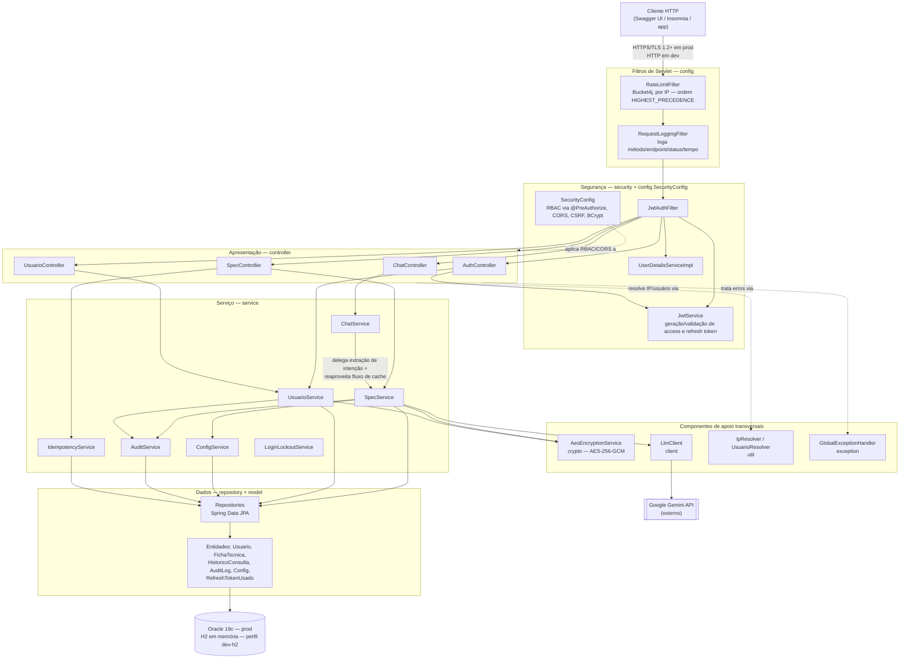
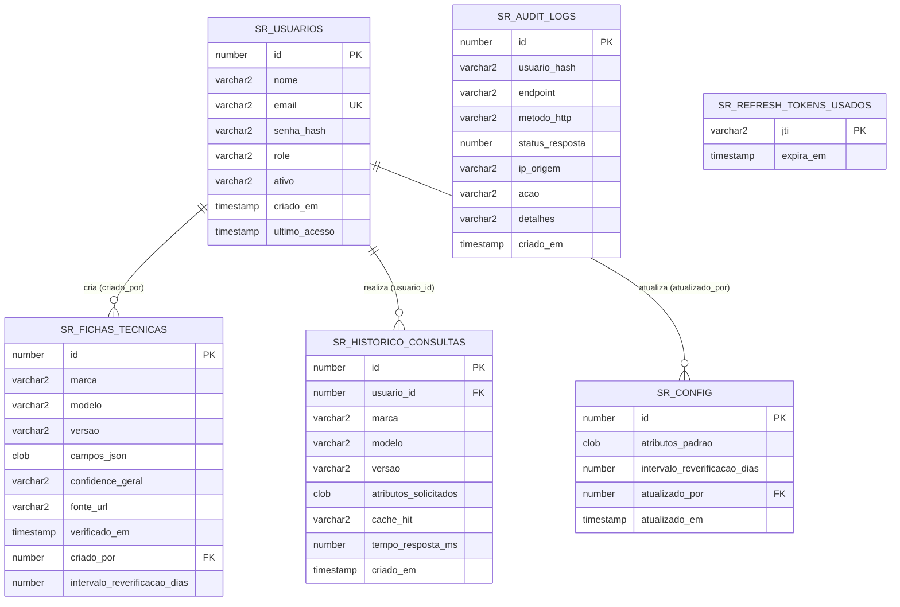

# SpecRadar

> Plataforma de inteligência competitiva automotiva — consulta, cacheia e compara especificações técnicas de veículos concorrentes via IA, com repositório histórico acumulativo. Desenvolvida para o Challenge Ford × FIAP 2026.

---

## Sumário

- [Sobre o projeto](#sobre-o-projeto)
  - [O problema](#o-problema)
  - [A solução](#a-solução)
  - [Caso de validação oficial (Ford Ranger Raptor)](#caso-de-validação-oficial-ford-ranger-raptor)
  - [Impacto esperado](#impacto-esperado)
- [Documentação por disciplina (Cybersecurity e SOA)](#documentação-por-disciplina-cybersecurity-e-soa)
- [Stack tecnológica](#stack-tecnológica)
- [Arquitetura](#arquitetura)
  - [Visão geral em camadas](#visão-geral-em-camadas)
  - [Diagrama de arquitetura](#diagrama-de-arquitetura)
  - [Estrutura de pacotes](#estrutura-de-pacotes)
  - [Fluxo de uma requisição](#fluxo-de-uma-requisição)
- [Como rodar o projeto](#como-rodar-o-projeto)
  - [Pré-requisitos](#pré-requisitos)
  - [Variáveis de ambiente](#variáveis-de-ambiente)
  - [Perfis disponíveis](#perfis-disponíveis)
  - [Subindo em dev (Oracle)](#subindo-em-dev-oracle)
  - [Subindo em dev-h2 (H2 em memória)](#subindo-em-dev-h2-h2-em-memória)
  - [Subindo em prod (HTTPS + Oracle)](#subindo-em-prod-https--oracle)
  - [Gerando o certificado SSL](#gerando-o-certificado-ssl)
  - [Resetando o banco do zero](#resetando-o-banco-do-zero)
  - [Armadilhas conhecidas de configuração](#armadilhas-conhecidas-de-configuração)
- [Banco de dados](#banco-de-dados)
  - [Modelo de dados](#modelo-de-dados)
  - [Diagrama de relacionamento](#diagrama-de-relacionamento)
  - [Migrações Flyway](#migrações-flyway)
  - [Portabilidade Oracle/H2](#portabilidade-oracleh2)
- [Autenticação e autorização](#autenticação-e-autorização)
  - [Fluxo de login](#fluxo-de-login)
  - [Access token e refresh token](#access-token-e-refresh-token)
  - [Rotação e revogação de refresh token](#rotação-e-revogação-de-refresh-token)
  - [RBAC](#rbac)
  - [Bloqueio por força bruta](#bloqueio-por-força-bruta)
- [Endpoints da API](#endpoints-da-api)
  - [Autenticação](#autenticação)
  - [Especificações técnicas](#especificações-técnicas)
  - [Chat em linguagem natural](#chat-em-linguagem-natural)
  - [Usuários](#usuários)
  - [Formato padrão de erro](#formato-padrão-de-erro)
  - [Documentação interativa (Swagger)](#documentação-interativa-swagger)
- [Consulta e cache de especificações técnicas](#consulta-e-cache-de-especificações-técnicas)
  - [Estratégia cache-primeiro](#estratégia-cache-primeiro)
  - [Níveis de confiança](#níveis-de-confiança)
  - [Reverificação periódica](#reverificação-periódica)
  - [Comparação entre veículos](#comparação-entre-veículos)
  - [Consulta via PDF anexado](#consulta-via-pdf-anexado)
  - [Consulta via chat em linguagem natural](#consulta-via-chat-em-linguagem-natural)
  - [Idempotência](#idempotência)
- [Integração com o Google Gemini](#integração-com-o-google-gemini)
  - [Como a extração funciona](#como-a-extração-funciona)
  - [Cliente HTTP dedicado para chamadas multimodais](#cliente-http-dedicado-para-chamadas-multimodais)
  - [Limitações conhecidas da integração](#limitações-conhecidas-da-integração)
- [Segurança](#segurança)
  - [Validação e sanitização de entrada](#validação-e-sanitização-de-entrada)
  - [Rate limiting](#rate-limiting)
  - [HTTPS/TLS](#httpstls)
  - [CORS](#cors)
  - [Criptografia de dados em repouso](#criptografia-de-dados-em-repouso)
  - [Pseudonimização](#pseudonimização)
  - [LGPD](#lgpd)
  - [Tratamento centralizado de erros](#tratamento-centralizado-de-erros)
  - [Trilha de auditoria](#trilha-de-auditoria)
- [Testes automatizados](#testes-automatizados)
  - [Suíte e cobertura](#suíte-e-cobertura)
  - [Como rodar](#como-rodar)
  - [Limitações conhecidas da suíte](#limitações-conhecidas-da-suíte)
- [Decisões técnicas importantes](#decisões-técnicas-importantes)
- [Limitações conhecidas e itens não implementados](#limitações-conhecidas-e-itens-não-implementados)
- [Equipe](#equipe)

---

## Sobre o projeto

### O problema

Hoje, o processo de coleta de especificações técnicas de veículos concorrentes — potência, torque, transmissão, tração, preço, itens de série — é feito manualmente por analistas: navegando em sites de fabricantes, catálogos em PDF e material de marketing de cada concorrente. Cada versão consultada consome cerca de **1 hora de trabalho manual**, com alto risco de imprecisão, ausência de padronização entre fontes e dificuldade real de comparar um veículo contra outro de forma consistente. Para uma linha completa de concorrentes com dezenas de versões, isso representa dias de trabalho improdutivo sobre dados que já nascem desatualizados.

### A solução

O SpecRadar centraliza essa inteligência competitiva numa API que consulta, armazena e compara especificações técnicas de veículos, com dois modos de interação sobre a mesma base:

- **Consulta estruturada** — o analista informa marca, modelo, versão e a lista de atributos que quer conhecer (motor, potência, torque, e assim por diante), e recebe uma ficha técnica padronizada, no mesmo formato independentemente do veículo consultado.
- **Consulta em linguagem natural** — o mesmo resultado pode ser obtido conversando com a API (`POST /chat/message`), que extrai marca/modelo/versão/atributos da mensagem do analista antes de delegar para o mesmo fluxo da consulta estruturada.

Quando um veículo é consultado pela primeira vez, a API usa o Google Gemini para extrair as especificações a partir do próprio conhecimento do modelo — não há scraping nem busca ao vivo (ver [limitações conhecidas](#limitações-conhecidas-e-itens-não-implementados)). O resultado é armazenado de forma cifrada, e consultas futuras pelo mesmo veículo — mesmo que pedindo atributos diferentes dentro do conjunto já coberto — são respondidas direto do banco, sem gastar uma nova chamada ao modelo. Cada campo retornado vem acompanhado de um nível de confiança e da fonte declarada, e o mesmo veículo consultado por múltiplos analistas ao longo do tempo forma um repositório histórico acumulativo, reaproveitado inclusive pela comparação direta entre dois veículos.

Um terceiro modo de entrada, `POST /specs/from-pdf`, aceita um catálogo em PDF anexado pelo próprio analista como fonte da extração, reaproveitando o mesmo fluxo de cache das outras duas vias.

### Caso de validação oficial (Ford Ranger Raptor)

O brief do Challenge define a Ford Ranger Raptor como o caso de teste oficial da solução: *"a solução deve conseguir entregar corretamente todas as especificações técnicas apresentadas no slide da Ranger Raptor"*, e considera a solução operando corretamente se os dados forem entregues "de forma clara, organizada e consistente". Esse é o cenário usado como referência de validação ponta a ponta do SpecRadar — da consulta inicial (cache miss, chamada real ao Gemini) à consulta subsequente (cache hit, sem nova chamada ao modelo).

### Impacto esperado

Com o SpecRadar, o tempo de consulta de especificações de um veículo concorrente já conhecido cai de cerca de 1 hora para uma resposta de cache em milissegundos — e mesmo uma consulta nova (cache miss, com chamada ao Gemini) é resolvida em segundos, não em horas. A padronização do formato de saída elimina a inconsistência entre fontes, o nível de confiança por campo torna explícito quando um dado é inferido em vez de verificado, e o repositório histórico acumulativo transforma cada consulta individual num ativo reutilizável por toda a equipe, em vez de um resultado descartado após o uso.

---

## Documentação por disciplina (Cybersecurity e SOA)

Cada disciplina tem um documento técnico dedicado, com evidência extraída diretamente do código-fonte real do projeto — requisitos formais exigidos, o que foi implementado para atendê-los, e como isso pode ser conferido:

- 🔒 **[Cybersecurity — Segurança da API](docs/Sprint1/documentacao-cyber-sprint1.md)**
- 🏛 **[Arquitetura Orientada a Serviços (SOA)](docs/Sprint1/documentacao-soa-sprint1.md)**

---

## Stack tecnológica

| Camada | Tecnologia | Versão |
|---|---|---|
| Linguagem | Java | 21 |
| Framework | Spring Boot | 3.5.14 |
| Segurança | Spring Security (JWT, RBAC via `@PreAuthorize`, CORS) | gerenciada pelo Spring Boot |
| Persistência | Spring Data JPA | gerenciada pelo Spring Boot |
| Banco de dados | Oracle (produção, instância FIAP) / H2 em memória (perfil `dev-h2`) | Oracle 19c · driver `ojdbc11` |
| Migrações de schema | Flyway (`flyway-core` + `flyway-database-oracle`) | 11.8.2 |
| Autenticação | JWT — `jjwt-api`/`jjwt-impl`/`jjwt-jackson` | 0.12.6 |
| Rate limiting | Bucket4j | 8.10.1 |
| Documentação da API | springdoc-openapi (Swagger UI) | 2.8.9 |
| Validação de entrada | Jakarta Bean Validation | gerenciada pelo Spring Boot |
| Modelo de linguagem | Google Gemini (`gemini-3.7-flash`, configurável via `LLM_MODEL`) — API `v1beta` | REST direto via `RestTemplate` |
| Variáveis de ambiente | springboot3-dotenv | 5.1.0 |
| Redução de boilerplate | Lombok | 1.18.38 |
| Testes | JUnit 5 + Mockito + JUnit Platform Suite (`@Suite`/`@SelectPackages`) | gerenciados pelo Spring Boot |
| Build | Maven | — |

Duas bibliotecas de criptografia da própria JDK (`javax.crypto`), sem dependência externa adicional, cobrem os dois usos de segurança de dados do projeto: **AES-256-GCM** para os dados sensíveis das fichas técnicas em repouso, e **HMAC-SHA256** para a pseudonimização de identificadores de usuário nos logs de auditoria — ambos detalhados na seção [Segurança](#segurança).

---

## Arquitetura

### Visão geral em camadas

O SpecRadar segue arquitetura em camadas: apresentação (`controller`) → segurança (filtros de servlet + Spring Security) → serviço (`service`) → dados (`repository` + `model`), com um pequeno conjunto de componentes de apoio transversais — criptografia, cliente do Gemini, utilitários de resolução de IP/usuário, tratamento centralizado de erros — usados por mais de uma camada sem pertencer estruturalmente a nenhuma delas.

A regra que a estrutura de pacotes impõe na prática: um `controller` nunca acessa um `repository` diretamente, sempre via `service`; um `service` nunca constrói uma `ResponseEntity` nem lê dados de `HttpServletRequest` além do que precisa (IP, usuário autenticado) — a tradução para HTTP é responsabilidade do controller e do `GlobalExceptionHandler`; um `repository` é só interface Spring Data JPA, sem regra de negócio.

### Diagrama de arquitetura



A requisição entra pelos filtros de servlet (`RateLimitFilter`, registrado com `Ordered.HIGHEST_PRECEDENCE` em `FilterConfig`, roda antes de qualquer autenticação — mesmo uma tentativa de força bruta no login é barrada por IP antes de chegar ao Spring Security), passa pela cadeia de segurança (`JwtAuthFilter` → `SecurityConfig`), chega ao controller correspondente, que delega a regra de negócio ao service. Os componentes de apoio (`AesEncryptionService`, `LlmClient`, `IpResolver`/`UsuarioResolver`, `GlobalExceptionHandler`) são usados por mais de uma camada — exatamente o papel de um componente transversal numa arquitetura em camadas.

Como complemento ao diagrama Mermaid acima — a mesma arquitetura, vista como pilha de camadas:

```
            ┌──────────────────────────────────────────────┐
            │    Cliente (Swagger UI / Insomnia / app)     │
            └──────────────────────────────────────────────┘
                                   │ HTTP (dev) / HTTPS (prod)
                                   ▼
┌──────────────────────────────────────────────────────────────────────┐
│ FILTROS DE SERVLET                                           config/ │
│ RateLimitFilter (por IP) -> RequestLoggingFilter                     │
├──────────────────────────────────────────────────────────────────────┤
│ SEGURANÇA                                 security/ + SecurityConfig │
│ JwtAuthFilter -> UserDetailsServiceImpl / JwtService                 │
│ -> RBAC checado via @PreAuthorize em cada controller                 │
├──────────────────────────────────────────────────────────────────────┤
│ APRESENTAÇÃO                                             controller/ │
│ AuthController . SpecController . ChatController . UsuarioController │
├─────────────────────────────────┬────────────────────────────────────┤
│ SERVIÇO (service/)              │ APOIO TRANSVERSAL                  │
│ SpecService                     │ crypto/  AesEncryptionService      │
│ UsuarioService                  │ client/  LlmClient                 │
│ ChatService                     │ util/    IpResolver                │
│ ConfigService                   │          UsuarioResolver           │
│ AuditService                    │ exception/                         │
│ IdempotencyService              │   GlobalExceptionHandler           │
│ LoginLockoutService             │                                    │
├─────────────────────────────────┴────────────────────────────────────┤
│ DADOS                                           repository/ + model/ │
│ Repositories (Spring Data JPA)  ->  Entidades JPA                    │
├──────────────────────────────────────────────────────────────────────┤
│ BANCO DE DADOS                                                       │
│ Oracle 19c (prod)              H2 em memória (perfil dev-h2)         │
└──────────────────────────────────────────────────────────────────────┘
                                   │
                                   │ LlmClient - só em cache miss/parcial/expirado
                                   ▼
                    ┌──────────────────────────────┐
                    │ Google Gemini API (externo)  │
                    └──────────────────────────────┘
```

### Estrutura de pacotes

```
sprint-ford-api/
├── src/main/java/com/icers/ford/
│   ├── client/
│   │   ├── LlmClient.java                    # Chamada REST ao Gemini — prompt, parse, tratamento de erro
│   │   ├── LlmRequest.java                   # Corpo da requisição ao Gemini (texto e/ou PDF inline)
│   │   └── LlmResponse.java                  # Resposta do Gemini — candidates, texto extraído, usageMetadata
│   │
│   ├── config/
│   │   ├── SecurityConfig.java               # Chain de segurança, RBAC via @PreAuthorize, CORS, BCrypt
│   │   ├── RateLimitFilter.java               # Rate limiting por IP (Bucket4j) — filtro de servlet
│   │   ├── FilterConfig.java                  # Registra RateLimitFilter e RequestLoggingFilter com ordem
│   │   ├── RequestLoggingFilter.java          # Loga método/endpoint/status/tempo — nunca headers sensíveis
│   │   ├── OpenApiConfig.java                 # Customização do Swagger — security scheme, exemplos reais
│   │   ├── RestTemplateConfig.java            # Dois RestTemplate — timeouts diferentes (texto vs. PDF)
│   │   └── FlywayConfig.java                  # repair() + migrate() a cada boot (Oracle não tem DDL transacional)
│   │
│   ├── controller/
│   │   ├── AuthController.java                # POST /auth/login, /auth/refresh
│   │   ├── SpecController.java                # /specs/query, compare, history, config, from-pdf, delete
│   │   ├── ChatController.java                # POST /chat/message
│   │   └── UsuarioController.java             # CRUD de usuários + reativar/anonimizar — só ADMIN
│   │
│   ├── crypto/
│   │   └── AesEncryptionService.java          # AES-256-GCM — cifra/decifra campos_json
│   │
│   ├── dto/
│   │   ├── request/
│   │   │   ├── LoginRequest.java              # email + senha
│   │   │   ├── RefreshRequest.java            # refreshToken
│   │   │   ├── SpecQueryRequest.java          # marca, modelo, versao, atributos (regex + @Size)
│   │   │   ├── SpecFromPdfRequest.java        # mesmos campos de SpecQueryRequest, para o multipart
│   │   │   ├── ChatMessageRequest.java        # mensagem em linguagem natural
│   │   │   ├── ConfigRequest.java             # atributosPadrao, intervaloReverificacaoDias (2–31)
│   │   │   ├── UsuarioCreateRequest.java      # nome, email, senha, role
│   │   │   └── UsuarioUpdateRequest.java      # nome, email, role — nunca senha
│   │   └── response/
│   │       ├── AuthResponse.java              # access_token, refresh_token, token_type, expires_in, role
│   │       ├── SpecResponse.java              # ficha técnica padronizada — id, campos, confidence_geral
│   │       ├── CampoSpec.java                 # um campo individual — valor, confiança, fonte, verificado_em
│   │       ├── ConfigResponse.java            # atributosPadrao, intervaloReverificacaoDias, atualizadoEm
│   │       ├── UsuarioResponse.java           # nunca inclui senha
│   │       └── ErrorResponse.java             # formato padrão de erro de toda a API
│   │
│   ├── exception/
│   │   ├── GlobalExceptionHandler.java        # @RestControllerAdvice — 15 handlers, nunca vaza stack trace
│   │   ├── FichaNaoEncontradaException.java   # 404, com sugestões de veículos similares
│   │   ├── UsuarioNaoEncontradoException.java # 404
│   │   ├── EmailJaCadastradoException.java    # 409 — email já pertence a outra conta
│   │   ├── AutoAnonimizacaoException.java     # 409 — ADMIN não pode anonimizar a si mesmo
│   │   ├── AutoDesativacaoException.java      # 409 — ADMIN não pode desativar a si mesmo
│   │   ├── ArquivoInvalidoException.java      # 422 — PDF de /from-pdf inválido (content-type/assinatura)
│   │   ├── LlmUnavailableException.java       # 503 — falha do Gemini, sem revelar qual tecnologia é usada
│   │   └── RateLimitExceededException.java    # 429 — carrega o retryAfterSeconds
│   │
│   ├── model/
│   │   ├── Usuario.java                       # sr_usuarios — implementa UserDetails via UserDetailsServiceImpl
│   │   ├── FichaTecnica.java                  # sr_fichas_tecnicas — campos_json cifrado via converter
│   │   ├── HistoricoConsulta.java             # sr_historico_consultas
│   │   ├── AuditLog.java                      # sr_audit_logs — usuario_hash pseudonimizado
│   │   ├── Config.java                        # sr_config
│   │   ├── RefreshTokenUsado.java             # sr_refresh_tokens_usados — chave natural (jti)
│   │   ├── converter/
│   │   │   └── CamposJsonEncryptedConverter.java  # AttributeConverter — cifra/decifra de forma transparente
│   │   └── enums/
│   │       ├── Role.java                      # ADMIN, ANALYST
│   │       └── ConfidenceLevel.java           # ALTA, MEDIA, PARCIAL, BAIXA (nível geral da ficha)
│   │
│   ├── repository/
│   │   ├── UsuarioRepository.java
│   │   ├── FichaTecnicaRepository.java
│   │   ├── HistoricoConsultaRepository.java
│   │   ├── AuditLogRepository.java
│   │   ├── ConfigRepository.java
│   │   └── RefreshTokenUsadoRepository.java   # chave String (jti), não Long
│   │
│   ├── security/
│   │   ├── JwtAuthFilter.java                 # valida o Bearer token em cada requisição
│   │   ├── JwtService.java                    # gera/valida access e refresh token
│   │   └── UserDetailsServiceImpl.java        # carrega Usuario pelo email para o Spring Security
│   │
│   ├── service/
│   │   ├── SpecService.java                   # cache-primeiro, rate limit por usuário, comparação
│   │   ├── UsuarioService.java                # CRUD, desativação, anonimização
│   │   ├── ChatService.java                   # extração de intenção por palavra-chave, delega a SpecService
│   │   ├── ConfigService.java                 # atributos padrão e intervalo de reverificação
│   │   ├── AuditService.java                  # trilha de auditoria, pseudonimização, detecção de força bruta
│   │   ├── IdempotencyService.java            # cache de resposta por Idempotency-Key (24h)
│   │   └── LoginLockoutService.java           # bloqueio de conta por força bruta (5 falhas/10min → 30s)
│   │
│   ├── util/
│   │   ├── IpResolver.java                    # resolve IP real — X-Forwarded-For não confiado por padrão
│   │   └── UsuarioResolver.java                # resolve o Usuario autenticado a partir do email do token
│   │
│   ├── GerarHashSenha.java                    # utilitário de linha de comando (main isolado, fora do
│   │                                           # fluxo HTTP) — gera os hashes BCrypt dos usuários semeados
│   │                                           # pela V5; não é chamado em runtime pela aplicação
│   └── SprintFordApiApplication.java          # entry point — banner com URL do Swagger, porta,
│                                               # protocolo e perfil ativo, lidos do Environment real
│
├── src/main/resources/
│   ├── application.properties                 # config base — JWT, rate limit, upload, CORS, Swagger
│   ├── application-dev.properties             # perfil dev — Oracle, HTTP, SSL desabilitado
│   ├── application-dev-h2.properties          # perfil dev-h2 — H2 em memória + Console
│   ├── application-prod.properties            # perfil prod — Oracle, HTTPS, Swagger desabilitado
│   ├── logback-spring.xml                     # logs — console legível em dev, JSON estruturado em prod
│   │                                           # (ver Trilha de auditoria, em Segurança)
│   ├── specradar-ssl.p12                      # certificado PKCS12 (gerado localmente, gitignored)
│   └── db/migration/                          # 9 migrations Flyway (ver Migrações Flyway)
│       └── V1__create_usuarios.sql … V9__revogacao_refresh_token.sql
│
├── src/test/java/com/icers/ford/
│   ├── SuiteDeTestesGeral.java                 # @Suite + @SelectPackages — agrupa todos os pacotes de teste
│   ├── SprintFordApiApplicationTests.java      # smoke test (@SpringBootTest), fixado em @ActiveProfiles("dev-h2")
│   ├── service/
│   │   ├── SpecServiceTest.java                # 32 testes
│   │   ├── UsuarioServiceTest.java             # 18 testes
│   │   ├── AuditServiceTest.java               # 17 testes
│   │   ├── ChatServiceTest.java                # 14 testes
│   │   ├── ConfigServiceTest.java              # 11 testes
│   │   ├── IdempotencyServiceTest.java         # 9 testes
│   │   └── LoginLockoutServiceTest.java        # 8 testes
│   ├── security/
│   │   └── JwtServiceTest.java                 # 24 testes
│   ├── exception/
│   │   └── GlobalExceptionHandlerTest.java     # 19 testes
│   ├── crypto/
│   │   └── AesEncryptionServiceTest.java       # 13 testes
│   └── model/converter/
│       └── CamposJsonEncryptedConverterTest.java  # 6 testes
│
├── test-files/                                 # PDFs/imagens usados nos testes manuais de /specs/from-pdf
│                                                # (com e sem imagem embutida — ver Limitações conhecidas
│                                                # da integração)
├── docs/
│   ├── Solucao/                                # Proposta do produto (PDFs) — fonte dos exemplos citados
│   │                                            # neste README (caso de validação, bulk-import, etc.)
│   ├── Sprint1/                                 # Documentação técnica de Cybersecurity e SOA (linkada
│   │                                            # no início e no fim deste README) + material oficial do Challenge
│   └── Sprint3/                                 # Documentação da entrega seguinte (em construção)
│
├── logs/                                        # Saída dos logs em arquivo do perfil prod (JSON) —
│                                                 # gitignored, só existe depois de rodar em prod
├── .env.example                                 # Template de variáveis de ambiente — copiar para .env
├── .env                                         # Segredos reais — nunca commitado (gitignored)
├── .gitignore                                   # .env, *.p12 e logs/ excluídos, entre outros
├── pom.xml                                      # Dependências Maven — ver Stack tecnológica
├── mvnw / mvnw.cmd                              # Maven Wrapper — dispensa instalação própria do Maven
└── README.md                                    # este arquivo
```

### Fluxo de uma requisição

Usando `POST /specs/query` como exemplo, do primeiro byte recebido até a resposta:

1. **`RateLimitFilter`** (filtro de servlet, `HIGHEST_PRECEDENCE`) consome um token do bucket por IP; se excedido, responde `429` com `Retry-After` sem chegar a nenhuma camada seguinte.
2. **`RequestLoggingFilter`** registra método, endpoint e IP da requisição (nunca headers sensíveis).
3. **`JwtAuthFilter`** valida o access token (assinatura, expiração, tipo `ACCESS`) e popula o contexto de segurança via `UserDetailsServiceImpl`; sem token válido, a cadeia do Spring Security responde `401` antes de qualquer controller ser alcançado.
4. **`SecurityConfig`** aplica CORS e a regra de autenticação obrigatória por padrão; a autorização fina por papel acontece no `@PreAuthorize` do método do controller (`SpecController.query`, neste exemplo, exige `ANALYST` ou `ADMIN`).
5. **`SpecController`** valida o corpo da requisição via Bean Validation (`422` se inválido) e delega para **`SpecService`**, aplicando primeiro o rate limit por usuário autenticado (independente do rate limit por IP do passo 1).
6. **`SpecService`** resolve a partir do cache (`FichaTecnicaRepository`): se a ficha já cobre os atributos pedidos e não está expirada, monta a resposta direto do banco — os campos vêm de `campos_json`, decifrados de forma transparente pelo `CamposJsonEncryptedConverter` ao carregar a entidade. Em cache miss ou parcial, `SpecService` chama **`LlmClient`**, que faz a requisição REST ao Gemini e devolve os campos extraídos.
7. **`AuditService`** registra a consulta de forma assíncrona (`@Async`), com o usuário identificado por hash pseudonimizado — sem bloquear a resposta ao cliente.
8. Qualquer exceção lançada em qualquer um dos passos acima (validação, regra de negócio, falha do Gemini) é interceptada pelo **`GlobalExceptionHandler`**, que nunca deixa vazar stack trace ou detalhe interno na resposta.

---

## Como rodar o projeto

### Pré-requisitos

- **JDK 21**
- **Maven** — o projeto já traz o wrapper (`mvnw`/`mvnw.cmd`), então uma instalação própria do Maven não é obrigatória
- Acesso a uma instância **Oracle** (schema FIAP do aluno) — necessário para os perfis `dev` e `prod`; **não é necessário** para o perfil `dev-h2` (ver abaixo)
- Uma chave de API do **Google Gemini** válida, com cota disponível (Google AI Studio)

### Variáveis de ambiente

Copie `.env.example` para `.env` e preencha (o arquivo `.env` nunca deve ser commitado — já está no `.gitignore`):

```env
ORACLE_URL=jdbc:oracle:thin:@oracle.fiap.com.br:1521:orcl
ORACLE_USER=seu_rm_aqui
ORACLE_PASSWORD=sua_senha_aqui

# JWT — gere com: openssl rand -base64 64
JWT_SECRET=gere-uma-chave-de-pelo-menos-64-caracteres-aqui

# AES-256 para criptografar campos_json (specs) em repouso.
# Gere a sua com: openssl rand -base64 32
AES_SECRET_KEY=gere-com-openssl-rand-base64-32

# Salt secreto para o hash HMAC do usuario_hash nos logs de auditoria
# (pseudonimização). Gere o seu com o mesmo comando acima.
PSEUDONYMIZATION_SALT=gere-com-openssl-rand-base64-32

# LLM — Google Gemini
LLM_API_KEY=sua-chave-do-google-ai-studio-aqui
LLM_API_URL=https://generativelanguage.googleapis.com/v1beta/models
LLM_MODEL=gemini-3.7-flash

# CORS — separar múltiplas origens por vírgula
CORS_ALLOWED_ORIGINS=http://localhost:3000,http://localhost:8081

# SSL / HTTPS (perfil prod) — senha do keystore gerado com keytool.
# Gere a sua com: openssl rand -base64 24
SSL_KEYSTORE_PASSWORD=
```

Todas as chaves simétricas (`JWT_SECRET`, `AES_SECRET_KEY`, `PSEUDONYMIZATION_SALT`, `SSL_KEYSTORE_PASSWORD`) devem ser geradas localmente com `openssl rand -base64 <n>` — nenhuma delas tem valor padrão de fallback no código; sem elas preenchidas, a aplicação não sobe.

### Perfis disponíveis

| Perfil | Banco | Protocolo | Quando usar |
|---|---|---|---|
| `dev` (padrão) | Oracle (schema FIAP) | HTTP, porta 8080 | Desenvolvimento com o Oracle da FIAP disponível |
| `dev-h2` | H2 em memória | HTTP, porta 8080 | Desenvolvimento sem acesso ao Oracle da FIAP — banco descartável, recriado a cada boot |
| `prod` | Oracle (schema FIAP) | HTTPS, porta 8443 | Execução com TLS habilitado |

**Importante:** o perfil ativo é controlado **exclusivamente** por uma variável de ambiente real (do sistema operacional ou da run configuration da IDE) — `SPRING_PROFILES_ACTIVE`. Não existe nenhuma variável de perfil dentro do `.env`; isso é intencional (ver [Armadilhas conhecidas de configuração](#armadilhas-conhecidas-de-configuração) abaixo). Sem essa variável definida, o padrão do `application.properties` (`spring.profiles.active=dev`) vale normalmente.

### Subindo em dev (Oracle)

1. Garanta que o schema Oracle está acessível (o valor default de `spring.jpa.properties.hibernate.default_schema` é `RM558540` — ajuste se o seu RM for outro).
2. Rode a aplicação — nenhuma variável de perfil extra é necessária, `dev` já é o padrão:
   ```bash
   ./mvnw spring-boot:run
   ```
3. O Flyway aplica as migrations `V1` a `V9` automaticamente na inicialização.
4. Acesse a documentação interativa em `http://localhost:8080/swagger-ui.html`.

### Subindo em dev-h2 (H2 em memória)

Alternativa para quem não tem acesso ao Oracle da FIAP — útil, por exemplo, para outro integrante do grupo testar localmente sem credenciais próprias.

1. Defina a variável de ambiente real `SPRING_PROFILES_ACTIVE=dev-h2` (nunca no `.env`):
   ```bash
   SPRING_PROFILES_ACTIVE=dev-h2 ./mvnw spring-boot:run
   ```
   Na IntelliJ: na run configuration, aba **Environment variables** → `SPRING_PROFILES_ACTIVE=dev-h2`.
2. As mesmas 9 migrations Flyway rodam do zero contra o H2, recriando inclusive os usuários semeados pela `V5`.
3. Acesse o **H2 Console** em `http://localhost:8080/h2-console` — JDBC URL `jdbc:h2:mem:specradar`, usuário `sa`, senha em branco.
4. O banco é descartável: reiniciar a aplicação zera todos os dados (`DB_CLOSE_DELAY=-1` só mantém o banco vivo **enquanto** a aplicação estiver de pé).

### Subindo em prod (HTTPS + Oracle)

1. Gere o certificado SSL (ver seção seguinte) antes de subir — sem `specradar-ssl.p12` presente, o boot falha.
2. Defina `SSL_KEYSTORE_PASSWORD` no `.env` com a mesma senha usada ao gerar o certificado.
3. Defina a variável de ambiente real `SPRING_PROFILES_ACTIVE=prod`:
   ```bash
   SPRING_PROFILES_ACTIVE=prod ./mvnw spring-boot:run
   ```
4. Com `server.ssl.enabled=true`, o Spring Boot desabilita o HTTP por completo — a aplicação responde **apenas** em HTTPS na porta 8443.
5. Acesse `https://localhost:8443/swagger-ui.html` — como o certificado é self-signed, o navegador exibirá um aviso de segurança ("não confiável"). Isso é esperado: confirma que o HTTPS está ativo, com um certificado que não foi emitido por uma autoridade certificadora reconhecida. Clique em **"Avançado"** → **"Prosseguir assim mesmo"**.
6. No Insomnia, desabilite a validação de certificado em **Settings → Security → Validate certificates** para aceitar o certificado self-signed.
7. Em `prod`, o Swagger e o `/v3/api-docs` ficam **desabilitados** por padrão (`springdoc.swagger-ui.enabled=false`) — reduz a superfície exposta num ambiente que se pretende mais próximo de produção real.

### Gerando o certificado SSL

O certificado é PKCS12, RSA 2048 bits, assinado com `SHA384withRSA`, gerado localmente via `keytool` (nunca commitado — está no `.gitignore`) em `src/main/resources/specradar-ssl.p12`, com alias `specradar` (precisa bater com `server.ssl.key-alias` em `application-prod.properties`):

```bash
keytool -genkeypair \
  -alias specradar \
  -keyalg RSA -keysize 2048 -sigalg SHA384withRSA \
  -storetype PKCS12 \
  -keystore src/main/resources/specradar-ssl.p12 \
  -validity 365 \
  -dname "CN=localhost, OU=SpecRadar, O=ICERS, L=Sao Paulo, ST=SP, C=BR"
```

O comando pede a senha do keystore interativamente — use a mesma que for preenchida em `SSL_KEYSTORE_PASSWORD` no `.env`. `-validity 365` e o `-dname` são livres para ajustar; os parâmetros que **precisam** bater com a configuração do projeto são o algoritmo (`RSA`/2048/`SHA384withRSA`), o tipo (`PKCS12`), o caminho do arquivo e o alias.

### Resetando o banco do zero

Para um ambiente limpo (útil durante o desenvolvimento contra o Oracle), derrube as tabelas e o controle do Flyway antes de reiniciar:

```sql
DROP TABLE sr_audit_logs PURGE;
DROP TABLE sr_historico_consultas PURGE;
DROP TABLE sr_fichas_tecnicas PURGE;
DROP TABLE sr_config PURGE;
DROP TABLE sr_refresh_tokens_usados PURGE;
DROP TABLE sr_usuarios PURGE;

DROP TABLE "flyway_schema_history_llm" PURGE;
```

(O nome da tabela de controle do Flyway é `flyway_schema_history_llm`, não o padrão `flyway_schema_history` — configurado explicitamente via `spring.flyway.table`, para não colidir com o de outros projetos que eventualmente dividam o mesmo schema Oracle.) Esse reset não é necessário no perfil `dev-h2` — o banco em memória já nasce vazio a cada reinício.

### Armadilhas conhecidas de configuração

**O perfil ativo não pode ser controlado pelo `.env`.** A biblioteca que lê o `.env` (`springboot3-dotenv`) roda como o `EnvironmentPostProcessor` de **menor prioridade** do Spring Boot — ou seja, ela só injeta os valores do `.env` *depois* que o Spring já decidiu, com base nas variáveis de ambiente reais do sistema, qual `application-{perfil}.properties` carregar. Colocar uma variável de perfil só no `.env` engana apenas o `Environment` quando consultado depois (inclusive o banner de inicialização), mas nunca a decisão real de bootstrap — o perfil efetivamente aplicado continua sendo `dev`. Para rodar de fato em `prod` (ou `dev-h2`), a variável precisa existir como **variável de ambiente real** — do sistema operacional ou da run configuration da IDE — nunca só no `.env`.

**Qualquer variável no `.env` tem prioridade *maior* que `application-{perfil}.properties`.** Isso é *relaxed binding* padrão do Spring Boot — por exemplo, uma variável `SERVER_PORT` no `.env` casaria com a property `server.port` e sobrescreveria silenciosamente o que o perfil ativo tentou definir. É por isso que `server.port` neste projeto é um valor fixo dentro de cada `application-{perfil}.properties` (`8080` no base/dev, `8443` só em `application-prod.properties`), nunca uma variável `${SERVER_PORT:...}` no `application.properties` — nenhuma propriedade que precisa variar por perfil (porta, SSL) pode depender de uma variável de `.env`, ou o `.env` vence silenciosamente.

**IntelliJ pode continuar mostrando `application.properties` com acentos corrompidos mesmo com o arquivo correto em UTF-8.** Se isso acontecer mesmo com os bytes do arquivo confirmadamente corretos (verificável fora da IDE) e todas as configurações de encoding da IDE já em UTF-8, o problema é a IntelliJ mantendo, só para aquele arquivo específico, uma decisão de encoding cacheada de uma versão anterior do arquivo. Correção: **File → Invalidate Caches → Invalidate and Restart**.

---

## Banco de dados

### Modelo de dados

| Tabela | Propósito |
|---|---|
| `sr_usuarios` | Usuários da plataforma (`ADMIN`/`ANALYST`) — nome, email, senha (BCrypt), papel, status ativo/inativo, último acesso |
| `sr_fichas_tecnicas` | Cache de especificações técnicas por veículo (`marca`+`modelo`+`versao`) — `campos_json` cifrado em AES-256-GCM; controla também confiança geral, fonte e o intervalo de reverificação periódica daquela ficha |
| `sr_historico_consultas` | Registro de toda consulta feita à plataforma (cache hit ou miss), com usuário, veículo, atributos pedidos e tempo de resposta |
| `sr_audit_logs` | Trilha de auditoria de segurança (login, falhas, ações administrativas) — usuário identificado apenas por hash pseudonimizado, nunca por email/nome |
| `sr_config` | Configuração editável em runtime pelo `ADMIN` — atributos padrão usados quando o chat não identifica nenhum na mensagem, e o intervalo global de reverificação |
| `sr_refresh_tokens_usados` | Refresh tokens já rotacionados, identificados por `jti` — impede reuso de um token já trocado, mesmo antes da expiração natural |

Todos os nomes de tabela, constraint e índice usam o prefixo `sr_` (SpecRadar) — o schema Oracle do RM é compartilhado entre disciplinas/projetos diferentes, e nomes de constraint/índice são únicos por schema no Oracle, não por tabela; um nome genérico como `pk_usuario` colidiria facilmente com outra tabela de usuário já existente no mesmo schema.

### Diagrama de relacionamento



`sr_audit_logs` e `sr_refresh_tokens_usados` são deliberadamente **sem foreign key** para `sr_usuarios`, por motivos diferentes: `sr_audit_logs.usuario_hash` guarda um hash HMAC-SHA256 pseudonimizado, não o `id` real, então uma FK não seria nem tecnicamente possível; `sr_refresh_tokens_usados` só precisa do `jti` (UUID embutido no token) para rejeitar reuso — associá-la a um usuário específico não muda a regra de rejeição.

Um índice único case-insensitive sobre `sr_fichas_tecnicas(marca, modelo, versao)` impede ficha duplicada para o mesmo veículo (ex.: "Ford"/"ford" não geram duas fichas diferentes) — ver [Migrações Flyway](#migrações-flyway), `V7`, para como esse índice é implementado de forma portável entre Oracle e H2.

### Migrações Flyway

| Migration | Escopo |
|---|---|
| `V1__create_usuarios.sql` | Tabela `sr_usuarios` |
| `V2__create_fichas_tecnicas.sql` | Tabela `sr_fichas_tecnicas` (cache de especificações) |
| `V3__create_historico_consultas.sql` | Tabela `sr_historico_consultas` |
| `V4__create_audit_logs.sql` | Tabela `sr_audit_logs` |
| `V5__insert_usuarios_iniciais.sql` | Usuários semente `admin@specradar.com`/`analyst@specradar.com` (senha BCrypt) |
| `V6__create_config.sql` | Tabela `sr_config`, com a linha inicial dos 16 atributos padrão do sistema |
| `V7__idempotencia_ficha_tecnica.sql` | Índice único case-insensitive (`marca_ci`/`modelo_ci`/`versao_ci`) contra ficha duplicada |
| `V8__reverificacao_periodica.sql` | Coluna `intervalo_reverificacao_dias` em `sr_config` e `sr_fichas_tecnicas` |
| `V9__revogacao_refresh_token.sql` | Tabela `sr_refresh_tokens_usados` |

`spring.flyway.table=flyway_schema_history_llm` — o controle de versão do Flyway usa um nome de tabela próprio, não o padrão `flyway_schema_history`, para não colidir com o de outro projeto que eventualmente divida o mesmo schema Oracle.

### Portabilidade Oracle/H2

O schema roda, sem modificação nenhuma, tanto contra o Oracle de produção quanto contra o H2 em memória do perfil `dev-h2` — o que exigiu três ajustes deliberados nas migrations, todos escritos em sintaxe ANSI SQL suportada nativamente pelos dois bancos:

**Geração de chave primária via `IDENTITY`, não sequence manual.** Todas as 5 tabelas com chave surrogate usam `NUMBER GENERATED BY DEFAULT AS IDENTITY` — sintaxe ANSI, suportada por Oracle 12c+ e H2 sem nenhuma reescrita — em vez de uma sequence Oracle-específica (`sequence.NEXTVAL`) combinada com um bloco PL/SQL defensivo de criação, que o H2 não suporta. Nas entidades JPA correspondentes, isso é `@GeneratedValue(strategy = GenerationType.IDENTITY)`. `sr_refresh_tokens_usados` é a exceção — usa `jti` como chave natural, não precisa de geração de id nenhuma.

**Índice de idempotência via colunas computadas, não índice funcional direto.** A primeira versão de `V7` criava o índice único diretamente sobre `UPPER(marca)`, `UPPER(modelo)`, `UPPER(versao)` — um índice funcional, que parecia portável só por leitura do SQL. Só ao subir de fato contra um H2 real ficou evidente que o parser de `CREATE INDEX` do H2 não aceita expressão nenhuma na lista de colunas, apenas identificadores simples. A correção final adiciona 3 colunas computadas (`GENERATED ALWAYS AS (UPPER(...))`, sem a palavra-chave `VIRTUAL` — testado contra o Oracle real da FIAP antes de assumir que seria opcional lá) e cria o índice único sobre essas colunas simples, em vez de sobre a expressão.

**`NUMERIC` explícito via `@JdbcTypeCode` em 9 campos, só necessário sob H2.** `NUMBER`/`NUMBER(n)` do Oracle e do H2 sempre reportam como `NUMERIC` via JDBC — mas o `H2Dialect` espera `BIGINT`/`INTEGER` por padrão para campos Java `Long`/`Integer`, enquanto o `OracleDialect` já esperava `NUMERIC` (por isso o mesmo mapeamento nunca deu problema contra o Oracle). Com `spring.jpa.hibernate.ddl-auto=validate` ativo nos dois perfis, essa divergência de expectativa faria o boot falhar só sob H2. Correção: `@JdbcTypeCode(SqlTypes.NUMERIC)` no `id` das 5 entidades com `IDENTITY`, mais em `HistoricoConsulta.tempoRespostaMs`, `AuditLog.statusResposta` e os dois campos `intervaloReverificacaoDias` (`Config` e `FichaTecnica`) — força o Hibernate a validar como `NUMERIC` nos dois bancos, sem alterar nenhuma migration.

`spring.jpa.hibernate.ddl-auto=validate` é mantido em todos os perfis — o schema em runtime nunca pode divergir silenciosamente do que o Flyway aplicou; qualquer incompatibilidade real (como as duas descritas acima) derruba o boot da aplicação em vez de deixar a divergência passar despercebida.

---

## Autenticação e autorização

### Fluxo de login

`POST /auth/login` recebe email e senha, autentica via `AuthenticationManager` do Spring Security (que valida a senha com BCrypt através do `UserDetailsServiceImpl`) e, se bem-sucedido, gera um par de tokens (access + refresh), atualiza o `ultimo_acesso` do usuário e registra o evento em auditoria. Falhas de credencial retornam sempre a mesma mensagem genérica (`"Email ou senha inválidos."`) — o endpoint nunca revela se o problema foi o email não existir ou a senha estar errada, o que impediria um atacante de usar o login para descobrir quais emails são contas válidas.

### Access token e refresh token

Dois tokens JWT, cada um com uma claim `type` própria (`ACCESS`/`REFRESH`) — um não pode ser usado no lugar do outro, porque a validação checa o tipo explicitamente antes de aceitar o token. O algoritmo de assinatura **não é fixado explicitamente no código** — `JwtService` constrói a chave com `Keys.hmacShaKeyFor(secret...)` e assina com `.signWith(signingKey)` (sem informar um algoritmo), então o próprio JJWT seleciona automaticamente o HMAC mais forte que o tamanho da chave permite. Com o `JWT_SECRET` gerado como o projeto recomenda (`openssl rand -base64 64`), isso resulta em **HS512** na prática — confirmado decodificando o header de um token emitido de verdade (`{"alg":"HS512"}`), não apenas inferido do código:

```java
// JwtService.java
this.signingKey = Keys.hmacShaKeyFor(secret.getBytes(StandardCharsets.UTF_8));
// ...
return Jwts.builder()
        .claims(extraClaims)
        .subject(subject)
        .issuedAt(now)
        .expiration(expiresAt)
        .signWith(signingKey)   // sem algoritmo explícito — JJWT escolhe HS512 pela força da chave
        .compact();
```

| Token | Expiração | Claims | Uso |
|---|---|---|---|
| Access | 8 horas (`28800000` ms) | `userId`, `role`, `type=ACCESS` | Enviado em `Authorization: Bearer <token>` em toda requisição autenticada |
| Refresh | 7 dias (`604800000` ms) | `jti` (UUID único), `type=REFRESH` | Usado só em `POST /auth/refresh` para obter um par novo |

```java
// JwtService.java
public String generateAccessToken(Long userId, String email, String role) {
    return buildToken(Map.of("userId", userId, "role", role, "type", "ACCESS"),
            email, accessTokenExpiration);
}

public String generateRefreshToken(String email) {
    return buildToken(Map.of("type", "REFRESH", "jti", UUID.randomUUID().toString()),
            email, refreshTokenExpiration);
}
```

O access token carrega o `role` do usuário — qualquer cliente (inclusive um app mobile) pode ler a permissão do usuário sem uma requisição extra.

### Rotação e revogação de refresh token

`POST /auth/refresh` implementa rotação real: cada chamada emite um par de tokens inteiramente novo e **invalida permanentemente** o refresh token apresentado, mesmo que ele ainda não tivesse expirado naturalmente. A revogação é feita registrando o `jti` (o identificador único do token, um UUID) na tabela `sr_refresh_tokens_usados` — reapresentar o mesmo `jti` depois é rejeitado:

```java
// AuthController.java — POST /auth/refresh
String jti = jwtService.extractJti(token);

if (jti != null && refreshTokenUsadoRepository.existsById(jti)) {
    // token já rotacionado antes — reuso é sinal de possível token comprometido
    return ResponseEntity.status(HttpStatus.UNAUTHORIZED).body(/* mensagem genérica */);
}

// ... valida usuário, então marca ESTE token como usado ANTES de emitir o par novo
refreshTokenUsadoRepository.save(RefreshTokenUsado.builder().jti(jti).expiraEm(expiraEm).build());
```

O `jti` do token apresentado é marcado como usado **antes** de o par novo ser gerado — prioriza nunca deixar uma janela onde o token antigo ainda funcionaria, mesmo que algo falhe logo em seguida. A mesma escrita aproveita para limpar oportunisticamente (`deleteByExpiraEmBefore`) entradas de tokens que já teriam expirado de qualquer forma, sem precisar de um job agendado à parte. Reuso de um `jti` já rotacionado recebe a mesma mensagem genérica de qualquer outro token inválido — o possível atacante não recebe informação sobre o motivo específico da rejeição, só o log interno é mais detalhado.

### RBAC

Dois papéis — `ADMIN` e `ANALYST` (enum `Role`) — com autorização checada via `@PreAuthorize` diretamente em cada método de controller, não apenas por path em `SecurityConfig`. Isso garante que a regra de acesso vive junto do endpoint que ela protege, reduzindo o risco de um endpoint novo ficar aberto por esquecimento — a postura padrão de `SecurityConfig` já exige autenticação (`.anyRequest().authenticated()`) para qualquer rota sem regra explícita; a autorização fina por papel é sempre responsabilidade do `@PreAuthorize`:

```java
// UsuarioController.java
@PreAuthorize("hasRole('ADMIN')")
@PostMapping
public ResponseEntity<UsuarioResponse> criar(...) { ... }

// SpecController.java
@PreAuthorize("hasAnyRole('ANALYST', 'ADMIN')")
@PostMapping("/query")
public ResponseEntity<SpecResponse> query(...) { ... }

@PreAuthorize("hasRole('ADMIN')")
@DeleteMapping("/{id}")
public ResponseEntity<Void> deletar(...) { ... }
```

| Ação | ANALYST | ADMIN |
|---|:---:|:---:|
| Login / refresh | ✅ | ✅ |
| `POST /specs/query`, `/from-pdf`, `/chat/message` | ✅ | ✅ |
| `GET /specs/{marca}/{modelo}/{versao}`, `/compare`, `/history` | ✅ | ✅ |
| `DELETE /specs/{id}` | ❌ | ✅ |
| `GET`/`PUT /specs/config` | ❌ | ✅ |
| Qualquer endpoint de `/usuarios/**` | ❌ | ✅ |

### Bloqueio por força bruta

`LoginLockoutService` bloqueia uma **conta** (não um IP) após 5 falhas de login em 10 minutos, por 30 segundos — bloquear pela conta, em vez do IP, evita que uma rede compartilhada inteira (escritório, wifi público) fique travada por causa de uma única pessoa errando a senha repetidamente:

```java
// LoginLockoutService.java
private static final int LIMITE_FALHAS = 5;
private static final Duration JANELA_FALHAS = Duration.ofMinutes(10);
private static final Duration DURACAO_BLOQUEIO = Duration.ofSeconds(30);
```

O bloqueio é checado **antes** de qualquer verificação de senha — uma tentativa de login contra uma conta já bloqueada nunca chega a gastar um cálculo de BCrypt, e a resposta (`429`, com header `Retry-After` informando quantos segundos faltam) é idêntica independentemente de a senha informada estar certa ou errada, para não vazar essa informação durante o bloqueio. Login bem-sucedido limpa imediatamente o histórico de falhas da conta. O estado do bloqueio vive em memória (mesmo padrão dos buckets do rate limiting) — não sobrevive a um restart da aplicação, o que é aceitável já que a janela de bloqueio é de segundos, não dias.

Essa checagem é independente da detecção de força bruta por IP que já existe em `AuditService` (ver [Trilha de auditoria](#trilha-de-auditoria)) — uma atua por conta, bloqueando o login em si; a outra atua por IP, apenas alertando.

---

## Endpoints da API

Todos os endpoints protegidos exigem `Authorization: Bearer <access_token>`. Os exemplos abaixo usam o host local de desenvolvimento (`http://localhost:8080`); em produção o mesmo caminho responde em `https://localhost:8443`. Ao todo são **18 operações REST em 17 rotas distintas** (`/specs/config` responde tanto a `GET` quanto a `PUT`), distribuídas em 4 controllers.

### Autenticação

| Método | Endpoint | Papel exigido | Descrição |
|---|---|---|---|
| POST | `/api/v1/auth/login` | Público | Autentica e retorna access + refresh token |
| POST | `/api/v1/auth/refresh` | Público (refresh token válido) | Rotaciona o par de tokens — o token usado é invalidado |

```json
// POST /api/v1/auth/login
{
  "email": "analyst@specradar.com",
  "senha": "Analyst@2026"
}
```

```json
// 200 OK
{
  "access_token": "eyJhbGciOiJIUzUxMiJ9...",
  "refresh_token": "eyJhbGciOiJIUzUxMiJ9...",
  "token_type": "Bearer",
  "expires_in": 28800,
  "role": "ANALYST"
}
```

**Credenciais de teste** — usuários semeados pela migração `V5` (ver [Migrações Flyway](#migrações-flyway)):

| Papel | Email | Senha |
|---|---|---|
| ADMIN | `admin@specradar.com` | `Admin@2026` |
| ANALYST | `analyst@specradar.com` | `Analyst@2026` |

Senhas armazenadas com BCrypt fator 12 — nunca em texto plano no banco (ver [Criptografia de dados em repouso](#criptografia-de-dados-em-repouso)).

### Especificações técnicas

| Método | Endpoint | Papel exigido | Descrição |
|---|---|---|---|
| POST | `/api/v1/specs/query` | ANALYST, ADMIN | Consulta especificações (cache ou Gemini); aceita header opcional `Idempotency-Key` |
| GET | `/api/v1/specs/{marca}/{modelo}/{versao}` | ANALYST, ADMIN | Busca ficha já armazenada, sem chamar o Gemini — `404` se nunca consultada |
| GET | `/api/v1/specs/compare` | ANALYST, ADMIN | Compara dois veículos já no banco, campo a campo |
| GET | `/api/v1/specs/history` | ANALYST, ADMIN | Lista fichas armazenadas, com filtro opcional de marca/modelo |
| DELETE | `/api/v1/specs/{id}` | ADMIN | Remove permanentemente uma ficha técnica |
| GET | `/api/v1/specs/config` | ADMIN | Lê os atributos padrão e o intervalo de reverificação |
| PUT | `/api/v1/specs/config` | ADMIN | Atualiza os atributos padrão e/ou o intervalo de reverificação |
| POST | `/api/v1/specs/from-pdf` | ANALYST, ADMIN | Extrai especificações de um PDF anexado (multipart); mesmo fluxo cache-primeiro do `/query` |

```json
// POST /api/v1/specs/query
{
  "marca": "Ford",
  "modelo": "Ranger",
  "versao": "Raptor",
  "atributos": ["motor", "potencia", "torque", "preco"]
}
```

```json
// 200 OK
{
  "id": 4,
  "marca": "Ford",
  "modelo": "Ranger",
  "versao": "Raptor",
  "campos": [
    {
      "campo": "motor",
      "valor": "V6 3.0L Nano bi turbo",
      "confianca": "ALTA",
      "fonte": "https://www.ford.com.br/caminhonetes/ranger",
      "verificado_em": "2026-05-10"
    },
    {
      "campo": "torque",
      "valor": null,
      "confianca": "NAO_ENCONTRADO",
      "fonte": null,
      "verificado_em": null
    }
  ],
  "confidence_geral": "ALTA",
  "consultado_em": "2026-05-10T14:30:00",
  "cache_hit": false
}
```

Um campo pedido mas não encontrado **nunca é omitido** da resposta — aparece com `valor: null` e `confianca: "NAO_ENCONTRADO"`, garantindo que o formato de saída seja sempre o mesmo, independentemente do veículo consultado. `GET /specs/{marca}/{modelo}/{versao}` retorna esse mesmo formato; `GET /specs/compare` retorna os dois veículos lado a lado com um campo adicional de vencedor por atributo numérico (ver [Comparação entre veículos](#comparação-entre-veículos)).

Reenviar o mesmo header `Idempotency-Key` em `/query` devolve a resposta já processada anteriormente, sem reprocessar nada (ver [Idempotência](#idempotência)). `POST /from-pdf` compartilha toda a validação de marca/modelo/versão/atributos de `/query`, mas o arquivo vai como `multipart/form-data` no campo `arquivo`; arquivos acima do limite configurado (`spring.servlet.multipart.max-file-size`) retornam `413`.

### Chat em linguagem natural

| Método | Endpoint | Papel exigido | Descrição |
|---|---|---|---|
| POST | `/api/v1/chat/message` | ANALYST, ADMIN | Extração de intenção em linguagem natural (marca/modelo/versão/atributos por palavra-chave), delega para o mesmo fluxo de `/query` |

```json
// POST /api/v1/chat/message
{
  "mensagem": "Quais são as especificações de motor e suspensão da Ford Ranger Raptor?"
}
```

Quando a mensagem não permite identificar um veículo, a resposta continua `200 OK`, mas com um campo `sucesso: false` — o cliente (app mobile ou Swagger) usa esse campo para decidir se exibe a ficha ou uma mensagem de ajuda, em vez de tratar isso como um erro HTTP.

### Usuários

Todos os endpoints abaixo são exclusivos de `ADMIN`:

| Método | Endpoint | Descrição |
|---|---|---|
| GET | `/api/v1/usuarios` | Lista todos os usuários, ativos e desativados |
| GET | `/api/v1/usuarios/{id}` | Busca usuário por id |
| POST | `/api/v1/usuarios` | Cria usuário (`ANALYST` ou `ADMIN`) |
| PUT | `/api/v1/usuarios/{id}` | Atualiza email e/ou papel — nunca a senha |
| DELETE | `/api/v1/usuarios/{id}` | Desativa (suspensão **reversível**, bloqueia login sem tocar no email) |
| PATCH | `/api/v1/usuarios/{id}/reativar` | Reverte a desativação |
| PATCH | `/api/v1/usuarios/{id}/anonimizar` | Remove dado pessoal (**irreversível**, LGPD) |

Duas travas de segurança nos endpoints de escrita: um `ADMIN` não pode desativar nem anonimizar a própria conta (`409 Conflict` em ambos os casos) — evita que um ADMIN se bloqueie fora do sistema sem querer, e garante que sempre exista pelo menos um administrador ativo capaz de reverter uma ação equivocada de outro.

### Formato padrão de erro

Toda resposta de erro da API segue a mesma estrutura, nunca expondo stack trace, nome de classe ou tecnologia interna:

```json
{
  "codigo_erro": "VALIDATION_ERROR",
  "mensagem": "Um ou mais campos estão inválidos",
  "timestamp": "2026-05-10T14:30:00",
  "endpoint": "/api/v1/specs/query",
  "campos_invalidos": {
    "marca": "Marca deve conter apenas letras, espaços e hífens"
  },
  "sugestoes_similares": null
}
```

`campos_invalidos` só é preenchido em erros de validação (`422`); `sugestoes_similares` só é preenchido no `404` de veículo não encontrado, quando existir algum veículo de marca/modelo igual e versão diferente já no banco (ex.: consultar "Ford Ranger Platinum" sugere "Ford Ranger XLT", "Ford Ranger Limited" se já consultados antes). Fora esses dois casos, ambos os campos vêm `null` — nunca omitidos, pelo mesmo princípio de formato fixo usado no campo técnico individual da ficha.

### Documentação interativa (Swagger)

Com a aplicação rodando em `dev` ou `dev-h2`, a documentação completa — as 18 operações, com exemplos reais de request/response para login, consulta, chat e cada código de erro (`400`, `404`, `429`, `503`) — fica disponível em `http://localhost:8080/swagger-ui.html`. Para testar endpoints protegidos, faça login em `/auth/login`, copie o `access_token`, clique em **Authorize** (cadeado) no Swagger UI e cole o token.

Em `prod`, o Swagger e o `/v3/api-docs` ficam **desabilitados por padrão** (`springdoc.swagger-ui.enabled=false`) — reduz a superfície exposta num ambiente que se pretende mais próximo de produção real; a documentação usada nesse caso é este próprio README.

---

## Consulta e cache de especificações técnicas

### Estratégia cache-primeiro

`SpecService` compartilha um único método privado, `resolverComCache`, entre `query()` (texto) e `queryFromPdf()` (PDF anexado) — a decisão de cache é idêntica nos dois fluxos, só muda *como* os atributos que faltam são buscados no Gemini, por isso essa parte é injetada como função. A cada consulta, um entre quatro caminhos é seguido:

1. **Cache hit puro** — a ficha existe, cobre todos os atributos pedidos e não está expirada: responde direto do banco, sem chamar o Gemini.
2. **Cache expirado** — a ficha existe, mas passou do intervalo de reverificação: reverifica **tudo** que ela já tinha (mais qualquer atributo novo pedido) numa única chamada, e **substitui** o conteúdo da ficha — o objetivo aqui é confirmar/atualizar o que já existe, não só completar uma lacuna. O intervalo de reverificação da ficha é renovado para o valor global vigente nesse momento.
3. **Cache parcial** — a ficha existe, não está expirada, mas faltam atributos novos: busca **só o que falta** no Gemini e **mescla** com o que já existia — a ficha não é recriada, e o que já estava certo não é descartado nem gasta uma nova chamada.
4. **Cache miss** — veículo nunca consultado: busca no Gemini a união dos atributos pedidos com o conjunto de atributos padrão configurado (mesmo que o usuário tenha pedido menos) — garante que a *primeira* consulta de um veículo já deixa o cache completo o bastante para que uma consulta futura pedindo atributos diferentes, mas dentro do padrão, não precise voltar ao Gemini à toa. A resposta para quem pediu continua mostrando só o que foi solicitado.

```java
// SpecService.java — os quatro caminhos, resumidos
if (!expirada && atributosFaltando.isEmpty()) {
    // 1. cache hit puro — monta resposta direto do banco
} else if (expirada) {
    // 2. reverifica tudo + o que falta, SUBSTITUI o conteúdo da ficha
} else {
    // 3. cache parcial — busca só o que falta, MESCLA com o que já existia
}
// 4. cache miss cai no bloco `else` externo — busca padrão ∪ pedidos, cria ficha nova
```

Duas requisições concorrentes para o **mesmo veículo nunca visto antes** podem ambas passar pela checagem de cache miss antes de qualquer uma terminar de salvar. A escrita usa `saveAndFlush` (não `save`) justamente para forçar o `INSERT` a acontecer de forma síncrona dentro do método — se o índice único de idempotência de veículo (`uk_sr_ficha_veiculo_ci`, ver [Migrações Flyway](#migrações-flyway), `V7`) rejeitar a segunda gravação, o `SpecService` captura a `DataIntegrityViolationException` e devolve a ficha que a outra requisição já salvou, em vez de propagar um `500` — o resultado funcional é idêntico, só sem duplicar linha nem mascarar o desperdício de uma segunda chamada ao Gemini.

### Níveis de confiança

Dois níveis distintos, um por campo e um geral da ficha — propositalmente não são a mesma escala:

| Escala | Valores | Onde se aplica |
|---|---|---|
| Por campo (`CampoSpec.confianca`) | `ALTA`, `MEDIA`, `INFERIDA`, `NAO_ENCONTRADO` | Cada atributo individual da ficha |
| Geral da ficha (`confidence_geral`) | `ALTA`, `MEDIA`, `PARCIAL`, `BAIXA` | A ficha como um todo, calculada a partir da distribuição dos campos |

O nível geral é derivado automaticamente da proporção de campos em cada faixa — não é escolhido pelo LLM nem por um analista:

```java
// SpecService.java
if (proporcaoAlta >= 0.8) return "ALTA";
if (proporcaoNaoEncontrado >= 0.5) return "BAIXA";
if (proporcaoAlta >= 0.5) return "MEDIA";
return "PARCIAL";
```

Um campo pedido mas não encontrado pelo Gemini nunca é omitido da resposta — aparece com `valor: null` e `confianca: "NAO_ENCONTRADO"` (ver [Especificações técnicas](#especificações-técnicas)), garantindo que o formato de saída seja sempre o mesmo, independentemente do veículo ou de quantos campos foram de fato encontrados.

### Reverificação periódica

Cada ficha técnica carrega seu próprio `intervalo_reverificacao_dias` — uma cópia do valor global configurado pelo `ADMIN` (`PUT /specs/config`, entre 2 e 31 dias) no momento em que a ficha foi criada, não uma referência viva a ele. Isso é deliberado: se o `ADMIN` mudar o valor global depois, uma ficha já existente só adota o valor novo na sua **próxima reverificação** (quando expira), não imediatamente — o `intervalo_reverificacao_dias` da ficha é renovado para o valor global vigente exatamente nesse momento.

A reverificação é **preguiçosa** — não existe uma varredura agendada em massa revisando todas as fichas periodicamente; a checagem de expiração só acontece quando aquele veículo específico é consultado de novo. Isso evita gastar uma chamada ao Gemini reverificando um veículo que ninguém está mais consultando.

### Comparação entre veículos

`GET /specs/compare` busca as duas fichas já armazenadas (`404` se qualquer uma delas nunca foi consultada) e compara campo a campo. Só 5 atributos têm comparação numérica real — `potencia`, `torque`, `aceleracao`, `preco`, `consumo` — cada um com extração por regex do valor numérico e a unidade esperada:

```java
// SpecService.java — CampoNumerico (enum interno)
POTENCIA("potencia", true,  unidade("(?i)(\\d+(?:[.,]\\d+)?)\\s*cv", 1.0)),
TORQUE("torque", true,
        unidade("(?i)(\\d+(?:[.,]\\d+)?)\\s*nm", 1.0),
        unidade("(?i)(\\d+(?:[.,]\\d+)?)\\s*kgf\\s*\\.?\\s*m", 9.80665)), // 1 kgf·m ≈ 9,80665 Nm
ACELERACAO("aceleracao", false, unidade("(?i)(\\d+(?:[.,]\\d+)?)\\s*segundos", 1.0)),
PRECO("preco", false,           unidade("(?i)r\\$\\s*(\\d{1,3}(?:\\.\\d{3})*(?:,\\d+)?)", 1.0)),
CONSUMO("consumo", true,        unidade("(?i)(\\d+(?:[.,]\\d+)?)\\s*km/l", 1.0));
```

`torque` é o único campo que aceita mais de uma unidade — o Gemini já respondeu tanto em `Nm` quanto em `kgfm` (comum em fichas técnicas brasileiras) em consultas reais; cada unidade reconhecida tem seu próprio multiplicador para uma base comum (Nm) antes de comparar, senão "55 kgfm" e "583 Nm" pareceriam diretamente comparáveis sem ser. `potencia` e `consumo` são "maior vence"; `aceleracao` e `preco` são "menor vence". Valores iguais retornam `"EMPATE"`.

Os demais campos (`motor`, `transmissao`, `tracao`, `amortecedores`, `modos_conducao`, `farois`, `rodas_pneus`, `dimensoes`, `modos_volante`, `modos_escapamento`, `modos_amortecedor`) são texto descritivo ou multivalorado (`dimensoes`, por exemplo, tem três números numa única string — comprimento × largura × altura — sem uma direção única de "melhor") — para esses, o vencedor é sempre `"N/A"`. Um campo ausente de qualquer um dos dois lados também vira `"N/A"` — a comparação nunca declara vencedor por eliminação, dado ausente de um lado não torna o outro automaticamente "melhor".

### Consulta via PDF anexado

`POST /specs/from-pdf` reaproveita o mesmo `resolverComCache` de `/query` — se o cache já cobre tudo que foi pedido, o PDF nem chega a ser processado. O arquivo é validado **antes** do rate limit e antes de qualquer chamada ao Gemini: content-type declarado como `application/pdf` e assinatura real `%PDF-` nos primeiros bytes do arquivo — um content-type mentiroso não passa dessa checagem:

```java
// SpecController.java
private void validarPdf(MultipartFile arquivo) throws IOException {
    if (arquivo == null || arquivo.isEmpty()) {
        throw new ArquivoInvalidoException("Arquivo é obrigatório e não pode estar vazio.");
    }
    if (!MediaType.APPLICATION_PDF_VALUE.equals(arquivo.getContentType())) {
        throw new ArquivoInvalidoException("Arquivo deve ser um PDF (Content-Type application/pdf).");
    }
    // ... confere os bytes de assinatura %PDF- no início do arquivo
}
```

A chamada ao Gemini com PDF é multimodal — mais cara e mais lenta que uma consulta de texto —, por isso tem orçamento de rate limit próprio (10 requisições/min por usuário, contra 60/min de `/query`) e um `RestTemplate` dedicado com timeout maior (120s contra 60s do fluxo de texto). PDFs contendo imagens embutidas (fotos de página inteira, por exemplo) têm uma taxa de falha observada bem maior que catálogos tabulares/texto — uma limitação conhecida do próprio serviço externo, documentada com mais detalhe em [Limitações conhecidas da integração](#limitações-conhecidas-da-integração).

### Consulta via chat em linguagem natural

`ChatService` extrai marca, modelo, versão e atributos de uma mensagem livre por reconhecimento de palavra-chave (sem chamar nenhum modelo de linguagem para essa extração) e monta um `SpecQueryRequest` equivalente ao que `POST /specs/query` receberia — delegando para o mesmo `SpecService.query()`, sem duplicar nenhuma lógica de cache:

```java
// ChatService.java
SpecQueryRequest request = new SpecQueryRequest(
        intencao.marca(),
        intencao.modelo(),
        intencao.versao() != null ? intencao.versao() : "base",
        intencao.atributos().isEmpty()
                ? configService.getAtributosPadrao()
                : intencao.atributos()
);
SpecResponse ficha = specService.query(request, usuario, ip);
```

Quando a mensagem não menciona uma versão específica, `"base"` é usada; quando não menciona nenhum atributo, os atributos padrão configuráveis pelo `ADMIN` (os mesmos de `GET /specs/config`) são usados no lugar. Se marca ou modelo não forem identificados na mensagem, a resposta continua `200 OK` com `sucesso: false` e uma sugestão de como reformular a pergunta — nunca um erro HTTP para "não entendi a mensagem".

### Idempotência

Duas proteções distintas contra duplicação, para dois problemas diferentes:

- **Ficha duplicada para o mesmo veículo** — resolvida em banco pelo índice único case-insensitive `uk_sr_ficha_veiculo_ci` (ver [Migrações Flyway](#migrações-flyway), `V7`). Protege contra a mesma ficha existir duas vezes, não importa quem perguntou.
- **Mesma requisição reprocessada** — resolvida em memória por `IdempotencyService`, acionada pelo header opcional `Idempotency-Key` em `POST /specs/query`. Se o cliente reenviar a mesma chave (ex.: timeout de rede, sem saber se a primeira tentativa foi processada), a resposta já calculada é devolvida sem reprocessar nada — sem nova chamada ao Gemini, sem nova gravação no histórico.

```java
// IdempotencyService.java
private static final long EXPIRACAO_SEGUNDOS = 24 * 60 * 60; // 24h

public Optional<SpecResponse> buscar(String chave) {
    // ... devolve a resposta salva se a chave já foi vista e ainda não expirou
}
```

O estado de idempotência vive em memória, com expiração de 24 horas, e não sobrevive a um restart da aplicação — aceitável para o propósito de proteger contra retry de rede de curto prazo, não para ser um registro permanente (isso já existe: é o próprio histórico de consultas).

---

## Integração com o Google Gemini

A integração usa a conta do **tier gratuito** do Google AI Studio, sem faturamento habilitado — isso é relevante para a seção de limitações abaixo: parte do que está descrito ali como "limitação conhecida" é especificamente uma restrição desse tier, não uma limitação inerente do modelo em si.

### Como a extração funciona

`LlmClient` monta um prompt textual pedindo explicitamente um JSON estruturado — marca/modelo/versão e a lista de atributos são inseridos entre delimitadores XML (`<veiculo>`, `<atributos_solicitados>`), uma defesa deliberada contra prompt injection: o modelo é instruído a tratar esse conteúdo como dado, não como instrução adicional. O prompt fixa o vocabulário de confiança (`ALTA`/`MEDIA`/`INFERIDA`/`NAO_ENCONTRADO`) e exige que **todo** atributo pedido apareça na resposta, mesmo quando não encontrado — a mesma regra de formato fixo que `SpecResponse` expõe para o cliente da API é imposta desde a origem, no próprio prompt.

```java
// LlmClient.java — trecho do prompt
<veiculo>
Marca: %s
Modelo: %s
Versão: %s
</veiculo>

<atributos_solicitados>
%s
</atributos_solicitados>

REGRAS OBRIGATÓRIAS:
1. Retorne APENAS o JSON, sem texto antes ou depois
2. Todos os atributos solicitados devem aparecer no JSON, mesmo os não encontrados
3. Para atributos não encontrados use: "valor": null, "confianca": "NAO_ENCONTRADO", "fonte": null
...
7. Não invente dados — se não tiver certeza use confianca: INFERIDA
```

Na resposta, `LlmClient` remove qualquer bloco de código Markdown que o modelo insira mesmo sendo instruído a não fazer isso (` ```json ... ``` `), desserializa o JSON e garante novamente, do lado do cliente, que todo atributo pedido está presente — um atributo omitido pelo Gemini é preenchido como `NAO_ENCONTRADO` antes de a resposta seguir adiante. Um ponto deliberado de design: se o JSON vier malformado ou incompleto (resposta cortada por instabilidade do serviço), `LlmClient` **lança exceção** em vez de devolver os atributos como "não encontrados" silenciosamente — um erro pontual e temporário do lado do Gemini nunca deve ser interpretado como uma consulta bem-sucedida e acabar **persistido no cache** como se fosse um resultado real.

Erros são tratados por categoria: `429` do Gemini (cota gratuita esgotada) e qualquer outro erro HTTP viram `LlmUnavailableException` com mensagens diferentes; timeout de rede (`ResourceAccessException`) e JSON malformado também caem em `LlmUnavailableException` — que o `GlobalExceptionHandler` converte, de forma consistente, em `503` para o cliente da API (ver [Formato padrão de erro](#formato-padrão-de-erro)).

### Cliente HTTP dedicado para chamadas multimodais

Duas instâncias de `RestTemplate`, configuradas com timeouts diferentes — `llm.api.timeout.seconds` (60s, padrão para consultas de texto) e `llm.api.timeout-pdf.seconds` (120s, só para `/from-pdf`):

```java
// RestTemplateConfig.java
@Bean
@Primary
public RestTemplate restTemplate() {
    return construir(timeoutSeconds);       // 60s
}

@Bean
public RestTemplate restTemplatePdf() {
    return construir(timeoutPdfSeconds);    // 120s
}
```

Chamadas multimodais (PDF anexado, enviado como `inlineData` em base64 no corpo da requisição) demoram consistentemente mais que consultas de texto puro — um `RestTemplate` separado evita aumentar o timeout de **todas** as chamadas (inclusive as de texto, que não precisam disso) só para acomodar o caso mais lento. `LlmClient` recebe os dois beans e escolhe qual usar por método (`consultarEspecificacoes` vs. `consultarEspecificacoesDePdf`), injetando o dedicado via `@Qualifier("restTemplatePdf")` — o nome do bean vem do nome do método `@Bean`, não de uma anotação explícita nele.

### Limitações conhecidas da integração

**Sem busca em tempo real (grounding) — restrição específica do tier gratuito.** O Gemini responde com base no próprio conhecimento de treinamento — não há chamada de busca ao vivo (`google_search` como *tool*) antes de gerar a resposta, o que já causou dados desatualizados ou levemente incorretos em alguns testes (ex.: nome de motor). Sete chamadas diretas à API do Gemini, fora da aplicação, com controles pareados (mesmo modelo, com e sem a ferramenta de grounding), confirmaram que essa é uma limitação estrutural da **conta/tier atual**, não um erro de configuração nem uma limitação do modelo em geral:

| Modelo | `google_search` | Resultado |
|---|:---:|---|
| `gemini-3.7-flash` | Sim | `429 RESOURCE_EXHAUSTED` — cota de grounding zerada para a geração Gemini 3 |
| `gemini-3.7-flash` | Não | `200` — funciona normalmente (controle) |
| `gemini-2.5-flash` | Sim | `404` — *"no longer available to new users"* |
| `gemini-3.6-flash` | Sim | `429 RESOURCE_EXHAUSTED` — mesmo padrão |
| `gemini-3.6-flash` | Não | `200` — funciona normalmente (controle) |
| `gemini-2.0-flash` | Sim | `404` — *"no longer available"* |
| `gemini-2.5-flash-lite` | Sim | `404` — *"no longer available to new users"* |

Ou seja: os modelos que a chave atual consegue efetivamente chamar (família Gemini 3.x) têm cota de grounding **zero**; os modelos com cota de grounding disponível (família Gemini 2.x) estão **bloqueados por elegibilidade de conta**, não pela chave em si. Não há combinação de nome de modelo que contorne isso no tier gratuito de hoje — por isso `LlmClient` não usa `google_search`. Se o faturamento da conta for habilitado no futuro, essa cota pode se comportar de forma diferente — vale reavaliar o grounding nesse caso; a limitação está registrada como uma decisão condicionada ao tier atual, não como algo tecnicamente impossível para sempre.

**Confiabilidade menor ao extrair de PDFs com imagens embutidas.** Antes de desenhar `/specs/from-pdf`, 16 tentativas de extração via PDF, com controles pareados, mostraram uma correlação forte entre presença de imagem embutida no arquivo e falha da chamada:

| Tipo de arquivo | Tentativas | Resultado |
|---|:---:|---|
| PDF **sem** nenhuma imagem embutida (specs como texto puro) | 1 | `200 OK` — 100% dos campos corretos, inclusive reproduzindo fielmente um erro de digitação do documento original |
| PDF **com** imagem embutida (foto real, a mesma foto recomprimida, ou uma imagem sintética sem relação com o conteúdo) | 15 | `503` em 15 de 16 tentativas — incluindo depois de dias de intervalo (descarta sobrecarga transitória) e com arquivo totalmente novo (descarta corrupção de um arquivo específico) |

A causalidade exata não foi isolada — não foi testada uma imagem sem nenhum texto associado isoladamente —, mas a correlação entre "presença de imagem embutida" e falha é forte o bastante para tratar como limitação conhecida do serviço externo, não um bug da aplicação. Por isso `/specs/from-pdf` trata essa falha como mais um caso de `LlmUnavailableException`/`503`, mas com uma mensagem diferenciada avisando o analista que PDFs com fotos grandes têm chance de falha maior que catálogos tabulares/texto (ver `GlobalExceptionHandler.handleLlmUnavailable`, [Tratamento centralizado de erros](#tratamento-centralizado-de-erros)).

---

## Segurança

### Validação e sanitização de entrada

Toda a persistência passa por Spring Data JPA com queries parametrizadas — não há concatenação manual de SQL em nenhum ponto do projeto, o que elimina SQL Injection por construção. Como a API só fala JSON (nunca renderiza HTML), XSS clássico não se aplica à superfície de ataque real; o que importa aqui é a integridade estrutural da entrada.

Todo DTO de entrada usa Bean Validation com `@Pattern` explícito por campo — não apenas presença/tamanho:

```java
// SpecQueryRequest.java
@NotBlank(message = "Marca é obrigatória")
@Size(min = 2, max = 50, message = "Marca deve ter entre 2 e 50 caracteres")
@Pattern(regexp = "^[a-zA-ZÀ-ÿ\\s\\-]+$", message = "Marca deve conter apenas letras, espaços e hífens")
String marca,

@NotEmpty(message = "Lista de atributos é obrigatória")
@Size(max = 20, message = "Máximo de 20 atributos por consulta")
List<String> atributos
```

A lista de atributos é texto livre por natureza do produto (o usuário pode pedir "motor", "modos de condução", qualquer termo técnico — não é um conjunto fechado como marca/modelo), então a normalização acontece em runtime, dentro de `SpecService`, removendo qualquer caractere fora de um conjunto explícito antes de qualquer uso do valor (persistência, cache ou prompt ao Gemini):

```java
// SpecService.java
private List<String> sanitizarAtributos(List<String> atributos) {
    return atributos.stream()
            .map(String::trim)
            .filter(a -> !a.isBlank())
            .map(a -> a.replaceAll("[^a-zA-ZÀ-ÿ0-9\\s\\-_]", ""))
            .filter(a -> !a.isBlank())
            .toList();
}
```

Para `POST /specs/from-pdf`, a validação do arquivo acontece **antes** do rate limit e antes de qualquer chamada ao Gemini: content-type declarado como `application/pdf` e a assinatura real `%PDF-` nos primeiros bytes do arquivo — um content-type mentiroso não passa dessa checagem, e um arquivo inválido nunca chega perto de gastar uma chamada cara ao Gemini (ver [Consulta via PDF anexado](#consulta-via-pdf-anexado)). Arquivos acima do limite configurado retornam `413`, não `422` — tamanho é um problema diferente de conteúdo inválido, e a API já pratica essa mesma precisão de status em outros pontos (`422` vs. `400`, por exemplo).

### Rate limiting

Duas camadas **independentes**, com orçamentos próprios — uma requisição pode ser barrada por qualquer uma das duas, e esgotar uma não afeta a outra. Valores conferidos direto em `application.properties`:

| Camada | Onde | Limite | Configuração |
|---|---|---|---|
| Por IP | `RateLimitFilter`, filtro de servlet (`Ordered.HIGHEST_PRECEDENCE`) | 60 req/min | `ratelimit.ip.requests-per-minute` |
| Por usuário autenticado — `/specs/query` e demais | Dentro de `SpecService` | 60 req/min | `ratelimit.user.requests-per-minute` |
| Por usuário autenticado — `/specs/from-pdf` | Dentro de `SpecService`, bucket separado | 10 req/min | `ratelimit.user.requests-per-minute-from-pdf` |

O filtro por IP roda **antes** de qualquer autenticação (registrado com prioridade máxima em `FilterConfig`) — protege inclusive o próprio `/auth/login` contra força bruta em volume, antes de a requisição sequer chegar ao Spring Security. Os dois limites por usuário existem separados porque `/from-pdf` é uma chamada multimodal bem mais cara (payload maior, timeout maior) — compartilhar o mesmo teto de `/query` deixaria um usuário fazendo uploads de PDF consumir, sem querer, o orçamento das suas próprias consultas de texto.

Toda resposta bem-sucedida recebe o header `X-RateLimit-Remaining`; ao exceder o limite, a resposta é `429` com `Retry-After` (em segundos, arredondado para cima) — nunca um `429` sem indicar quando tentar de novo:

```java
// config/RateLimitFilter.java
ConsumptionProbe probe = bucket.tryConsumeAndReturnRemaining(1);

if (probe.isConsumed()) {
    response.addHeader("X-RateLimit-Remaining", String.valueOf(probe.getRemainingTokens()));
    chain.doFilter(request, response);
} else {
    long retryAfterSeconds = (probe.getNanosToWaitForRefill() + 999_999_999L) / 1_000_000_000L;
    response.setStatus(HttpStatus.TOO_MANY_REQUESTS.value());
    response.addHeader("Retry-After", String.valueOf(retryAfterSeconds));
    // ... corpo JSON com codigo_erro RATE_LIMIT_EXCEEDED
}
```

**`X-Forwarded-For` não é confiado por padrão.** `IpResolver` centraliza a resolução do IP real do cliente para os pontos que precisam dele (rate limiting, log de requisições, auditoria) e, por padrão, ignora completamente o header `X-Forwarded-For` — qualquer cliente pode enviar esse header com qualquer valor, e sem um proxy reverso real na frente da aplicação (o Tomcat embutido fica exposto direto na porta configurada), não há como diferenciar um `X-Forwarded-For` legítimo de um forjado usado para burlar o rate limit por IP:

```java
// util/IpResolver.java
public String resolverIp(HttpServletRequest request) {
    String ipDireto = request.getRemoteAddr();

    if (!proxiesConfiaveis.contains(ipDireto)) {
        // conexão não veio de um proxy cadastrado como confiável —
        // X-Forwarded-For pode ser forjado por qualquer cliente direto
        return ipDireto;
    }
    // só confia no header se a conexão DIRETA já vier de um proxy conhecido
    String forwarded = request.getHeader("X-Forwarded-For");
    return (forwarded == null || forwarded.isBlank())
            ? ipDireto
            : forwarded.split(",")[0].trim();
}
```

O header só passa a ser considerado quando a conexão TCP direta já vier de um IP explicitamente cadastrado em `security.trusted-proxies` (vazio por padrão) — postura correta para o ambiente atual (sem proxy/load balancer real na frente); se o projeto for implantado atrás de um proxy de verdade, basta cadastrar o IP dele ali.

### HTTPS/TLS

Perfil `prod` roda exclusivamente em HTTPS, na porta 8443, com certificado PKCS12 self-signed (RSA 2048, `SHA384withRSA`, gerado via `keytool` — ver [Gerando o certificado SSL](#gerando-o-certificado-ssl)):

```properties
# application-prod.properties
server.port=8443
server.ssl.enabled=true
server.ssl.key-store=classpath:specradar-ssl.p12
server.ssl.key-store-password=${SSL_KEYSTORE_PASSWORD}
server.ssl.key-store-type=PKCS12
server.ssl.key-alias=specradar
```

Com `server.ssl.enabled=true`, o Spring Boot desabilita o HTTP por completo em `prod` — não existe uma porta HTTP aberta em paralelo por engano. O perfil `dev` roda em HTTP puro na porta 8080, para facilitar o desenvolvimento local; a alternância entre os dois nunca depende de uma variável opcional do `.env` (ver [Armadilhas conhecidas de configuração](#armadilhas-conhecidas-de-configuração)) — só de `SPRING_PROFILES_ACTIVE` como variável de ambiente real, justamente para que HTTP nunca vaze para produção por uma configuração esquecida.

### CORS

Origens permitidas lidas de variável de ambiente — nunca `*` — com métodos e headers explicitamente listados, configurado dentro do próprio `SecurityConfig`:

```java
// SecurityConfig.java
@Value("${cors.allowed-origins:http://localhost:3000,http://localhost:8081}")
private String allowedOriginsStr;

@Bean
public CorsConfigurationSource corsConfigurationSource() {
    CorsConfiguration config = new CorsConfiguration();
    List<String> origins = List.of(allowedOriginsStr.split(","));
    config.setAllowedOrigins(origins);
    config.setAllowedMethods(List.of("GET", "POST", "PUT", "PATCH", "DELETE", "OPTIONS"));
    config.setAllowedHeaders(List.of("Authorization", "Content-Type", "Accept", "X-Requested-With"));
    config.setExposedHeaders(List.of("Authorization", "X-RateLimit-Remaining", "Retry-After"));
    config.setAllowCredentials(true);
    config.setMaxAge(3600L);
    ...
}
```

`X-RateLimit-Remaining` e `Retry-After` são explicitamente expostos (`setExposedHeaders`) — sem isso, um cliente browser não conseguiria ler esses headers de rate limiting nas respostas, mesmo eles estando presentes (restrição padrão do CORS para headers não "seguros" por padrão).

### Criptografia de dados em repouso

Dois mecanismos distintos, para dois tipos de dado sensível. **Senhas:** BCrypt fator 12 (`~250ms` por hash, custo alto o bastante para tornar força bruta offline inviável), aplicado em toda criação/atualização de usuário — a senha nunca é gravada nem trafega em texto plano em nenhum ponto do sistema depois do login.

**Especificações técnicas em `sr_fichas_tecnicas.campos_json`:** AES-256 em modo GCM — modo autenticado, que garante não só confidencialidade mas também integridade: se o texto cifrado for adulterado no banco, a descriptografia falha com exceção em vez de devolver dado corrompido silenciosamente.

```java
// crypto/AesEncryptionService.java
public String encrypt(String textoPlano) {
    byte[] iv = new byte[TAMANHO_IV_BYTES]; // 12 bytes
    new SecureRandom().nextBytes(iv);
    Cipher cipher = Cipher.getInstance("AES/GCM/NoPadding");
    cipher.init(Cipher.ENCRYPT_MODE, chave, new GCMParameterSpec(TAMANHO_TAG_BITS, iv));
    byte[] cifrado = cipher.doFinal(textoPlano.getBytes(StandardCharsets.UTF_8));
    // IV || texto cifrado + tag de autenticação, tudo em Base64
}
```

A cifragem/decifragem é aplicada de forma **transparente**, via um `AttributeConverter` do JPA — `CamposJsonEncryptedConverter` — em vez de qualquer service precisar lembrar de chamar `encrypt`/`decrypt` manualmente:

```java
// model/converter/CamposJsonEncryptedConverter.java
@Converter(autoApply = false)
public class CamposJsonEncryptedConverter implements AttributeConverter<String, String> {
    public String convertToDatabaseColumn(String atributoEmTextoPlano) {
        return aesEncryptionService.encrypt(atributoEmTextoPlano);
    }
    public String convertToEntityAttribute(String valorCifradoNoBanco) {
        return aesEncryptionService.decrypt(valorCifradoNoBanco);
    }
}
```

`FichaTecnica.getCamposJson()`/`setCamposJson()` continuam funcionando com texto plano normalmente do ponto de vista de `SpecService` — só o valor gravado fisicamente no banco vem cifrado; eliminar a cifragem manual elimina também uma classe inteira de erro (esquecer de cifrar um novo ponto de escrita). `autoApply=false` é deliberado — o converter só se aplica onde explicitamente anotado com `@Convert`, nunca em qualquer `String` da aplicação por acidente (o que cifraria campos que não deveriam ser cifrados, como email).

### Pseudonimização

Identificação de usuário em `sr_audit_logs` nunca é o e-mail ou nome em texto plano — é um hash HMAC-SHA256 com salt secreto:

```java
// service/AuditService.java
public String hashUserId(Long userId) {
    Mac mac = Mac.getInstance("HmacSHA256");
    mac.init(new SecretKeySpec(pseudonymizationSalt.getBytes(StandardCharsets.UTF_8), "HmacSHA256"));
    byte[] hash = mac.doFinal(userId.toString().getBytes(StandardCharsets.UTF_8));
    // ... hex encode
}
```

HMAC, não SHA-256 puro, é deliberado: IDs de usuário são inteiros sequenciais pequenos (1, 2, 3...) — um hash sem chave secreta seria trivialmente reversível por força bruta (basta hashear 1, 2, 3... até bater), o que seria ofuscação, não pseudonimização de verdade. O HMAC exige conhecer o `PSEUDONYMIZATION_SALT` (guardado só no servidor, via `.env`) para sequer tentar reverter — reidentificação continua tecnicamente possível com essa informação adicional, o que é exatamente a definição de pseudonimização (diferente de anonimização, que é irreversível por design — ver LGPD abaixo).

### LGPD

Dois mecanismos para dois problemas diferentes — desativação (reversível) e anonimização (irreversível) não são graus da mesma ação:

| | `DELETE /usuarios/{id}` (desativar) | `PATCH /usuarios/{id}/anonimizar` |
|---|---|---|
| Reversível? | Sim — `PATCH /reativar` desfaz | **Não** |
| O que muda | Só `ativo='N'` (bloqueia login) | `email` substituído por placeholder único + `ativo='N'` |
| `nome`/`senha` alterados? | Não | Não |
| Exige desativação prévia? | — | Não — pode ser chamado em usuário ainda ativo |
| Quando usar | Afastamento temporário | Descarte de dado pessoal (LGPD) |

```java
// service/UsuarioService.java
@Transactional
public void anonimizar(Long id) {
    Usuario usuario = usuarioRepository.findById(id)
            .orElseThrow(() -> new UsuarioNaoEncontradoException(id));

    usuario.setEmail("anonimizado-" + usuario.getId() + "@deleted.local");
    usuario.setAtivo("N");
    usuarioRepository.save(usuario);
}
```

A linha do usuário **nunca é deletada fisicamente**, nos dois casos — a anonimização remove o único dado pessoal identificável (o email; o `id` numérico, o `nome` e o hash da senha permanecem inalterados), preservando a integridade referencial com `sr_fichas_tecnicas.criado_por` e `sr_historico_consultas` já gravados. Deletar a linha quebraria essas referências.

A única trava contra uso indevido dos dois endpoints é contra a própria conta: um `ADMIN` não pode desativar nem anonimizar a si mesmo (`409 Conflict` nos dois casos — `AutoDesativacaoException`/`AutoAnonimizacaoException`) — evita que um administrador se bloqueie fora do sistema sem querer, e garante que sempre exista pelo menos um `ADMIN` ativo capaz de reverter uma ação equivocada de outro administrador. Não há checagem adicional de estado prévio (como exigir que o usuário já esteja desativado antes de anonimizar) — a anonimização pode ser aplicada diretamente a um usuário ainda ativo.

### Tratamento centralizado de erros

Um único `@RestControllerAdvice` (`GlobalExceptionHandler`) mapeia mais de uma dezena de tipos de exceção para o código HTTP correto — nunca um `500` cru sem contexto para algo previsível, e nunca stack trace, nome de classe ou tecnologia interna vazando para o cliente:

| Exceção | Status | Motivo |
|---|---|---|
| `MethodArgumentNotValidException` | `422` | Bean Validation — corpo é JSON válido, mas viola regra semântica |
| `HttpMessageNotReadableException` | `400` | Corpo nem chega a ser parseado como JSON válido — erro sintático, não semântico |
| `FichaNaoEncontradaException` / `UsuarioNaoEncontradoException` | `404` | Recurso não encontrado |
| `AutoAnonimizacaoException` / `AutoDesativacaoException` / `EmailJaCadastradoException` | `409` | Conflito com o estado atual |
| `AuthenticationException` | `401` | Não autenticado |
| `AccessDeniedException` | `403` | Autenticado, mas sem permissão |
| `ArquivoInvalidoException` | `422` | Arquivo de `/from-pdf` inválido (content-type ou assinatura) |
| `MaxUploadSizeExceededException` | `413` | Arquivo maior que o limite configurado |
| `LlmUnavailableException` | `503` | Falha do Gemini — mensagem diferenciada quando a origem é `/from-pdf` |
| `RateLimitExceededException` | `429` | Limite de requisições excedido |
| `Exception` (catch-all) | `500` | Qualquer exceção não prevista — stack trace completo só no log interno |

```java
// exception/GlobalExceptionHandler.java — catch-all
@ExceptionHandler(Exception.class)
public ResponseEntity<ErrorResponse> handleGeneric(Exception ex, HttpServletRequest request) {
    // Stack trace completo no log interno — NUNCA vai para o response
    log.error("Erro não tratado — endpoint: {} | tipo: {} | mensagem: {}",
            request.getRequestURI(), ex.getClass().getSimpleName(), ex.getMessage(), ex);

    return ResponseEntity.status(HttpStatus.INTERNAL_SERVER_ERROR).body(ErrorResponse.of(
            "INTERNAL_ERROR",
            "Ocorreu um erro inesperado. Tente novamente ou entre em contato com o suporte.",
            request.getRequestURI()
    ));
}
```

Toda resposta de erro segue o mesmo formato (ver [Formato padrão de erro](#formato-padrão-de-erro)), o que também facilita o consumo previsível pelo cliente sem expor nenhum detalhe de implementação.

### Trilha de auditoria

Duas camadas de registro, para dois propósitos diferentes. **Histórico funcional** (`sr_historico_consultas`): toda consulta de especificações é registrada com usuário, veículo, atributos pedidos, se foi cache hit e o tempo de resposta — é rastreabilidade de uso, não segurança por si só. **Auditoria de segurança** (`sr_audit_logs`, via `AuditService`): login bem/malsucedido (com detecção de força bruta por IP — ver [Bloqueio por força bruta](#bloqueio-por-força-bruta)), rate limit excedido, e toda ação administrativa de escrita.

A trilha em banco (`sr_audit_logs`) não é a única camada de log estruturado do projeto — `logback-spring.xml` configura a saída de log de forma diferente por perfil. Em `dev`/`dev-h2`, console legível colorido, para depuração local. Em `prod`, dois appenders JSON separados: um geral (`logs/specradar.log`, todo log de `INFO` para cima, rotação diária com 30 dias de retenção) e um dedicado só a segurança (`logs/security.log`, filtrado para `WARN` e acima, 90 dias de retenção) — que recebe especificamente os avisos do Spring Security e tudo que `AuditService` loga. Separar esse segundo arquivo facilita auditoria e monitoramento externo (SIEM, alerta) sem precisar filtrar o volume de log geral da aplicação; o formato JSON em `prod` existe justamente para ser consumido por uma ferramenta de agregação de log, não para leitura humana direta como em `dev`.

```java
// service/AuditService.java
@Async
public void logAdminAction(Long adminId, String ip, String metodoHttp,
                           String endpoint, int status,
                           String acao, String detalhe) {
    salvar(hashUserId(adminId), endpoint, metodoHttp, status, ip, "ADMIN_" + acao, detalhe);
}
```

Cada um dos 6 pontos de chamada de `logAdminAction` (criar/atualizar/desativar/reativar/anonimizar usuário, deletar ficha técnica) passa o método HTTP, endpoint e status **reais**, vindos do próprio controller — não um valor fixo — então cada linha de auditoria reflete exatamente o que aconteceu na requisição que a gerou, inclusive o código de status correto por tipo de ação (`201` para criação, `204` para as ações que não devolvem corpo). O registro roda de forma assíncrona (`@Async`) e propositalmente nunca lança exceção para o fluxo principal — uma falha ao gravar auditoria não pode derrubar a ação de negócio que está sendo auditada:

```java
// service/AuditService.java
private void salvar(String usuarioHash, String endpoint, String metodo,
                    int status, String ip, String acao, String detalhes) {
    try {
        auditLogRepository.save(AuditLog.builder()
                .usuarioHash(usuarioHash).endpoint(endpoint).metodoHttp(metodo)
                .statusResposta(status).ipOrigem(ip).acao(acao).detalhes(detalhes)
                .build());
    } catch (Exception e) {
        log.error("Falha ao salvar audit log — acao: {} | erro: {}", acao, e.getMessage());
    }
}
```

---

## Testes automatizados

### Suíte e cobertura

**171 testes unitários**, distribuídos em 11 classes de teste (JUnit 5 + Mockito), organizados numa suíte única via JUnit Platform Suite:

| Classe de teste | Testes | Cobre |
|---|:---:|---|
| `SpecServiceTest` | 32 | Cache hit/expirada/parcial/miss, concorrência, rate limiting, comparação, histórico |
| `JwtServiceTest` | 24 | Geração/extração de claims, validação, expiração, tipos de token |
| `UsuarioServiceTest` | 18 | CRUD, race condition de email duplicado, desativação/reativação/anonimização |
| `GlobalExceptionHandlerTest` | 19 | Cada exceção mapeada para o status HTTP correto |
| `AuditServiceTest` | 17 | Hash pseudonimizado, valores reais de método/endpoint/status por ação |
| `AesEncryptionServiceTest` | 13 | Round-trip, IV aleatório, integridade (dado adulterado/chave errada) |
| `ChatServiceTest` | 14 | Extração de intenção por amostragem representativa |
| `ConfigServiceTest` | 11 | Leitura/atualização de atributos padrão e intervalo de reverificação |
| `IdempotencyServiceTest` | 9 | Registro e busca por `Idempotency-Key` |
| `LoginLockoutServiceTest` | 8 | Registro de falhas, cálculo de bloqueio |
| `CamposJsonEncryptedConverterTest` | 6 | Delegação de cifragem/decifragem ao `AesEncryptionService` |
| **Total** | **171** | |

```java
// SuiteDeTestesGeral.java
@Suite
@SelectPackages({
        "com.icers.ford.service",
        "com.icers.ford.security",
        "com.icers.ford.exception",
        "com.icers.ford.crypto",
        "com.icers.ford.model.converter"
})
public class SuiteDeTestesGeral { }
```

Todos os `repository` são mockados via Mockito — **nenhum teste toca o Oracle real da FIAP**. O único teste que sobe um `ApplicationContext` de verdade é `SprintFordApiApplicationTests` (o smoke test padrão do Spring Initializr, `@SpringBootTest`), explicitamente fixado no perfil `dev-h2` para nunca apontar para o Oracle por padrão:

```java
// SprintFordApiApplicationTests.java
@SpringBootTest
@ActiveProfiles("dev-h2")
class SprintFordApiApplicationTests {
    @Test void contextLoads() {}
}
```

### Como rodar

```bash
# Suíte completa
./mvnw test

# Um pacote específico
./mvnw test -Dtest="com.icers.ford.service.*Test"

# Uma classe específica
./mvnw test -Dtest="SpecServiceTest"
```

Ou, na IntelliJ, clicando com o botão direito em `SuiteDeTestesGeral` → **Run**. Como nenhum teste depende do Oracle, a suíte roda igual com o servidor da aplicação parado ou rodando, em qualquer perfil.

### Limitações conhecidas da suíte

Duas lacunas conscientes, documentadas em comentário nos próprios arquivos de teste (a primeira, explicitamente com a tag `// TODO`) — decisão consciente, não esquecimento:

- **`IdempotencyServiceTest` e `LoginLockoutServiceTest` não cobrem a expiração real de suas entradas em memória** (24h e 30s/10min, respectivamente). `IdempotencyService` e `LoginLockoutService` não têm um `Clock` injetável — a única forma de testar a expiração de verdade seria esperar o tempo real (lento e instável num teste unitário) ou usar reflection sobre o `Instant` interno (`IdempotencyService` guarda um record privado aninhado, tornando isso ainda mais frágil). Fica reconsiderado se algum dia fizer sentido refatorar essas classes para um `Clock` injetável.
- **`ChatServiceTest` cobre a extração de intenção por amostragem representativa, não as 58 palavras-chave de atributos nem todas as marcas/modelos/versões dos mapas hardcoded** (comentário no próprio arquivo, sem a tag `// TODO`, mas registrando a mesma decisão consciente). O próprio reconhecimento por palavra-chave já é uma limitação de design documentada (ver [Consulta via chat em linguagem natural](#consulta-via-chat-em-linguagem-natural)) — a cobertura de teste não deveria mascarar esse gap como "resolvido", só confirma que o comportamento observável funciona para os casos amostrados.

---

## Decisões técnicas importantes

Decisões de maior peso que exigiram trade-off explícito ao longo do desenvolvimento, reunidas aqui como índice — algumas com a explicação completa (quando ainda não apareceram em profundidade em nenhuma seção anterior), outras só como referência cruzada (quando o mecanismo já foi detalhado com código em outro lugar deste documento).

- **`pom.xml` declara UTF-8 explicitamente** (`project.build.sourceEncoding`/`project.reporting.outputEncoding`) — sem isso, compilação e cópia de resources ficam à mercê do encoding padrão do ambiente que builda, o que pode corromper acentos tanto em arquivos `.properties` quanto em strings compiladas de `.java` quando o build roda numa toolchain com encoding diferente de UTF-8.
- **Marca e modelo são validados por regex de caracteres permitidos, não por um enum fechado.** O SpecRadar precisa aceitar qualquer veículo concorrente que um analista queira consultar — o universo de marcas/modelos do mercado é aberto e muda com o tempo, diferente de um catálogo fixo pré-definido que precisaria ser atualizado a cada novo concorrente lançado.
- **Revogação de refresh token via tabela de tokens usados (`jti`), não contador de versão no usuário** — o problema é rotação individual (cada refresh deveria invalidar só aquele token específico), não revogação em massa; um contador de versão no usuário resolveria um problema diferente (ver [Rotação e revogação de refresh token](#rotação-e-revogação-de-refresh-token)).
- **`UsuarioResponse` nunca inclui o campo de senha** — o DTO de saída simplesmente não tem esse campo na classe, então não há como vazar por descuido futuro em outro ponto do código; não é uma filtragem que precisa ser lembrada em runtime.
- **`SpecResponse` expõe o `id` da ficha técnica** — mudança aditiva no contrato de resposta, necessária para que `DELETE /specs/{id}` seja utilizável: sem o `id` na resposta de uma consulta, não haveria como saber qual ficha remover sem acesso direto ao banco.
- **O mesmo padrão `saveAndFlush` que evita a corrida de concorrência no cache de fichas técnicas também é usado em `UsuarioService.criar()`/`atualizar()`**, pelo mesmo motivo: `save()` sozinho só aloca o ID, o `INSERT`/`UPDATE` real fica pendente para o flush/commit, tarde demais para um `catch(DataIntegrityViolationException)` no método capturar (ver [Estratégia cache-primeiro](#estratégia-cache-primeiro)).
- **`IpResolver` e `UsuarioResolver` existem como componentes compartilhados (`util/`)** porque a lógica que centralizam — resolver o IP real do cliente, resolver o `Usuario` autenticado a partir do `UserDetails` — antes se repetia em múltiplos controllers e filtros. Extrair para um componente único elimina o risco de um desses pontos duplicados divergir do resto (por exemplo, um controller novo esquecendo de aplicar a mesma lógica de `X-Forwarded-For`).
- **Perfil `dev` continua apontando para o Oracle da FIAP por enquanto; `dev-h2` é uma opção adicional, não uma substituição.** A troca completa — `dev` virar H2, como já é o caso do perfil `dev-h2` — fica planejada para quando o projeto estiver mais estável; hoje trocar o padrão introduziria risco desnecessário numa rotina de teste que já depende do Oracle.
- **`vencedor` do `/compare` só compara `potencia`, `torque`, `aceleracao`, `preco` e `consumo`** — os demais campos são descritivos ou multivalorados, e uma comparação numérica forçada neles produziria um resultado arbitrário (ver [Comparação entre veículos](#comparação-entre-veículos)).
- **O cache sempre busca pelo menos o conjunto de atributos padrão na primeira consulta de um veículo**, mesmo que o usuário tenha pedido menos — evita que uma pergunta estreita deixe o cache incompleto para consultas futuras mais amplas do mesmo veículo (ver [Estratégia cache-primeiro](#estratégia-cache-primeiro)).
- **`X-Forwarded-For` só é confiado com uma lista explícita de proxies confiáveis, vazia por padrão** — sem proxy reverso real na frente hoje, a postura segura é nunca confiar no header, só habilitando por IP explicitamente cadastrado se/quando isso mudar (ver [Rate limiting](#rate-limiting)).

---

## Limitações conhecidas e itens não implementados

**Sem busca em tempo real (grounding) no Gemini.** O Gemini responde com base no próprio conhecimento de treinamento, não com busca ao vivo — confirmado como limitação estrutural do tier gratuito atual da conta, não erro de configuração, com evidência de 7 chamadas pareadas (ver [Limitações conhecidas da integração](#limitações-conhecidas-da-integração)). Vale reavaliar se o faturamento da conta for habilitado no futuro.

**Confiabilidade menor ao extrair especificações de PDFs com imagens embutidas.** 16 tentativas de extração mostraram uma correlação forte entre presença de imagem embutida no arquivo e falha da chamada ao Gemini — PDFs de texto/tabela funcionam de forma confiável (ver [Limitações conhecidas da integração](#limitações-conhecidas-da-integração)).

**Reconhecimento de intenção do chat por palavras-chave, não por um modelo de linguagem.** `ChatService` identifica marca, modelo e versão por listas de termos hardcoded, e atributos por um mapa dedicado de 58 palavras-chave (ver [Consulta via chat em linguagem natural](#consulta-via-chat-em-linguagem-natural)) — funciona bem para o caso de uso principal ("especificações do Toyota Hilux"), mas não cobre consultas comparativas cruzando o histórico, como "qual pick-up concorrente tem mais torque abaixo de R$ 300 mil?" (exemplo do próprio modo chat da proposta original do produto). Responder esse tipo de pergunta exigiria uma camada de interpretação mais rica que a extração por palavra-chave, algo ainda não implementado.

**Identificação de veículo por ano não implementada.** Foi avaliada em profundidade, mas até uma versão simples (um campo opcional de ano) esbarra numa pergunta de fundo sem resposta boa sem interação com o usuário: o que "sem ano informado" deveria significar — o ano mais recente da versão, ou uma categoria própria no cache? O fluxo conversacional completo (perguntar ao usuário quando ambíguo, sugerir modelos, decidir "mais recente" automaticamente quando fizer sentido) foi deliberadamente adiado, não descartado.

**Importação em lote avaliada e descartada.** Um endpoint administrativo de importação em lote (`POST /specs/bulk-import`) aparece como exemplo na proposta original do produto, mas nunca foi implementado — avaliado e descartado por falta de especificação suficiente (formato de entrada aceito, tratamento de duplicatas, limites de tamanho) para implementar com a mesma segurança do resto da API, não por dificuldade técnica.

---

## Equipe

| Integrante | RM | Responsabilidade |
|---|---|---|
| Renan Dias Utida | 558540 | Arquitetura Orientada a Serviços (SOA) e Web Services, e Cybersecurity — documentado neste README |
| Camila Pedroza da Cunha | 558768 | Testing, Compliance and Quality Assurance |
| Isabelle Dallabeneta Carlesso | 554592 | Mobile |
| Pedro Almeida e Camacho | 556831 | Mobile e integração de Mobile com o Backend |
| Nicoli Amy Kassa | 559104 | Inteligência Artificial e Machine Learning |

**Instituição:** FIAP — Faculdade de Informática e Administração Paulista, turma 3ESPW.
**Challenge:** Ford × FIAP 2026 — Desafio 01, Inteligência Competitiva Automotiva.
**Responsável por Arquitetura Orientada a Serviços (SOA) e Web Services, e por Cybersecurity** (as duas disciplinas cobertas pela documentação técnica deste projeto): Renan Dias Utida.

**Professores:**
- Arquitetura Orientada a Serviços (SOA) e Web Services: Salatiel Marinho (1º semestre) e Thiago Dourado (2º semestre)
- Cybersecurity: Vitor Miguel Lasse Silva

---

## Documentação por disciplina (Cybersecurity e SOA)

- 🔒 **[Cybersecurity — Segurança da API](docs/Sprint1/documentacao-cyber-sprint1.md)**
- 🏛 **[Arquitetura Orientada a Serviços (SOA)](docs/Sprint1/documentacao-soa-sprint1.md)**

**[⬆ Voltar ao topo](#specradar)**
