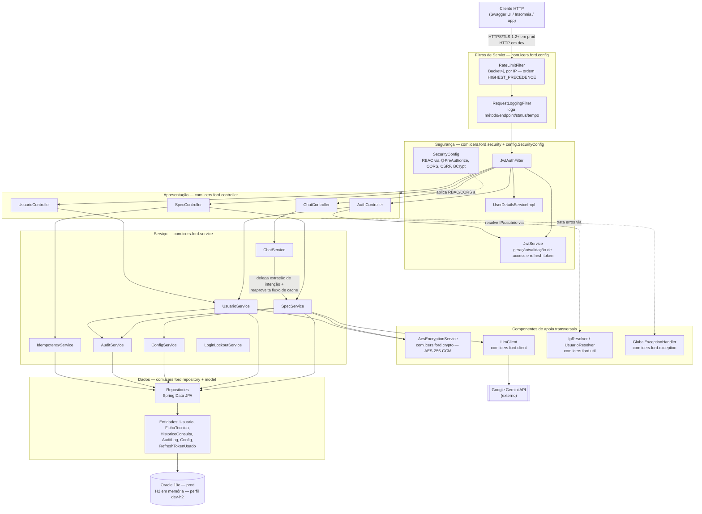

# SpecRadar — Arquitetura Orientada a Serviços (SOA)

> Documentação técnica de como o SpecRadar atende, hoje, aos requisitos
> formais de Arquitetura Orientada a Serviços e Web Services desta etapa do
> Challenge Ford × FIAP — com evidência extraída diretamente do código-fonte
> real do projeto (pacotes, classes e comportamento observável), não de uma
> descrição de intenção.

**Equipe:** Renan Dias Utida (RM 558540), Camila Pedroza da Cunha (RM 558768),
Isabelle Dallabeneta Carlesso (RM 554592), Nicoli Amy Kassa (RM 559104), Pedro
Almeida e Camacho (RM 556831) — FIAP 3ESPW.
**Professor da disciplina:** Salatiel Marinho.

---

## Sumário

- [Contexto e escopo](#contexto-e-escopo)
- [Critérios de avaliação exigidos](#critérios-de-avaliação-exigidos)
- [Arquitetura da solução](#arquitetura-da-solução)
- [1. Integração por Web Services (50%)](#1-integração-por-web-services-50)
- [2. Arquitetura Orientada a Serviços (20%)](#2-arquitetura-orientada-a-serviços-20)
- [3. Padrões e Boas Práticas (15%)](#3-padrões-e-boas-práticas-15)
- [4. Conexão com banco de dados (15%)](#4-conexão-com-banco-de-dados-15)
- [Tabela-resumo de cobertura](#tabela-resumo-de-cobertura)

---

## Contexto e escopo

O problema de negócio (Inteligência Competitiva Automotiva) exige uma
ferramenta que receba marca/modelo/versão de um veículo concorrente e uma
lista livre de atributos, e devolva uma ficha técnica padronizada — o que, do
ponto de vista de SOA, significa desenhar um serviço com contrato estável
(mesmo formato de saída independentemente do veículo consultado), reutilizável
por múltiplos consumidores (consulta direta, chat em linguagem natural,
upload de PDF) e desacoplado de onde o dado efetivamente vem (cache local ou
uma chamada a um provedor de IA externo).

Stack: Java 21, Spring Boot 3.5.14, Spring Security 6.x (RBAC via
`@PreAuthorize`), Spring Data JPA, Flyway, Bucket4j, springdoc-openapi
(Swagger), Oracle 19c em produção e H2 em memória num perfil de
desenvolvimento adicional.

## Critérios de avaliação exigidos

| Bloco | Sub-item | Peso |
|---|---|---:|
| Integração por Web Services | Desenho de arquitetura com os componentes usados | 10% |
| Integração por Web Services | APIs RESTful ou SOAP para comunicação entre sistemas | 20% |
| Integração por Web Services | Uso adequado de métodos HTTP | 10% |
| Integração por Web Services | Documentação das APIs (README ou Swagger) | 10% |
| Arquitetura Orientada a Serviços | Organização modular em serviços independentes e reutilizáveis | 10% |
| Arquitetura Orientada a Serviços | Separação clara entre apresentação, serviço e dados | 10% |
| Padrões e Boas Práticas | Adoção de padrões (REST, SOAP, JSON, XML, WSDL) | 8% |
| Padrões e Boas Práticas | Tratamento adequado de erros e exceções nos serviços | 7% |
| Conexão com banco de dados | Dependências e configurações de conexão | 8% |
| Conexão com banco de dados | Controle de migrações | 7% |
| **Total** | | **100%** |

---

## Arquitetura da solução

A API segue arquitetura em camadas clássica (apresentação → segurança →
serviço → dados), com um pequeno conjunto de componentes de apoio
transversais (criptografia, cliente do LLM externo, utilitários,
tratamento de erros) usados por mais de uma camada. O diagrama abaixo reflete
os pacotes reais do projeto (`com.icers.ford.*`) e o caminho que uma
requisição percorre:



**Como ler o diagrama:** a requisição entra pelos filtros de servlet
(`RateLimitFilter`, registrado com `Ordered.HIGHEST_PRECEDENCE` em
`FilterConfig`, roda antes de qualquer autenticação — mesmo uma tentativa de
força bruta no login é barrada por IP antes de chegar ao Spring Security),
passa pela cadeia de segurança (`JwtAuthFilter` → `SecurityConfig`, que aplica
RBAC por método via `@PreAuthorize` em cada controller), chega ao controller
correspondente, que delega a regra de negócio ao service — nunca o inverso, e
nunca um controller falando direto com um repository. Os componentes de apoio
(`AesEncryptionService`, `LlmClient`, `IpResolver`/`UsuarioResolver`,
`GlobalExceptionHandler`) são usados por mais de uma camada sem pertencer
estruturalmente a nenhuma — exatamente o papel de um componente transversal
numa arquitetura em camadas.

---

## 1. Integração por Web Services (50%)

**Desenho de arquitetura com os componentes usados (10%).** Ver diagrama
acima — construído a partir da estrutura real de pacotes do projeto, não de
uma versão idealizada.

**APIs RESTful (20%).** Toda comunicação é HTTP/JSON, sem SOAP/XML/WSDL —
opção deliberada pelo formato do problema (o cliente do SpecRadar é
majoritariamente um app mobile e uma UI web consumindo JSON, não um sistema
legado que exigisse contrato WSDL). 18 operações mapeadas em 17 rotas
distintas (`/specs/config` responde a `GET` e a `PUT`), organizadas por
recurso — contagem conferida diretamente contra as anotações
`@GetMapping`/`@PostMapping`/`@PutMapping`/`@PatchMapping`/`@DeleteMapping`
dos 4 controllers (`AuthController`, `SpecController`, `ChatController`,
`UsuarioController`, todos `@RestController`, nenhum oculto do Swagger via
`@Hidden`):

| Recurso | Método | Endpoint | Papel exigido |
|---|---|---|---|
| Autenticação | POST | `/api/v1/auth/login` | Público |
| Autenticação | POST | `/api/v1/auth/refresh` | Público (refresh token válido) |
| Especificações | POST | `/api/v1/specs/query` | ANALYST, ADMIN |
| Especificações | GET | `/api/v1/specs/{marca}/{modelo}/{versao}` | ANALYST, ADMIN |
| Especificações | GET | `/api/v1/specs/compare` | ANALYST, ADMIN |
| Especificações | GET | `/api/v1/specs/history` | ANALYST, ADMIN |
| Especificações | DELETE | `/api/v1/specs/{id}` | ADMIN |
| Especificações | GET / PUT | `/api/v1/specs/config` | ADMIN |
| Especificações | POST | `/api/v1/specs/from-pdf` | ANALYST, ADMIN |
| Chat | POST | `/api/v1/chat/message` | ANALYST, ADMIN |
| Usuários | GET | `/api/v1/usuarios` | ADMIN |
| Usuários | GET | `/api/v1/usuarios/{id}` | ADMIN |
| Usuários | POST | `/api/v1/usuarios` | ADMIN |
| Usuários | PUT | `/api/v1/usuarios/{id}` | ADMIN |
| Usuários | DELETE | `/api/v1/usuarios/{id}` | ADMIN |
| Usuários | PATCH | `/api/v1/usuarios/{id}/reativar` | ADMIN |
| Usuários | PATCH | `/api/v1/usuarios/{id}/anonimizar` | ADMIN |

**Uso adequado de métodos HTTP (10%).** Os cinco verbos são usados com a
semântica correta, não por convenção superficial: `GET` nunca tem efeito
colateral; `POST /specs/query` cria um registro de histórico de consulta como
efeito legítimo da operação (não é um "GET disfarçado"); `PUT /specs/config`
substitui a configuração inteira; `PATCH /usuarios/{id}/reativar` e
`/anonimizar` são atualizações parciais e específicas de estado — não
reaproveitam `PUT`; `DELETE /specs/{id}` remove o recurso.

**Documentação das APIs (10%).** `OpenApiConfig` configura o Swagger com
`SecurityScheme` Bearer JWT, servidores por ambiente, e exemplos reais de
request/response para login, consulta de specs, chat e cada código de erro
(`400`, `404`, `429`, `503`) — não é o Swagger gerado por padrão sem
customização, é uma especificação com descrição de negócio (níveis de
confiança dos campos, credenciais de teste, como usar). Endpoints ficam
acessíveis em `/swagger-ui/index.html` (desabilitado em produção via
`springdoc.swagger-ui.enabled=false`, reduzindo superfície de ataque num
ambiente real). O mesmo conjunto de endpoints também está documentado em
tabela no [`README-documentacao.md`](../README-documentacao.md) do projeto.

---

## 2. Arquitetura Orientada a Serviços (20%)

**Organização modular em serviços independentes e reutilizáveis (10%).** Cada
`service` cobre um domínio de negócio isolado (`SpecService` — especificações
e cache; `UsuarioService` — gestão de usuários e LGPD; `ChatService` —
linguagem natural; `ConfigService` — configuração administrável em runtime;
`AuditService` — auditoria e pseudonimização; `IdempotencyService`/
`LoginLockoutService` — controles transversais de segurança). O reuso não é
teórico:

- `ChatService` não duplica a lógica de busca de especificações — ele extrai
  a intenção da mensagem em linguagem natural e **delega para `SpecService`**,
  reaproveitando todo o fluxo de cache/reverificação/chamada ao LLM já
  existente.
- Dentro do próprio `SpecService`, o método privado `resolverComCache` foi
  extraído de `query()` e é reaproveitado por `queryFromPdf()`,
  parametrizado por uma função que decide *como* buscar o atributo que falta
  (texto vs. PDF) — evita duplicar a lógica de cache hit/expirada/parcial/miss
  entre os dois fluxos de entrada.
- `IpResolver` e `UsuarioResolver` (pacote `util`) são componentes
  reutilizados por múltiplos controllers/filtros (`ChatController`,
  `SpecController`, `UsuarioController`, `RequestLoggingFilter`) em vez de
  cada um reimplementar a própria resolução de IP ou de usuário autenticado.

**Separação clara entre apresentação, serviço e dados (10%).** Três pacotes
com responsabilidade única e nenhuma dependência invertida: `controller`
nunca acessa um `repository` diretamente — sempre via `service`; `service`
nunca constrói uma `ResponseEntity` ou lê um `HttpServletRequest` além do que
precisa (IP, método, URI) — a tradução para HTTP é responsabilidade do
controller e do `GlobalExceptionHandler`; `repository` é só interface Spring
Data JPA, sem regra de negócio.

---

## 3. Padrões e Boas Práticas (15%)

**Adoção de padrões (8%).** REST + JSON como único formato de comunicação,
consistente em toda a API (inclusive nas respostas de erro). Enums da própria
linguagem (`Role`, `ConfidenceLevel`) padronizam os valores possíveis de
campos-chave.

**Tratamento adequado de erros e exceções (7%).** `GlobalExceptionHandler`
(`@RestControllerAdvice`) centraliza o tratamento de 12 tipos de exceção
diferentes, cada um mapeado para o código HTTP correto (`401`, `403`, `404`,
`409`, `413`, `422`, `429`, `503`, `500` catch-all) — nunca deixando uma
exceção não mapeada vazar como um `500` cru sem contexto. O corpo malformado
(`HttpMessageNotReadableException`, erro sintático de JSON) é tratado
separadamente da falha de validação semântica
(`MethodArgumentNotValidException`, `422`) — o projeto distingue
explicitamente as duas categorias em vez de tratar ambas como "erro de
entrada genérico":

```java
// GlobalExceptionHandler.java
@ExceptionHandler(MethodArgumentNotValidException.class)
public ResponseEntity<ErrorResponse> handleValidation(...) {
    // 422 — corpo é JSON válido, mas viola uma regra de negócio (regex, tamanho)
}

@ExceptionHandler(HttpMessageNotReadableException.class)
public ResponseEntity<ErrorResponse> handleJsonInvalido(...) {
    // 400 — corpo nem chega a ser parseado como JSON válido
}
```

---

## 4. Conexão com banco de dados (15%)

**Dependências e configurações de conexão (8%).** Datasource configurado por
perfil Spring — `application-prod.properties` aponta para Oracle 19c (URL,
usuário e senha via variáveis de ambiente, nunca hardcoded, com pool HikariCP
dimensionado para produção: `maximum-pool-size=20`); um perfil adicional
`dev-h2` sobe H2 em memória, com dialeto e schema sobrescritos, para
desenvolvimento sem depender do Oracle da FIAP.

**Controle de migrações (7%).** Flyway com 9 migrations versionadas e
imutáveis, cobrindo desde a criação das tabelas até evoluções incrementais de
schema:

| Migration | Escopo |
|---|---|
| `V1__create_usuarios.sql` | Tabela `sr_usuarios` |
| `V2__create_fichas_tecnicas.sql` | Tabela `sr_fichas_tecnicas` (cache de especificações) |
| `V3__create_historico_consultas.sql` | Tabela `sr_historico_consultas` |
| `V4__create_audit_logs.sql` | Tabela `sr_audit_logs` |
| `V5__insert_usuarios_iniciais.sql` | Usuários ADMIN/ANALYST iniciais |
| `V6__create_config.sql` | Tabela `sr_config` (configuração em runtime) |
| `V7__idempotencia_ficha_tecnica.sql` | Índice único case-insensitive para idempotência |
| `V8__reverificacao_periodica.sql` | Controle de reverificação periódica de fichas |
| `V9__revogacao_refresh_token.sql` | Tabela `sr_refresh_tokens_usados` |

`spring.jpa.hibernate.ddl-auto=validate` garante que o schema em runtime
nunca diverge silenciosamente do que o Flyway aplicou — qualquer
inconsistência entre entidade JPA e schema real derruba o boot da aplicação
em vez de deixar a divergência passar despercebida.

---

## Tabela-resumo de cobertura

| Bloco | Peso | O que cobre | Status |
|---|---:|---|:---:|
| Integração por Web Services | 50% | Diagrama de arquitetura, 18 operações REST/JSON em 17 rotas distintas, verbos HTTP semânticos, Swagger customizado | ✅ |
| Arquitetura Orientada a Serviços | 20% | Services independentes com reuso real (`ChatService`→`SpecService`, `resolverComCache`), separação controller/service/repository | ✅ |
| Padrões e Boas Práticas | 15% | REST/JSON consistente, `GlobalExceptionHandler` com 12 exceções mapeadas | ✅ |
| Conexão com banco de dados | 15% | Datasource por perfil (Oracle prod / H2 dev-h2), 9 migrations Flyway versionadas | ✅ |
| **Total** | **100%** | | **✅** |
