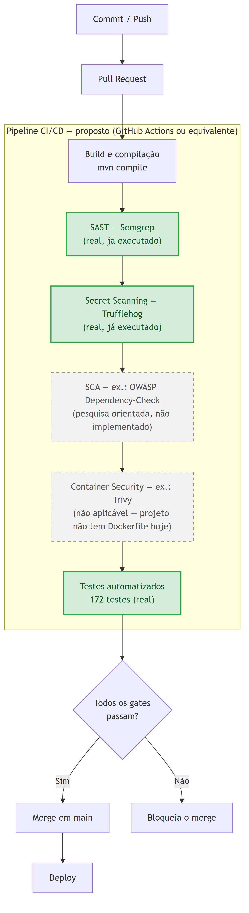
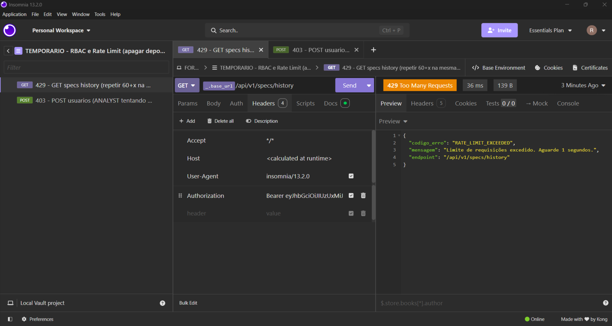
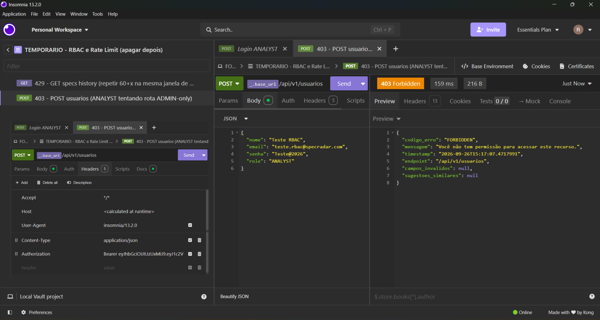
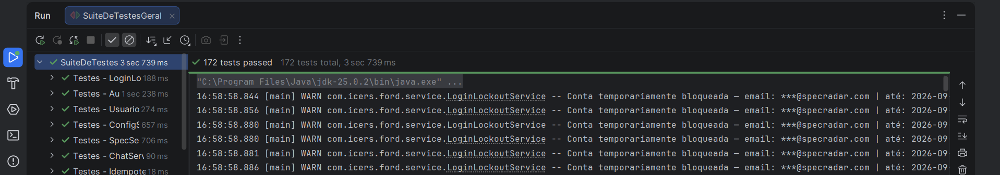
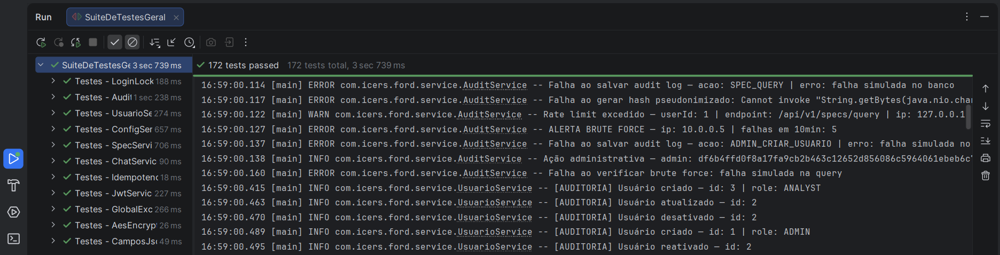

# SpecRadar — Cybersecurity — Sprint 3

> Documentação técnica de como o SpecRadar evolui sua postura de segurança
> para um modelo DevSecOps nesta etapa do Challenge Ford × FIAP — com
> evidência extraída diretamente do código-fonte real do projeto e de
> varreduras de ferramentas de segurança executadas de verdade contra o
> repositório, não de uma descrição de intenção. Trechos ilustrativos ou
> propostos (ainda não implementados) são marcados explicitamente como tal
> ao longo do documento.

| Integrante | RM |
|---|---|
| Renan Dias Utida | 558540 |
| Camila Pedroza da Cunha | 558768 |
| Isabelle Dallabeneta Carlesso | 554592 |
| Nicoli Amy Kassa | 559104 |
| Pedro Almeida e Camacho | 556831 |

**Turma:** FIAP 3ESPW.
**Professor da disciplina:** Vitor Miguel Lasse Silva.

---

## Sumário

- [Contexto e escopo](#contexto-e-escopo)
- [Etapas exigidas](#etapas-exigidas)
- [1. Pipeline DevSecOps & Análise de Código](#1-pipeline-devsecops--análise-de-código)
- [2. Segurança em Código e Infraestrutura](#2-segurança-em-código-e-infraestrutura)
- [3. Logs, Alertas e Resposta a Incidentes](#3-logs-alertas-e-resposta-a-incidentes)
- [4. Pesquisa de Vulnerabilidades (OWASP Top 10 e API)](#4-pesquisa-de-vulnerabilidades-owasp-top-10-e-api)
- [Tabela-resumo de cobertura](#tabela-resumo-de-cobertura)
- [Referências](#referências)

---

## Contexto e escopo

Esta é a segunda entrega formal de Cybersecurity do SpecRadar — a primeira
(Sprint 1) cobriu validação de entrada, autenticação/autorização, proteção
de APIs, criptografia/privacidade e trilha de auditoria como controles
isolados. A Sprint 3 evolui esse trabalho para um modelo **DevSecOps**:
segurança verificada com ferramentas reais no pipeline (não só descrita em
documento), e um plano formal de como o sistema detecta, registra e reage a
incidentes.

Por definição explícita da disciplina para esta etapa, a fonte normativa
deste documento é exclusivamente o roteiro de entregas de Cybersecurity da
Sprint 3 — os critérios gerais do Challenge usados no documento de SOA
(arquitetura, mobile, QA, IA) não se aplicam aqui, e nenhum requisito de
segurança fora desse roteiro foi usado como fonte.

| Ferramenta/Tecnologia | Papel neste documento | Versão |
|---|---|---|
| Semgrep | SAST — análise estática do código Java | 1.178.0 |
| Trufflehog | Secret Scanning — busca por credenciais expostas | 3.97.9 |
| Spring Security | Base de autenticação/autorização (Etapa 2) | 6.x |
| JWT (`jjwt`) | Base de hardening de API (Etapa 2) | 0.12.6 |
| AES-256-GCM | Criptografia local (Etapa 2) | — |

## Etapas exigidas

| # | Etapa | Objetivo |
|---|---|---|
| 1 | Pipeline DevSecOps & Análise de Código | Demonstrar a aplicação prática de ferramentas de segurança no pipeline e no código |
| 2 | Segurança em Código e Infraestrutura | Evidenciar práticas de segurança aplicadas diretamente no código e na infraestrutura |
| 3 | Logs, Alertas e Resposta a Incidentes | Mostrar como o sistema registra eventos críticos e como a equipe reage a um incidente de segurança |
| 4 | Pesquisa de Vulnerabilidades (OWASP Top 10 e API) | Mapear e pesquisar vulnerabilidades críticas comuns em aplicações web e APIs para blindar a arquitetura da solução |

O roteiro oficial não atribui peso percentual a cada etapa individualmente
— por isso a tabela acima não tem coluna de peso, diferente do documento de
SOA (onde os pesos são explícitos no material de referência).

---

## 1. Pipeline DevSecOps & Análise de Código

**Pedido:** implementação de SAST com Semgrep; implementação de Secret
Scanning com Trufflehog; pesquisa orientada sobre SCA e Container Security;
documento + diagrama do CI/CD com os pontos de execução + prints/resultados
das varreduras.

### 1.1 Diagrama do pipeline CI/CD



**O que é real e o que é proposto, marcado explicitamente no próprio
diagrama:** o projeto **não tem hoje** um pipeline CI/CD configurado (não
existe `.github/workflows/` no repositório) — o desenho do pipeline em si
é **proposto/ilustrativo**, no formato que a disciplina cita como exemplo
(GitHub Actions ou equivalente). Os dois estágios em verde sólido (SAST com
Semgrep e Secret Scanning com Trufflehog) já foram **executados de
verdade** contra o código real do projeto para este documento — não fazem
parte de uma automação ainda, mas o resultado que produzem é genuíno, não
simulado. Os estágios em cinza tracejado (SCA, Container Security) são
pesquisa orientada (seção 1.4) — nem implementados nem automatizados.

### 1.2 SAST real com Semgrep

Varredura executada contra os 68 arquivos Java rastreados pelo git em
`src/main/java`, combinando três conjuntos de regras do Registro público do
Semgrep — `p/java` (regras específicas da linguagem), `p/security-audit`
(padrões gerais de segurança: injeção, criptografia fraca, etc.) e
`p/owasp-top-ten` (mapeado diretamente à pesquisa da Etapa 4 deste mesmo
documento):

```
$ semgrep --config=p/java --config=p/security-audit --config=p/owasp-top-ten src/main/java

┌─────────────┐
│ Scan Status │
└─────────────┘
  Scanning 68 files tracked by git with 690 Code rules:

  Language      Rules   Files          Origin      Rules
 ─────────────────────────────        ───────────────────
  java             86      68          Community     690
  <multilang>       8      68

┌──────────────┐
│ Scan Summary │
└──────────────┘
✅ Scan completed successfully.
 • Findings: 0 (0 blocking)
 • Rules run: 94
 • Targets scanned: 68
 • Parsed lines: ~100.0%
```

**Nota sobre os dois números de regras** (690 vs. 94): "**Code rules:
690**" é o total baixado do Registro para as três configs combinadas —
verificado de forma exata rodando cada config isoladamente antes de
combinar (`p/java` carrega 60 regras, `p/security-audit` 225, `p/owasp-top-ten`
560 — a soma, 845, é maior que os 690 combinados porque as três configs
compartilham regras entre si; o Registro deduplica automaticamente regras
repetidas ao combinar múltiplas configs). "**Rules run: 94**" é o
subconjunto desse catálogo combinado que de fato se aplica a arquivos Java
depois do filtro do Semgrep (86 regras Java + 8 multilinguagem genéricas);
o mesmo mecanismo de deduplicação por sobreposição entre pacotes se aplica
nesse nível também, ainda que não tenhamos isolado a contagem exata de
regras aplicadas por config antes da combinação — a evidência verificada
com precisão de ponta a ponta é a do nível do catálogo (845 → 690).

**Resultado real: 94 regras aplicáveis, zero findings.** Vale registrar com
a mesma honestidade usada no resto da documentação: **zero findings não
significa "código formalmente livre de vulnerabilidades"** — significa que,
para este conjunto de regras públicas da comunidade Semgrep, nenhum padrão
conhecido de vulnerabilidade foi encontrado no código Java do projeto. Um
resultado limpo é uma evidência real e válida (é exatamente o que a
Sprint 1 já havia buscado manualmente — validação de entrada, criptografia,
tratamento de erro — agora confirmado por uma ferramenta automatizada e
independente), mas não substitui uma auditoria de segurança completa nem
regras proprietárias/pagas do Semgrep, que exigiriam `semgrep login`.

### 1.3 Secret Scanning real com Trufflehog

**Tentativa 1 — modo nativo de histórico Git — encontrou um problema real
de ambiente, documentado em vez de escondido:**

```
$ trufflehog git file://.

{"msg":"fatal: unable to create temp-file: No such file or directory", ...}
{"msg":"finished parsing git log.","total_log_size":0}
{"msg":"scanning git repo complete","commits_scanned":1}
```

O Trufflehog clona o repositório e tenta rodar `git log -p` internamente
para percorrer commit a commit — nesse ambiente (Windows + Git for Windows
via MSYS), essa chamada específica falha com um erro do próprio `git`
(`unable to create temp-file`), um problema conhecido de interoperabilidade
entre o binário Go do Trufflehog e o `git.exe` do Git for Windows na
criação de arquivos temporários. Confirmamos que **não é falta de
histórico** — `git log -p --all` roda normalmente quando executado
manualmente no mesmo repositório (64 commits, mais de 26 mil linhas de
diff) — o problema é específico de como o Trufflehog invoca o `git` como
subprocesso neste ambiente.

**Tentativa 2 — modo `filesystem` — funcionou e produziu resultado real:**

```
$ trufflehog filesystem .

{"msg":"finished scanning","chunks":1478,"bytes":5845944,
 "verified_secrets":0,"unverified_secrets":19, ...}
```

Esse modo varre o diretório de trabalho inteiro, incluindo os objetos
internos do `.git` (que armazenam o conteúdo de versões antigas de
arquivos rastreados) — na prática, cobre uma fatia real do histórico
mesmo sem percorrer commit a commit oficialmente. Confirmamos isso: um dos
arquivos sinalizados é um blob interno do Git (`git cat-file -p <hash>`)
que corresponde a uma versão antiga do `.env`, não ao arquivo atual.

**Resultado: 1.478 blocos analisados, ~5,8 MB de conteúdo, 19 achados não
verificados, 0 verificados.** Todos os 19 são do mesmo detector (`JDBC`) e
a mesma string, repetida em várias versões do `.env`/`.env.example`, no
`README.md`, em `application-dev.properties` e nos objetos internos do
`.git`:

```
jdbc:oracle:thin:@oracle.fiap.com.br:1521:orcl
```

**Triagem real desse achado:** essa é a URL de conexão JDBC do banco Oracle
**institucional da FIAP**, sem usuário nem senha embutidos na string — só
host, porta e SID. O detector do Trufflehog sinaliza qualquer string com
formato de URI JDBC como candidata a credencial, mas não conseguiu
**verificá-la** (por isso "não verificado", não "verificado") porque não há
nenhuma credencial ali para validar. Isso não é um vazamento — é o mesmo
tipo de endpoint compartilhado que qualquer aluno da FIAP com acesso ao
Oracle da instituição já usaria. Reforça, com uma ferramenta de verdade e
não só inspeção manual, a mesma conclusão já registrada anteriormente no
projeto: o `.env` real (com credenciais de fato, como `GEMINI_API_KEY` e a
senha do Oracle) nunca foi commitado — só `.env.example`, com placeholders.

### 1.4 SCA e Container Security — pesquisa orientada

Estas duas práticas não são implementadas no projeto hoje — o roteiro pede
explicitamente pesquisa e contextualização de onde elas entrariam no
ecossistema, não implementação:

**SCA (Software Composition Analysis)** analisa as dependências de
terceiros de um projeto (no caso do SpecRadar, as bibliotecas declaradas no
`pom.xml` — Spring Boot, JJWT, springdoc-openapi, Flyway, etc.) em busca de
vulnerabilidades conhecidas (CVEs) publicadas para versões específicas
dessas bibliotecas. Ferramentas típicas: **OWASP Dependency-Check** (roda
localmente ou em CI, sem depender de serviço externo), **Snyk** e
**Dependabot** (nativo do GitHub, abre PR automático quando uma dependência
tem CVE conhecido). No pipeline proposto (seção 1.1), esse estágio entraria
logo depois do build — faz sentido resolver dependências antes de
analisá-las, e antes do SAST, porque uma dependência vulnerável é um
problema independente de qualquer código que o time escreveu.

**Container Security** analisa a imagem de container de uma aplicação
(camadas do SO base, pacotes instalados, configuração) em busca de
vulnerabilidades e más práticas — ferramenta típica:
[**Trivy**](https://github.com/aquasecurity/trivy) (open-source, escaneia
tanto a imagem final quanto o `Dockerfile` que a gera). **Não é
aplicável ao SpecRadar hoje** — o projeto não tem `Dockerfile` nem processo
de containerização (roda direto via `mvn spring-boot:run` ou o `.jar`
empacotado, conforme documentado no `README.md` principal). Se o projeto
vier a ser containerizado no futuro, esse estágio entraria no pipeline
depois do build da imagem e antes do deploy — mesma lógica do SCA, mas para
a camada de infraestrutura do container em vez das dependências Java.

---

## 2. Segurança em Código e Infraestrutura

**Pedido:** evidências de correções ou melhorias reais no código —
criptografia local, hardening de API (rate limit, validação de entrada,
JWT seguro) e controle de acesso por perfil (RBAC); trechos de código,
prints, commits, explicações técnicas.

O roteiro usa nomes de papéis genéricos como exemplo ("Brigadista, Gestor,
Administrador") — um template compartilhado entre diferentes desafios do
Challenge. No SpecRadar, os papéis reais são **ANALYST** e **ADMIN**; o
mapeamento conceitual (perfis distintos, permissões distintas, checadas em
todo endpoint sensível) é o que importa, não os nomes específicos.

### 2.1 Criptografia local (AES-256-GCM)

`AesEncryptionService` (`src/main/java/com/icers/ford/crypto/AesEncryptionService.java`)
implementa AES-256-GCM — modo autenticado, não só confidencial: se o texto
cifrado for adulterado ou a chave mudar, a descriptografia falha com
exceção em vez de devolver dado corrompido silenciosamente:

```java
private static final String ALGORITMO = "AES/GCM/NoPadding";
private static final int TAMANHO_IV_BYTES = 12;
private static final int TAMANHO_TAG_BITS = 128;

public String encrypt(String textoPlano) {
    byte[] iv = new byte[TAMANHO_IV_BYTES];
    new SecureRandom().nextBytes(iv);          // IV aleatório novo a cada chamada

    Cipher cipher = Cipher.getInstance(ALGORITMO);
    cipher.init(Cipher.ENCRYPT_MODE, chave, new GCMParameterSpec(TAMANHO_TAG_BITS, iv));
    byte[] cifrado = cipher.doFinal(textoPlano.getBytes(StandardCharsets.UTF_8));

    // Formato armazenado: Base64(IV || texto cifrado + tag de autenticação)
    ...
}
```

A aplicação é **transparente** via `CamposJsonEncryptedConverter`, um
`AttributeConverter` do JPA anotado com `@Convert` (não `autoApply`, para
não criptografar campos onde isso não faria sentido, como email):

```java
@Component
@Converter(autoApply = false)
public class CamposJsonEncryptedConverter implements AttributeConverter<String, String> {
    private final AesEncryptionService aesEncryptionService;

    @Override
    public String convertToDatabaseColumn(String atributoEmTextoPlano) {
        return aesEncryptionService.encrypt(atributoEmTextoPlano);
    }

    @Override
    public String convertToEntityAttribute(String valorCifradoNoBanco) {
        return aesEncryptionService.decrypt(valorCifradoNoBanco);
    }
}
```

Isso é aplicado no campo `campos_json` de `FichaTecnica` — o JSON bruto com
os dados técnicos extraídos pelo Gemini fica cifrado em repouso no Oracle;
o resto do código (`SpecService`, `ChatService`, etc.) continua lendo/
escrevendo texto plano normalmente, sem saber que a criptografia existe.
Commit real de referência: `29b9c22` (introduz `AesEncryptionService.java`
— confirmado via `git show --stat`, não só pela mensagem do commit).

### 2.2 Hardening de API

**Rate limiting real, em duas camadas independentes** — uma descoberta que
vale registrar em detalhe, porque as duas produzem formatos de resposta
`429` diferentes, e isso é intencional/estrutural, não uma inconsistência:

**Camada 1 — por IP, em `RateLimitFilter`.** É um filtro de servlet puro
(`OncePerRequestFilter`), registrado com prioridade máxima em
`FilterConfig` — roda **antes** do `JwtAuthFilter` e do Spring Security,
aplicado a todo `/api/*`, garantindo que o limite vale mesmo para
requisições não autenticadas (ex.: força bruta em `/login`):

```properties
ratelimit.ip.requests-per-minute=60
```

```java
// config/RateLimitFilter.java
response.setStatus(HttpStatus.TOO_MANY_REQUESTS.value());
response.addHeader("Retry-After", String.valueOf(retryAfterSeconds));
response.getWriter().write(
        "{" +
                "\"codigo_erro\":\"RATE_LIMIT_EXCEEDED\"," +
                "\"mensagem\":\"Limite de requisições excedido. Aguarde " + retryAfterSeconds + " segundos.\"," +
                "\"endpoint\":\"" + uri + "\"" +
                "}"
);
```

Evidência real, capturada repetindo `GET /api/v1/specs/history` mais de 60
vezes em menos de um minuto com o mesmo usuário autenticado:



**Camada 2 — por usuário, em `SpecService`.** Só nos dois endpoints que
disparam chamadas caras ao Gemini (`/specs/query` e `/specs/from-pdf`), um
segundo limite (também 60/min para `/query`, 10/min para `/from-pdf`) é
checado dentro do service, lançando `RateLimitExceededException`.

**Por que os dois formatos de `429` são diferentes:** um `OncePerRequestFilter`
roda **antes** do `DispatcherServlet` do Spring MVC — ele nunca vê o
`@ExceptionHandler` do `GlobalExceptionHandler`, porque esse mecanismo só
intercepta exceções lançadas dentro do fluxo do Spring MVC. Por isso a
Camada 1 escreve o JSON manualmente, com só 3 campos (`codigo_erro`,
`mensagem`, `endpoint` — sem `timestamp`, `campos_invalidos` nem
`sugestoes_similares`). A Camada 2, por lançar uma exceção normal dentro do
service (dentro do fluxo do Spring MVC), chega ao `GlobalExceptionHandler`
normalmente e usa o `ErrorResponse` completo de 6 campos — o mesmo formato
do `403` da seção 2.3. O print acima capturou a Camada 1 (`GET /specs/history`
não tem limite por usuário, só o limite geral por IP) — é evidência real e
correta do comportamento, não um exemplo "escolhido a dedo" pra parecer
uniforme com o resto da API. (Detalhe pequeno, visível no próprio print:
a mensagem "Aguarde 1 segundos" não pluraliza corretamente pro singular —
um typo cosmético no código, sem efeito funcional.)

**Validação de entrada real**, via Bean Validation nos DTOs de request —
exemplo real de `SpecQueryRequest`:

```java
@NotBlank(message = "Marca é obrigatória")
@Size(min = 2, max = 50, message = "Marca deve ter entre 2 e 50 caracteres")
@Pattern(regexp = "^[a-zA-ZÀ-ÿ\\s\\-]+$",
        message = "Marca deve conter apenas letras, espaços e hífens")
String marca,

@NotEmpty(message = "Lista de atributos é obrigatória")
@Size(max = 20, message = "Máximo de 20 atributos por consulta")
List<String> atributos
```

Isso barra tanto ausência de campo quanto conteúdo malicioso/fora do
padrão (ex.: tentativa de injeção via caractere fora do `Pattern`) antes de
qualquer lógica de negócio rodar — rejeitado com `422` pelo
`GlobalExceptionHandler`. Commit real de referência: `0f73be9` (confirmado
via `git show --stat`).

**JWT seguro**: `JwtService` assina com HMAC sem fixar o algoritmo
explicitamente (`Keys.hmacShaKeyFor` + `.signWith(signingKey)`) — o JJWT
seleciona automaticamente o HMAC mais forte suportado pelo tamanho da
chave, resultando em **HS512** na prática (confirmado decodificando um
token real). Tokens de acesso expiram em 8h, refresh em 7 dias, e cada
refresh é de uso único — reaproveitar um `jti` já rotacionado é rejeitado
com `401`. Detalhe completo de geração, validação e rotação já documentado
no Critério 3 (JWT) do `documentacao-soa-sprint3.md` — não duplicado aqui
por extenso para evitar dois textos divergindo com o tempo. Commit real de
referência: `45ee1b2` (introduz `JwtService`/`JwtAuthFilter`, confirmado
via `git show --stat`).

### 2.3 Controle de acesso por perfil (RBAC)

Dois papéis reais (`ADMIN`, `ANALYST`), checados via `@PreAuthorize`
diretamente em cada método de controller — não só por rota:

```java
// UsuarioController.java — exclusivo de ADMIN
@PreAuthorize("hasRole('ADMIN')")
@PostMapping
public ResponseEntity<UsuarioResponse> criar(...) { ... }

// SpecController.java — ANALYST e ADMIN
@PreAuthorize("hasAnyRole('ANALYST', 'ADMIN')")
@PostMapping("/query")
public ResponseEntity<SpecResponse> query(...) { ... }
```

Evidência real, capturada tentando `POST /api/v1/usuarios` autenticado
como `analyst@specradar.com` (rota exclusiva de `ADMIN`):



Todos os 7 endpoints de `/usuarios/**` (gestão de contas, LGPD) são
`ADMIN`-only; `/specs/**` e `/chat/**` aceitam `ANALYST` e `ADMIN`; ações
administrativas dentro de `/specs/**` (deletar ficha, alterar configuração)
voltam a ser `ADMIN`-only. Detalhe completo (incluindo a tabela de
permissões por ação) já documentado no Critério 2 do
`documentacao-soa-sprint3.md`. Commit real de referência: `1ee4a0b`
(introduz RBAC de administrador e bloqueio de conta por força bruta —
confirmado via `git show` completo: `@PreAuthorize` aparece 4 vezes nesse
commit, e `LoginLockoutService.java` é um dos arquivos novos).

---

## 3. Logs, Alertas e Resposta a Incidentes

**Pedido:** plano de monitoramento (logs estruturados + métricas e
alertas) e plano/fluxo de resposta a incidentes segundo o modelo SANS
PICERL; exemplos de logs estruturados, regras/gatilhos de alertas e o
fluxo documentado de resposta a incidentes aplicados ao projeto. Nota do
roteiro: não é necessário documentar Lições Aprendidas.

### 3.1 Logs estruturados reais

`logback-spring.xml` define, **só no perfil `prod`**, três destinos reais
(o perfil `dev` usa um formato legível em texto puro, sem essa estrutura —
faz sentido só existir onde monitoramento de verdade importaria):

| Destino | Conteúdo | Retenção |
|---|---|---|
| `logs/specradar.log` (+ console, formato JSON) | Todo log `INFO`+ da aplicação | 30 dias, cap de 1 GB |
| `logs/security.log` | Só `WARN`+ do Spring Security **e** todo log do `AuditService` (`INFO`+) | 90 dias |

Cada linha em produção é uma entrada JSON estruturada
(`{"timestamp":...,"level":...,"logger":...,"mensagem":...}`), não texto
livre — pensada para ser consumida por uma ferramenta de log
centralizado, não só lida por humano no console.

`AuditService` é o produtor central dos eventos críticos que o roteiro
pede — login, falhas de autenticação e alterações críticas — cada método
correspondendo a um tipo de evento, todos `@Async` (não bloqueiam a
requisição principal por causa do log):

```java
// service/AuditService.java
public void logAuthFailure(String ip, String emailTentado) {
    salvar(null, "/api/v1/auth/login", "POST", 401, ip,
            "AUTH_FAILURE", "Credenciais inválidas para: " + mascararEmail(emailTentado));
    verificarBruteForce(ip);   // já verifica o padrão de ataque na hora
}

public void logAuthSuccess(Long userId, String ip, String email) { ... }   // AUTH_SUCCESS
public void logAdminAction(Long adminId, String ip, String metodoHttp,
                           String endpoint, int status, String acao, String detalhe) { ... }   // ADMIN_*
public void logRateLimitExceeded(Long userId, String endpoint, String ip) { ... }   // RATE_LIMIT_EXCEEDED
```

**Exemplos reais** (não digitados à mão) — capturados numa execução real
da suíte de testes (mesmo mecanismo de evidência já usado no Critério 5 do
`documentacao-soa-sprint3.md`, 172/172 testes passando), formato de
console do perfil `dev`:

```
16:58:58.844 [main] WARN  c.icers.ford.service.LoginLockoutService -- Conta temporariamente bloqueada — email: ***@specradar.com | até: 2026-09-26T19:59:28.841500100Z
```



```
16:59:00.122 [main] WARN  c.icers.ford.service.AuditService -- Rate limit excedido — userId: 1 | endpoint: /api/v1/specs/query | ip: 127.0.0.1
16:59:00.127 [main] ERROR c.icers.ford.service.AuditService -- ALERTA BRUTE FORCE — ip: 10.0.0.5 | falhas em 10min: 5
```



O mesmo evento de brute force, se emitido em `prod` em vez de `dev`, sairia
no formato JSON estruturado real definido em `logback-spring.xml` —
aplicando o encoder real do perfil `prod` ao mesmo evento (transformação
mecânica a partir de um padrão já documentado, **não uma captura real de
produção**, já que o projeto não roda em `prod` neste ambiente de teste):

```json
{"timestamp":"2026-09-26T16:59:00.127-0300","level":"ERROR","app":"sprint-ford-api","profile":"prod","thread":"main","logger":"c.i.f.service.AuditService","mensagem":"ALERTA BRUTE FORCE — ip: 10.0.0.5 | falhas em 10min: 5","exception":""}
```

Cada chamada grava uma linha em `sr_audit_logs` (trilha de auditoria
persistente, não só um arquivo de log) **e** loga estruturado — o `userId`
nunca aparece em texto puro em nenhum dos dois, só o hash HMAC-SHA256
pseudonimizado (`hashUserId`), e o email sempre mascarado
(`mascararEmail`, só o domínio visível). "Alterações críticas" na prática
são as 6 ações administrativas que chamam `logAdminAction` — criar,
atualizar, desativar, reativar e anonimizar usuário, e deletar ficha
técnica — cada uma com o método/endpoint/status real da requisição, não um
placeholder.

### 3.2 Métricas e alertas

O roteiro cita "API, mobile, IoT, ML" como escopo geral de métricas e
alertas — este documento cobre só a **API** (backend do SpecRadar), que é
o escopo de Cyber sob responsabilidade deste chat. O app mobile
(`Sprint_Mobile`) não tem hoje nenhum mecanismo de logging, métricas ou
observabilidade implementado — confirmado revisando o README real desse
repositório, consistente com a integração real com a API ainda estar
pendente (ver Etapa 4, seção 4.3). IoT não existe no SpecRadar. ML é
responsabilidade de outra frente do time, fora deste documento.

O roteiro não pede um dashboard (essa exigência aparecia só na versão
geral do desafio, que não é a fonte usada para Cyber nesta etapa) — o que
existe hoje é alerta via log, não um painel visual. Honestidade sobre o
que é real e o que seria necessário para produção:

| Sinal | Hoje (real) | Produção (proposto) |
|---|---|---|
| Força bruta de login | `AuditService.verificarBruteForce` loga `ERROR` (`"ALERTA BRUTE FORCE"`) após 5+ falhas do mesmo IP em 10 min — evidência real capturada em teste automatizado (ver Critério 5 do `documentacao-soa-sprint3.md`) | Alerta `ERROR` em `security.log` encaminhado automaticamente pra um canal (Slack/e-mail/PagerDuty) via um coletor de log (ex.: Filebeat + Elastic, ou Grafana Loki) |
| Bloqueio de conta | `LoginLockoutService` bloqueia a conta por 30s após 5 falhas em 10 min, com log `WARN` | Métrica de contagem de bloqueios/hora, com alerta se o volume subir muito acima do normal (indício de campanha de ataque, não só um usuário esquecendo a senha) |
| Rate limit excedido | `WARN` real em `RateLimitFilter`/`AuditService.logRateLimitExceeded`, por IP e por usuário | Métrica de taxa de `429` por endpoint — um pico isolado é normal, um platô sustentado indica possível abuso automatizado |
| Erro de extração do Gemini (`503`) | `ERROR` real logado pelo `GlobalExceptionHandler` | Métrica de taxa de erro da integração externa, com alerta se ultrapassar um limiar (indício de instabilidade do provedor, não do próprio SpecRadar) |

O que já existe (coluna "Hoje") é 100% real, verificável no código e nos
logs reais gerados por teste. A coluna "Produção" é proposta — nenhuma
dessas ferramentas de agregação/alerta está implementada ou simulada aqui.

### 3.3 Fluxo de resposta a incidentes ([SANS PICERL](https://sans.org/white-papers/33901))

**Cenário: força bruta de login.** Escolhido porque os mecanismos de
detecção e contenção já existem de verdade no código — o fluxo abaixo
narra comportamento real, não hipotético, exceto onde marcado.

| Fase | O que acontece no SpecRadar |
|---|---|
| **Preparação** | Antes de qualquer ataque: `LoginLockoutService` e `AuditService.verificarBruteForce` já ativos em todo `POST /auth/login`; `security.log` retendo 90 dias; `hashUserId`/`mascararEmail` garantindo que o log em si não vira um vazamento de dado pessoal. |
| **Identificação** | Ao 5º `AUTH_FAILURE` do mesmo IP em 10 minutos, `verificarBruteForce(ip)` loga `ERROR — "ALERTA BRUTE FORCE — ip: {} \| falhas em {}min: {}"` e grava um registro `BRUTE_FORCE_ALERT` em `sr_audit_logs` — o incidente é identificado automaticamente, sem intervenção humana. |
| **Contenção** | Em paralelo (mecanismo independente, checado por conta — não por IP), `LoginLockoutService` já bloqueou a conta-alvo por 30s assim que ela atingiu 5 falhas em 10 minutos — a conta fica inacessível a mais tentativas de senha imediatamente, mesmo antes de qualquer analista olhar o alerta. `RateLimitFilter` (60 req/min por IP) contém, em paralelo, o volume bruto de tentativas do mesmo IP contra qualquer endpoint. |
| **Erradicação** | **Proposto** (não automatizado hoje): um administrador consulta `sr_audit_logs` filtrando por `BRUTE_FORCE_ALERT`, confirma se é um ataque real (vs. um usuário legítimo digitando a senha errada repetidamente), e — se a conta-alvo parecer comprometida, não só atacada — usa `DELETE /api/v1/usuarios/{id}` (desativação, `ADMIN`-only, já real) para tirá-la de circulação até confirmar que a senha foi trocada. Bloqueio de IP a nível de rede/WAF não existe hoje — ficaria nessa fase se implementado. |
| **Recuperação** | Automática para o caso comum: o bloqueio de 30s expira sozinho (`segundosRestantesDeBloqueio` retorna vazio depois disso) e a conta volta a aceitar login normalmente. Para o caso de desativação manual na fase anterior, a recuperação é `PATCH /api/v1/usuarios/{id}/reativar` (`ADMIN`-only, já real) depois de confirmado que a ameaça passou. |

Por instrução explícita do roteiro, a fase de **Lições Aprendidas não é
documentada** aqui.

**Nota sobre o cenário de vazamento de segredo** (não desenvolvido como um
segundo incidente completo, para não diluir o cenário principal, que é
real e mais rico em evidência): a Etapa 1 já cobre a ponta preventiva desse
risco via Secret Scanning (Trufflehog). Se um segredo de fato escapasse
dessa varredura, o fluxo seguiria a mesma estrutura PICERL acima, trocando
a Identificação (hoje, o log de `AuditService`) por um alerta do
Trufflehog/GitGuardian rodando no pipeline proposto (seção 1.1) — o
restante do raciocínio (conter, erradicar — nesse caso, revogar/rotacionar
a credencial vazada — e recuperar) é estruturalmente o mesmo.

---

## 4. Pesquisa de Vulnerabilidades (OWASP Top 10 e API)

**Pedido:** pesquisa direcionada e mapeamento prático baseado em OWASP Top
10, OWASP API Top 10, OWASP Mobile Top 10 e OWASP ASVS, com análise de
riscos e recomendações de mitigação; documento consolidado com a pesquisa,
matriz de mapeamento e plano de mitigação.

As quatro versões usadas foram confirmadas diretamente nas páginas oficiais
da OWASP nesta sessão, não assumidas de memória — cada padrão evolui em
ritmos diferentes, e usar uma versão desatualizada de um deles enquanto os
outros estão atuais seria inconsistente:

| Padrão | Versão usada | Confirmada em |
|---|---|---|
| OWASP Top 10 | **2025** | [top10.owasp.org/2025](https://top10.owasp.org/2025) |
| OWASP API Security Top 10 | **2023** (ainda a mais atual) | [api-security.owasp.org](https://api-security.owasp.org/) |
| OWASP Mobile Top 10 | **2024** | [owasp.org/www-project-mobile-top-10](https://owasp.org/www-project-mobile-top-10/) |
| OWASP ASVS | **5.0** (mai/2025) | [github.com/OWASP/ASVS](https://github.com/OWASP/ASVS) — 345 requisitos em 17 capítulos |

### 4.1 OWASP Top 10:2025

| # | Categoria | Aplica-se? | Situação real no SpecRadar |
|---|---|---|---|
| A01:2025 | Broken Access Control | Sim | **Mitigado** — `@PreAuthorize` método a método em todo endpoint sensível, postura "autenticado por padrão" no `SecurityConfig` (Critério 2 SOA). |
| A02:2025 | Security Misconfiguration | Sim | **Mitigado** — HTTPS/TLS real em `prod`, Swagger desabilitado em `prod`, CORS restrito, `.env` real nunca commitado (confirmado via Trufflehog, Etapa 1.3). |
| A03:2025 | Software Supply Chain Failures | Sim | **Lacuna real** — SCA não implementado; dependências do `pom.xml` nunca auditadas contra CVEs conhecidos (Etapa 1.4, pesquisa orientada apenas). |
| A04:2025 | Cryptographic Failures | Sim | **Mitigado** — AES-256-GCM (dados em repouso), BCrypt fator 12 (senhas), HS512 (JWT), TLS (dados em trânsito em `prod`). |
| A05:2025 | Injection | Sim | **Mitigado** — Spring Data JPA (queries parametrizadas, nunca concatenação de SQL), Bean Validation com `@Pattern` restritivo, confirmado por 0 findings do Semgrep incluindo regras de SQLi/XXE/command injection (Etapa 1.2). |
| A06:2025 | Insecure Design | Sim | **Mitigado parcialmente** — rate limiting em duas camadas, idempotência real (`Idempotency-Key`), `LoginLockoutService` — decisões de design pensadas contra abuso, não só a funcionalidade feliz. |
| A07:2025 | Authentication Failures | Sim | **Mitigado** — JWT com expiração curta (8h) + rotação de refresh por `jti`, BCrypt, bloqueio de conta por força bruta. |
| A08:2025 | Software or Data Integrity Failures | Sim | **Mitigado** — AES-GCM é modo autenticado (detecta adulteração do texto cifrado), assinatura JWT verificada em toda requisição, idempotência evita reprocessamento indevido. |
| A09:2025 | Security Logging and Alerting Failures | Sim | **Mitigado** — `AuditService` + `security.log` com 90 dias de retenção, detecção automática de força bruta (Etapa 3 completa). |
| A10:2025 | Mishandling of Exceptional Conditions | Sim | **Mitigado, com evidência rica** — `GlobalExceptionHandler` centralizado (16 handlers); `LlmClient.parsearResposta` nunca falha aberta: se o JSON do Gemini vier malformado/incompleto, a chamada falha explicitamente com `503` em vez de silenciosamente devolver dado corrompido como se fosse válido (ver 4.2, mesma evidência). |

### 4.2 OWASP API Security Top 10:2023

Este é o mapeamento mais rico dos quatro, porque quase toda categoria tem
mecanismo real e específico da API do SpecRadar pra citar:

| # | Categoria | Situação real no SpecRadar |
|---|---|---|
| API1:2023 | Broken Object Level Authorization (BOLA) | **Risco estruturalmente baixo** — o domínio não tem "recurso privado por usuário" no sentido clássico do BOLA: fichas técnicas são dado compartilhado (cache), não pertencem a um usuário específico; `/usuarios/**` é `ADMIN`-only por completo, então não existe cenário de um `ANALYST` acessando dado de outro usuário por manipulação de ID. |
| API2:2023 | Broken Authentication | **Mitigado** — mesmo mecanismo do A07:2025 acima. |
| API3:2023 | Broken Object Property Level Authorization | **Mitigado estruturalmente** — DTOs explícitos (`record`s) em vez de bind direto em entidade JPA: não existe mass assignment porque o cliente nunca consegue setar um campo que o DTO não declara (ex.: `UsuarioCreateRequest` não tem campo `ativo` — não dá pra criar um usuário já inativo via payload). |
| API4:2023 | Unrestricted Resource Consumption | **Mitigado** — rate limiting em duas camadas (IP e usuário), limite mais agressivo em `/from-pdf` (10/min, por ser o mais caro), máximo de 20 atributos por consulta (`SpecQueryRequest`), limite de tamanho de arquivo em `/from-pdf` (`413`). |
| API5:2023 | Broken Function Level Authorization | **Mitigado** — `@PreAuthorize` método a método, não só por prefixo de rota: a mesma família `/specs/**` tem métodos `ANALYST`+`ADMIN` e métodos `ADMIN`-only lado a lado no mesmo controller. |
| API6:2023 | Unrestricted Access to Sensitive Business Flows | **Mitigado parcialmente** — rate limit reduz abuso automatizado do fluxo mais caro (consulta com IA); não há um controle adicional de "padrão de uso humano plausível" além disso. |
| API7:2023 | Server Side Request Forgery (SSRF) | **Não aplicável hoje** — nenhum endpoint aceita uma URL fornecida pelo cliente para o servidor buscar; o upload em `/from-pdf` são bytes enviados pelo cliente, não uma URL a ser baixada pelo servidor, e a chamada ao Gemini usa endpoint fixo, não parametrizável pelo usuário. |
| API8:2023 | Security Misconfiguration | **Mitigado** — mesmo do A02:2025. |
| API9:2023 | Improper Inventory Management | **Mitigado** — versionamento explícito (`/api/v1`), Swagger/OpenAPI gerado automaticamente a partir do código (nunca um documento solto desatualizado — Critério 6 do `documentacao-soa-sprint3.md`). |
| API10:2023 | Unsafe Consumption of APIs | **Mitigado, evidência real e rica** — o próprio SpecRadar consome a API do Gemini como uma API de terceiro não confiável. `LlmClient.parsearResposta` valida a estrutura da resposta (existência do campo `campos`), nunca trata JSON malformado como sucesso silencioso. O próprio comentário do código documenta um bug real do passado: uma versão anterior devolvia `NAO_ENCONTRADO` silenciosamente pra resposta malformada, o que fazia o `SpecService` **salvar essa ficha vazia no cache permanentemente** por engano — corrigido para lançar `LlmUnavailableException` (`503`) explícito nesse caso. |

### 4.3 OWASP Mobile Top 10:2024

Aplicado ao app [`Sprint_Mobile`](https://github.com/dallaisa/Sprint_Mobile)
— com honestidade sobre o limite real de visibilidade: só o README do
repositório foi revisado, não o código-fonte completo. Onde não há
evidência, isso é declarado explicitamente, não maquiado como "não se
aplica":

| # | Categoria | Situação (real, confirmada, ou fora de escopo de visibilidade) |
|---|---|---|
| M1 | Improper Credential Usage | **Não verificável ainda** — a integração com JWT real está pendente (Fase 4, não implementada); não há credencial de API em uso no app hoje. Recomendação preventiva: nunca fixar a URL/chave da API no bundle do app; usar variável de ambiente de build. |
| M2 | Inadequate Supply Chain Security | **Fora de escopo de visibilidade** — exigiria auditoria das dependências `npm`/`package.json` do app, que não foi revisado (só o README). |
| M3 | Insecure Authentication/Authorization | **Não aplicável ainda** — não há autenticação implementada no app; nada a avaliar até a integração real acontecer na Fase 4. |
| M4 | Insufficient Input/Output Validation | **Fora de escopo de visibilidade** — exigiria revisão do código-fonte completo do app. |
| M5 | Insecure Communication | **Recomendação preventiva** — quando a integração real acontecer, garantir que a URL pública da API (uma das pendências já listadas no próprio README do `Sprint_Mobile`) use HTTPS; o backend já suporta TLS real em `prod` (Etapa 2.2) — a peça que falta é o app efetivamente apontar pra ela em vez de HTTP. |
| M6 | Inadequate Privacy Controls | **Risco baixo, confirmado** — o histórico de consultas salvo localmente (`AsyncStorage`) não contém dado pessoal do usuário do app, só marca/modelo/versão de veículos consultados. |
| M7 | Insufficient Binary Protections | **Fora de escopo** — exigiria o build APK final, que é entrega da Sprint 3 de Mobile Development (disciplina diferente), não deste documento. |
| M8 | Security Misconfiguration | **Fora de escopo de visibilidade** — exigiria revisão da configuração completa do projeto Expo/React Native. |
| M9 | Insecure Data Storage | **Achado real, já verificado** — `AsyncStorage` (não criptografado) usado só para histórico de consultas (máx. 10, dedupe por id), dado não sensível hoje. **Vira risco real** assim que a Fase 4 implementar JWT: o token de sessão nunca deve ir para `AsyncStorage` sem proteção. Recomendação: usar armazenamento seguro nativo (`expo-secure-store` ou `react-native-keychain`) desde o início dessa integração, não como retrofit depois. |
| M10 | Insufficient Cryptography | **Não aplicável hoje** — nada criptografado no app ainda, porque não há dado sensível armazenado. Mesma recomendação do M9 se aplica quando o token existir. |

### 4.4 OWASP ASVS 5.0 — Nível 1

Nível 1 é o adequado ao tipo de dado que o SpecRadar processa hoje — não é
dado de saúde ou financeiro regulado que justificaria Nível 2/3. Mapeamento
por **capítulo** (nomenclatura verificada da versão 5.0), não por código de
requisito individual — não confirmamos o texto exato de cada um dos 345
requisitos nesta sessão, e citar um código específico sem essa confirmação
seria o mesmo erro que já corrigimos noutras partes deste documento:

| Capítulo | Situação real no SpecRadar |
|---|---|
| V1 — Encoding and Sanitization | Baixo risco por natureza — a API só retorna JSON, não renderiza HTML diretamente (sem superfície de XSS refletido do lado do servidor). |
| V2 — Validation and Business Logic | **Atende** — Bean Validation nos DTOs + regras de negócio no `service`, nunca confiando só na validação do lado do cliente. |
| V3 — Web Frontend Security | **Não aplicável** — o SpecRadar não serve um frontend web próprio (o consumidor é o app mobile e o Swagger, não uma SPA). |
| V4 — API and Web Service | **Atende** — Maturidade REST Nível 2 (Critério 4 SOA), versionamento `/api/v1`. |
| V5 — File Handling | **Atende** — validação de arquivo em `/specs/from-pdf` (content-type + assinatura `%PDF-`) antes de qualquer processamento caro. |
| V6 — Authentication | **Atende** — JWT + BCrypt + `LoginLockoutService`. |
| V7 — Session Management | **Atende** — tokens stateless com expiração curta, rotação de refresh por `jti`. |
| V8 — Authorization | **Atende** — RBAC via `@PreAuthorize`. |
| V9 — Self-contained Tokens | **Atende** — JWT com claims mínimas necessárias (`userId`, `role`, `type`), assinatura HS512 verificada a cada requisição. |
| V10 — OAuth and OIDC | **Não aplicável** — decisão de design, não lacuna: o projeto usa autenticação própria via JWT, não federada/delegada a um provedor externo. |
| V11 — Cryptography | **Atende** — AES-256-GCM, BCrypt, HS512. |
| V12 — Secure Communication | **Atende em `prod`** — HTTPS/TLS real; `dev` continua HTTP por decisão explícita de ambiente de desenvolvimento local. |
| V13 — Configuration | **Atende** — segredos via `.env` nunca commitado, Swagger desabilitado em `prod`, CORS restrito. |
| V14 — Data Protection | **Atende** — pseudonimização HMAC-SHA256 (auditoria), anonimização real de LGPD. |
| V15 — Secure Coding and Architecture | **Atende parcialmente** — arquitetura em camadas com separação clara (Critério 1 SOA), mas sem um processo formal de revisão de código de segurança documentado além do que este próprio documento levanta. |
| V16 — Security Logging and Error Handling | **Atende** — `GlobalExceptionHandler` + `AuditService` + `security.log` (Etapa 3 completa). |
| V17 — WebRTC | **Não aplicável** — o projeto não tem comunicação em tempo real via WebRTC. |

### Matriz de mapeamento consolidada

Cruzando os quatro padrões, os temas de risco reais do SpecRadar se
agrupam em poucos eixos — a maioria já coberta por mais de um padrão ao
mesmo tempo (sinal de que a mitigação é estrutural, não pontual):

| Eixo de risco | Cobertura cruzada | Status |
|---|---|---|
| Controle de acesso | A01:2025, API1/API3/API5:2023, ASVS V8 | ✅ Mitigado |
| Autenticação e sessão | A07:2025, API2:2023, ASVS V6/V7/V9 | ✅ Mitigado |
| Criptografia | A04:2025, API8:2023, ASVS V11 | ✅ Mitigado |
| Injeção e validação de entrada | A05:2025, ASVS V1/V2/V5 | ✅ Mitigado |
| Consumo de API externa não confiável | A10:2025, API10:2023 | ✅ Mitigado |
| Logging e resposta a incidentes | A09:2025, ASVS V16 | ✅ Mitigado |
| Configuração e segredos | A02:2025, API8:2023, ASVS V13 | ✅ Mitigado |
| Cadeia de dependências (SCA) | A03:2025 | ❌ Lacuna real (pesquisa orientada, Etapa 1.4) |
| Armazenamento seguro no mobile | M9/M10:2024 | ⚠️ Preventivo — condicionado à Fase 4 do app, ainda não implementada |

### Plano de mitigação

As lacunas reais identificadas nesta pesquisa, em ordem de prioridade:

1. **SCA (A03:2025 / Etapa 1.4)** — implementar OWASP Dependency-Check ou
   Dependabot no pipeline proposto assim que ele existir de fato; até lá,
   uma auditoria manual pontual do `pom.xml` contra a base do NVD é um
   primeiro passo de baixo custo.
2. **Secure storage no app mobile (M9/M10:2024)** — recomendação a
   comunicar ao time de Mobile Development antes da Fase 4 (integração
   real com JWT) começar, não depois: usar `expo-secure-store` desde o
   primeiro commit que armazenar um token.
3. **ASVS Nível 2** — não avaliado nesta pesquisa (fora do escopo desta
   sprint); se o projeto avançar pra dados mais sensíveis no futuro, os
   183 requisitos adicionais do Nível 2 (principalmente em V14 Data
   Protection e V16 Logging) seriam o próximo passo natural.

---

## Tabela-resumo de cobertura

| # | Etapa | O que cobre | Status |
|---|---|---|---|
| 1 | Pipeline DevSecOps & Análise de Código | SAST real com Semgrep (94 regras, 0 findings), Secret Scanning real com Trufflehog (19 achados triados, bug de ambiente documentado), pesquisa orientada de SCA/Container Security, diagrama do pipeline proposto | ✅ |
| 2 | Segurança em Código e Infraestrutura | Criptografia local (AES-256-GCM), hardening de API em duas camadas de rate limit + validação de entrada + JWT seguro, RBAC real (ANALYST/ADMIN) — com prints reais de 429 e 403, 6 commits verificados via `git show` | ✅ |
| 3 | Logs, Alertas e Resposta a Incidentes | Logs estruturados reais (`AuditService`, `logback-spring.xml`), métricas/alertas reais vs. propostos, fluxo PICERL completo (cenário de força bruta) com evidência real de log em 2 prints | ✅ |
| 4 | Pesquisa de Vulnerabilidades (OWASP Top 10 e API) | 4 padrões OWASP mapeados por completo (Top 10:2025, API Top 10:2023, Mobile Top 10:2024, ASVS 5.0), todas as versões confirmadas na fonte, matriz consolidada + plano de mitigação | ✅ |

Os quatro etapas formais de Cybersecurity da Sprint 3 estão cobertas com
evidência extraída do código-fonte real do SpecRadar e de varreduras de
ferramentas de segurança executadas de verdade — não uma descrição do que
se pretende fazer. Onde algo não foi implementado (SCA, Container
Security, ASVS Nível 2) ou está fora do controle direto deste chat (código
mobile completo), isso está registrado explicitamente como lacuna ou
limitação de escopo, não escondido atrás de uma alegação de cobertura que
não existe.

---

## Referências

### OWASP Top 10

- [OWASP Top 10:2025](https://top10.owasp.org/2025)
- [A10:2025 — Mishandling of Exceptional Conditions](https://top10.owasp.org/2025/A10_2025-Mishandling_of_Exceptional_Conditions/)

### OWASP API Security Top 10

- [OWASP API Security Top 10:2023](https://api-security.owasp.org/)

### OWASP Mobile Top 10

- [OWASP Mobile Top 10](https://owasp.org/www-project-mobile-top-10/)

### OWASP ASVS

- [OWASP Application Security Verification Standard (ASVS)](https://owasp.github.io/www-project-application-security-verification-standard/)
- [OWASP/ASVS — Repositório oficial (versão 5.0.0)](https://github.com/OWASP/ASVS)

### SANS PICERL

- [Incident Handler's Handbook (Patrick Kral, SANS Institute)](https://sans.org/white-papers/33901)

### Ferramentas de segurança

- [Semgrep — Documentação oficial](https://docs.semgrep.dev/)
- [TruffleHog — Repositório oficial](https://github.com/trufflesecurity/trufflehog)
- [Trivy — Repositório oficial](https://github.com/aquasecurity/trivy)

### Repositório mobile do projeto

- [Sprint_Mobile](https://github.com/dallaisa/Sprint_Mobile)