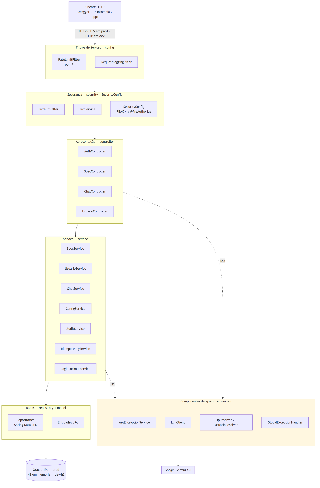
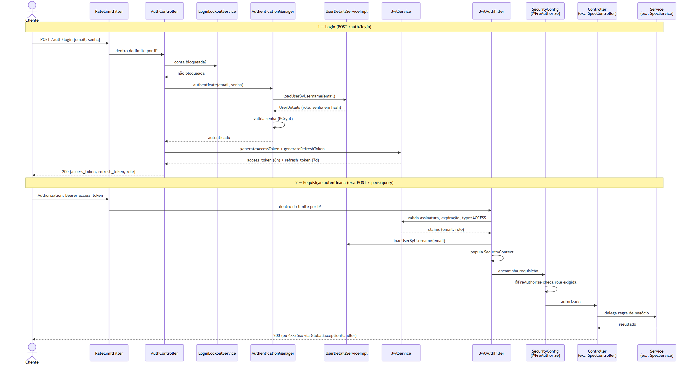
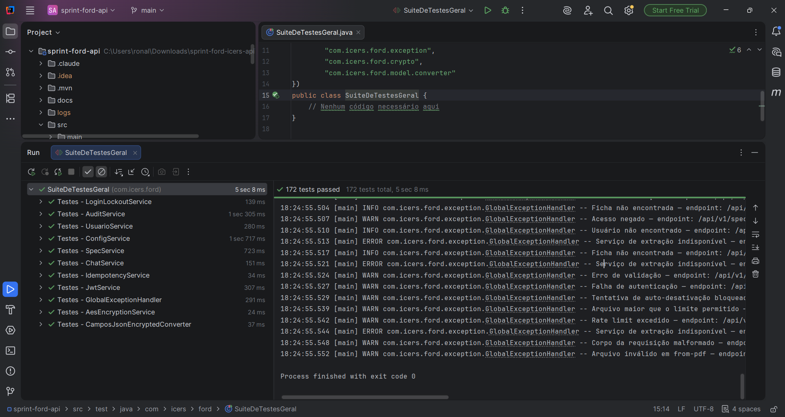
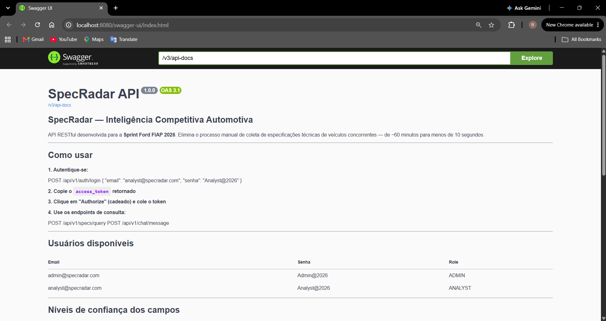

# SpecRadar — Arquitetura Orientada a Serviços (SOA) — Sprint 3

> Documentação técnica de como o SpecRadar atende, hoje, aos requisitos
> formais de Arquitetura Orientada a Serviços e Web Services desta etapa do
> Challenge Ford × FIAP — com evidência extraída diretamente do código-fonte
> real do projeto (pacotes, classes, diagramas gerados a partir da
> arquitetura real e comportamento observável), não de uma descrição de
> intenção.

| Integrante | RM |
|---|---|
| Renan Dias Utida | 558540 |
| Camila Pedroza da Cunha | 558768 |
| Isabelle Dallabeneta Carlesso | 554592 |
| Nicoli Amy Kassa | 559104 |
| Pedro Almeida e Camacho | 556831 |

**Turma:** FIAP 3ESPW.
**Professor da disciplina:** Thiago Dourado.

---

## Sumário

- [Contexto e escopo](#contexto-e-escopo)
- [Critérios de avaliação exigidos](#critérios-de-avaliação-exigidos)
- [1. Arquitetura da Solução (20%)](#1-arquitetura-da-solução-20)
- [2. Autenticação e Autorização (20%)](#2-autenticação-e-autorização-20)
- [3. JWT (15%)](#3-jwt-15)
- [4. Maturidade REST — Nível 2 (20%)](#4-maturidade-rest--nível-2-20)
- [5. Testes Automatizados (15%)](#5-testes-automatizados-15)
- [6. Documentação e Tratamento de Erros (10%)](#6-documentação-e-tratamento-de-erros-10)
- [Tabela-resumo de cobertura](#tabela-resumo-de-cobertura)

---

## Contexto e escopo

Esta é a segunda entrega formal de Arquitetura Orientada a Serviços do
SpecRadar — a primeira (Sprint 1) cobriu integração por Web Services,
modularidade e conexão com banco de dados. A Sprint 3 aprofunda especificamente
em quatro frentes que a Sprint 1 não avaliava com o mesmo nível de detalhe:
arquitetura formal da solução (com diagrama de componentes e de fluxo de
autenticação), autenticação/autorização como critério próprio, JWT como
critério próprio (separado de autenticação), maturidade REST segundo o
modelo de Richardson, e evidência de execução de testes automatizados.

| Camada | Tecnologia | Versão |
|---|---|---|
| Linguagem | Java | 21 |
| Framework | Spring Boot | 3.5.14 |
| Segurança | Spring Security | 6.x |
| Autenticação | JWT (`jjwt`) | 0.12.6 |
| Persistência | Spring Data JPA | — |
| Banco de dados (produção) | Oracle | 19c |
| Banco de dados (perfil `dev-h2`) | H2 em memória | — |

## Critérios de avaliação exigidos

| # | Critério | Peso |
|---|---|---:|
| 1 | Arquitetura da Solução | 20% |
| 2 | Autenticação e Autorização | 20% |
| 3 | JWT | 15% |
| 4 | Maturidade REST — Nível 2 | 20% |
| 5 | Testes Automatizados | 15% |
| 6 | Documentação e Tratamento de Erros | 10% |
| | **Total** | **100%** |

---

## 1. Arquitetura da Solução (20%)

**Pedido:** diagrama com os principais componentes e responsabilidades;
organização e separação clara de responsabilidades; fluxo de comunicação e
autenticação da solução.

### Componentes e responsabilidades

O SpecRadar segue arquitetura em camadas: apresentação (`controller`) →
segurança (filtros de servlet + Spring Security) → serviço (`service`) →
dados (`repository` + `model`), com um pequeno conjunto de componentes de
apoio transversais (criptografia, cliente do Gemini, utilitários de
resolução de IP/usuário, tratamento centralizado de erros) usados por mais
de uma camada sem pertencer estruturalmente a nenhuma delas.



| Camada | Responsabilidade | Componentes |
|---|---|---|
| Filtros de servlet | Rate limiting por IP e log de requisição, antes de qualquer autenticação | `RateLimitFilter`, `RequestLoggingFilter` |
| Segurança | Autenticação via JWT e autorização por papel | `JwtAuthFilter`, `JwtService`, `SecurityConfig` |
| Apresentação | Recebe requisições HTTP, valida entrada, delega ao service | `AuthController`, `SpecController`, `ChatController`, `UsuarioController` |
| Serviço | Regras de negócio | `SpecService`, `UsuarioService`, `ChatService`, `ConfigService`, `AuditService`, `IdempotencyService`, `LoginLockoutService` |
| Dados | Acesso ao banco via Spring Data JPA | `Repository`s + entidades JPA |
| Apoio transversal | Criptografia, cliente externo, utilitários, erros — usados por mais de uma camada | `AesEncryptionService`, `LlmClient`, `IpResolver`/`UsuarioResolver`, `GlobalExceptionHandler` |

### Separação de responsabilidades

A separação não é só visual no diagrama — é uma regra que a estrutura de
pacotes impõe na prática, verificável no próprio código:

- Um `controller` **nunca** acessa um `repository` diretamente — sempre via
  `service`. Nenhum dos 4 controllers importa uma interface de
  `repository`.
- Um `service` **nunca** constrói uma `ResponseEntity` nem lê dados de
  `HttpServletRequest` além do estritamente necessário (IP, usuário
  autenticado) — a tradução para HTTP é responsabilidade exclusiva do
  controller e do `GlobalExceptionHandler`.
- Um `repository` é só interface Spring Data JPA — nenhuma regra de negócio
  vive ali.
- O reuso entre services é real, não teórico: `ChatService` não duplica a
  lógica de busca de especificações — extrai a intenção da mensagem em
  linguagem natural e delega para `SpecService`, reaproveitando todo o
  fluxo de cache já existente.

### Fluxo de comunicação e autenticação

Os dois diagramas anteriores mostram a arquitetura estática (camadas e
componentes); o diagrama abaixo mostra a dimensão que falta — a sequência
temporal de uma autenticação e de uma requisição autenticada subsequente,
como o critério pede explicitamente:



**Fase 1 — Login (`POST /auth/login`):** a requisição passa primeiro pelo
`RateLimitFilter` (por IP). O `AuthController` verifica com
`LoginLockoutService` se a conta não está temporariamente bloqueada por
força bruta, autentica via `AuthenticationManager` do Spring Security (que
carrega o usuário através de `UserDetailsServiceImpl` e valida a senha com
BCrypt), e finalmente gera o par de tokens através de `JwtService` — um
access token (8h) e um refresh token (7d), cada um com uma claim `type`
própria.

**Fase 2 — Requisição autenticada (ex.: `POST /specs/query`):** o cliente
envia o access token no header `Authorization: Bearer`. Depois do
`RateLimitFilter`, o `JwtAuthFilter` valida a assinatura, a expiração e o
tipo do token através de `JwtService`, carrega o usuário via
`UserDetailsServiceImpl` e popula o `SecurityContext`. A partir daí, a
autorização fina por papel acontece via `@PreAuthorize` no método do
controller (representado no diagrama como `SecurityConfig`, que é onde
`@EnableMethodSecurity` habilita esse mecanismo) — só então a requisição
chega ao controller, que delega ao service correspondente.

---

## 2. Autenticação e Autorização (20%)

**Pedido:** implementação de autenticação e controle de acesso; endpoints
públicos e protegidos; diferentes perfis ou permissões de acesso.

### Implementação de autenticação e controle de acesso

Autenticação stateless via JWT, integrada ao Spring Security. `POST
/auth/login` autentica email/senha através do `AuthenticationManager`
(que valida a senha com BCrypt via `UserDetailsServiceImpl`) e devolve um
access token e um refresh token. Toda requisição a um endpoint protegido
passa pelo `JwtAuthFilter`, que valida o token e popula o
`SecurityContext` antes de a requisição chegar ao controller — sem token
válido, a cadeia do Spring Security responde `401` antes de qualquer
lógica de negócio ser executada:

```java
// security/JwtAuthFilter.java
final String authHeader = request.getHeader("Authorization");

if (authHeader == null || !authHeader.startsWith("Bearer ")) {
    filterChain.doFilter(request, response);
    return; // sem token — Spring Security rejeita com 401 se o endpoint exigir auth
}
```

### Endpoints públicos e protegidos

A postura padrão de `SecurityConfig` é **autenticado por padrão** — só uma
lista explícita de rotas é pública, tudo o resto exige token válido:

```java
// config/SecurityConfig.java
.authorizeHttpRequests(auth -> auth
        .requestMatchers(
                "/api/v1/auth/**",
                "/swagger-ui.html", "/swagger-ui/**", "/v3/api-docs/**",
                "/error"
        ).permitAll()
        .requestMatchers("/api/v1/admin/**").hasRole("ADMIN")
        .anyRequest().authenticated()
)
```

A segunda regra (`/api/v1/admin/**`) é vestigial — nenhum controller do
projeto mapeia esse prefixo hoje; toda autorização de administrador real
acontece via `@PreAuthorize` diretamente nos endpoints de `/usuarios/**`
(próxima subseção). Mantê-la não representa risco (é mais restritiva, não
menos), mas também não tem efeito prático no momento.

| Categoria | Endpoints | Acesso |
|---|---|---|
| Público | `POST /auth/login`, `POST /auth/refresh` | Sem token |
| Protegido | Todos os demais — `/specs/**`, `/chat/**`, `/usuarios/**` | Exige `Authorization: Bearer <access_token>` válido |

### Diferentes perfis de acesso (RBAC)

Dois papéis (`ADMIN`, `ANALYST`, enum `Role`), checados via `@PreAuthorize`
diretamente em cada método de controller — não só por path em
`SecurityConfig`, mas garantido método a método:

```java
// UsuarioController.java — exclusivo de ADMIN
@PreAuthorize("hasRole('ADMIN')")
@PostMapping
public ResponseEntity<UsuarioResponse> criar(...) { ... }

// SpecController.java — ANALYST e ADMIN
@PreAuthorize("hasAnyRole('ANALYST', 'ADMIN')")
@PostMapping("/query")
public ResponseEntity<SpecResponse> query(...) { ... }
```

| Ação | ANALYST | ADMIN |
|---|:---:|:---:|
| Login / refresh | ✅ | ✅ |
| Consultar/comparar especificações, chat | ✅ | ✅ |
| Deletar ficha técnica, alterar configuração | ❌ | ✅ |
| Qualquer ação em `/usuarios/**` | ❌ | ✅ |

Além do controle de acesso por papel, há uma proteção adicional específica
do fluxo de autenticação: `LoginLockoutService` bloqueia uma **conta** (não
um IP) por 30 segundos após 5 ou mais falhas de login em 10 minutos — o
bloqueio é checado antes de qualquer verificação de senha, e a resposta é
idêntica independentemente de o email existir ou não, para não revelar
contas válidas a um possível atacante.

---

## 3. JWT (15%)

**Pedido:** geração e validação de JWT; proteção dos recursos utilizando
token; expiração e uso adequado das informações do token.

### Geração e validação

Dois tipos de token, cada um com uma claim `type` própria (`ACCESS`/
`REFRESH`) — um não pode ser usado no lugar do outro, porque a validação
checa o tipo explicitamente:

```java
// security/JwtService.java
public String generateAccessToken(Long userId, String email, String role) {
    return buildToken(Map.of("userId", userId, "role", role, "type", "ACCESS"),
            email, accessTokenExpiration);
}

public String generateRefreshToken(String email) {
    return buildToken(Map.of("type", "REFRESH", "jti", UUID.randomUUID().toString()),
            email, refreshTokenExpiration);
}

public boolean isAccessTokenValid(String token, String email) {
    String tokenEmail = extractEmail(token);
    String tokenType = extractTokenType(token);
    return tokenEmail.equals(email) && "ACCESS".equals(tokenType) && !isTokenExpired(token);
}
```

O algoritmo de assinatura não é fixado explicitamente no código —
`JwtService` constrói a chave com `Keys.hmacShaKeyFor(secret...)` e assina
com `.signWith(signingKey)`, sem informar um algoritmo, então o próprio
JJWT seleciona automaticamente o HMAC mais forte que o tamanho da chave
permite. Com o `JWT_SECRET` gerado como o projeto recomenda (`openssl rand
-base64 64`), isso resulta em **HS512** na prática — confirmado
decodificando o header de um token emitido de verdade (`{"alg":"HS512"}`),
não apenas inferido do código.

### Proteção dos recursos utilizando token

`JwtAuthFilter` é o único ponto de validação do token na cadeia de
filtros — nenhum controller lê ou valida o token diretamente. A validação
(assinatura, expiração, tipo `ACCESS`) acontece antes de o `SecurityContext`
ser populado; sem isso, o Spring Security nunca autentica a requisição, e
qualquer endpoint protegido responde `401` antes de alcançar o controller
(ver [Endpoints públicos e protegidos](#endpoints-públicos-e-protegidos)).

### Expiração e uso adequado das informações do token

| Token | Expiração | Claims |
|---|---|---|
| Access | 8 horas (`28800000` ms) | `userId`, `role`, `type=ACCESS` |
| Refresh | 7 dias (`604800000` ms) | `jti` (UUID único), `type=REFRESH` |

O access token carrega `role` — qualquer cliente pode ler a permissão do
usuário sem uma requisição extra. O refresh token carrega `jti`, usado de
forma ativa, não apenas armazenado: cada rotação (`POST /auth/refresh`)
registra o `jti` do token apresentado na tabela `sr_refresh_tokens_usados`
**antes** de emitir o par novo, e rejeita qualquer tentativa de reapresentar
o mesmo `jti` depois — mesmo que o token ainda não tivesse expirado
naturalmente:

```java
// controller/AuthController.java — POST /auth/refresh
String jti = jwtService.extractJti(token);

if (jti != null && refreshTokenUsadoRepository.existsById(jti)) {
    // token já rotacionado antes — reuso é sinal de possível token comprometido
    return ResponseEntity.status(HttpStatus.UNAUTHORIZED).body(/* mensagem genérica */);
}
```

Isso é o que faz a rotação de token ser real, não só cosmética: sem essa
checagem, um refresh token continuaria válido pelos 7 dias inteiros mesmo
depois de já ter sido trocado por um novo.

---

## 4. Maturidade REST — Nível 2 (20%)

O SpecRadar é avaliado aqui contra o **Modelo de Maturidade de Richardson**,
a régua mais usada para medir o quão "RESTful" uma API realmente é:

| Nível | Característica | O SpecRadar atende? |
|---|---|---|
| 0 | Um único endpoint, estilo RPC (tudo via `POST /api`, ação definida pelo corpo) | Não se aplica — o SpecRadar nunca foi desenhado assim |
| 1 | Múltiplos recursos com URIs próprias, mas ainda pouco uso semântico dos métodos HTTP | Superado |
| **2** | **Recursos com URIs próprias + métodos HTTP usados com o significado correto (GET/POST/PUT/PATCH/DELETE) + status codes coerentes com cada operação** | **Sim — é o nível exigido por este critério** |
| 3 | Nível 2 + HATEOAS (respostas trazem links de navegação para os próximos estados possíveis) | Não implementado — não é exigido pelo critério, e o consumidor real da API (app mobile) não navega por hipermídia, consome contratos fixos documentados no Swagger |

O restante desta seção detalha os dois pilares do Nível 2: métodos HTTP
usados com o significado correto, e status codes coerentes.

### APIs orientadas a recursos

Todas as rotas do SpecRadar giram em torno de substantivos (recursos), nunca
de verbos de ação na URI — não existe `/getUsuario`, `/criarFicha` ou
`/fazerLogin`. Os quatro grupos de recursos:

| Recurso | Base da URI | Representa |
|---|---|---|
| Autenticação | `/api/v1/auth` | Sessão (login, refresh) |
| Especificações técnicas | `/api/v1/specs` | Fichas técnicas de veículos, e sub-recursos (`/compare`, `/history`, `/config`) |
| Chat | `/api/v1/chat` | Mensagens do assistente conversacional |
| Usuários | `/api/v1/usuarios` | Contas de usuário do sistema |

Variações do mesmo recurso são expressas por sub-caminho, não por endpoints
paralelos — `/specs/{marca}/{modelo}/{versao}` é o mesmo recurso "ficha
técnica" que `/specs/query`, só que endereçado diretamente por identidade em
vez de resolvido por uma busca. `/usuarios/{id}/reativar` e
`/usuarios/{id}/anonimizar` são ações que mudam o estado do recurso
`usuario` — modeladas como sub-recurso do `usuario` (`/{id}/ação`), não como
um endpoint solto e desconectado (`/reativarUsuario?id=`), mantendo a
associação clara com o recurso pai.

### Uso adequado dos métodos HTTP

Cada verbo é usado com o significado semântico que o protocolo HTTP define
para ele, verificado endpoint a endpoint no código real dos quatro
controllers:

| Verbo | Uso no SpecRadar | Exemplos reais |
|---|---|---|
| `GET` | Leitura, sem efeito colateral no servidor | `GET /specs/{marca}/{modelo}/{versao}`, `GET /specs/compare`, `GET /specs/history`, `GET /specs/config`, `GET /usuarios`, `GET /usuarios/{id}` |
| `POST` | Criação de recurso, ou operação que não é idempotente por natureza | `POST /usuarios` (cria conta — `201`), `POST /auth/login` (cria uma sessão), `POST /auth/refresh` (emite novo par de tokens), `POST /chat/message` (nova mensagem no histórico) |
| `PUT` | Substituição completa de um recurso existente | `PUT /specs/config` (substitui a configuração de reverificação por inteiro) |
| `PATCH` | Modificação parcial de estado de um recurso existente | `PATCH /usuarios/{id}` (atualização parcial de cadastro), `PATCH /usuarios/{id}/reativar`, `PATCH /usuarios/{id}/anonimizar` |
| `DELETE` | Remoção (lógica ou física) de um recurso | `DELETE /specs/{id}`, `DELETE /usuarios/{id}` (desativação lógica — `ativo='N'`, nunca `DROP` de linha) |

Um caso que vale registrar com honestidade, em vez de forçar uma leitura
perfeitamente purista: `POST /specs/query` é o endpoint mais usado da API e,
tecnicamente, pode criar uma ficha nova no banco (em caso de *cache miss*) —
o que, por uma leitura estrita do modelo de maturidade, poderia sugerir
`201 Created`. Ele foi modelado como `POST` retornando sempre `200 OK`
(ver tabela da próxima subseção) porque a operação, do ponto de vista do
cliente, **não é "criar uma ficha em um URI que eu escolhi"** — é "me dê a
ficha técnica destes três parâmetros, buscando onde for preciso": a criação
é um efeito colateral interno da estratégia de cache-primeiro (documentada
na seção "Estratégia cache-primeiro" do `README.md` principal), não a
semântica que o cliente está pedindo. `GET` não é usado aqui porque o
`POST` também dispara a chamada cara ao Gemini em caso de *miss* — um
efeito relevante o bastante para não ser modelado como uma leitura
inofensiva e livremente cacheável por intermediários HTTP.

### Status codes coerentes com cada operação

O `GlobalExceptionHandler` (16 métodos `@ExceptionHandler`, um por tipo de
exceção mais um catch-all) garante que toda resposta de erro da API — não
só as de sucesso — carregue um status code semanticamente correto, nunca um
`400` ou `500` genérico disfarçando o problema real:

| Status | Quando ocorre | Operação típica |
|---|---|---|
| `200 OK` | Leitura ou operação processada com corpo de resposta | `GET`s em geral, `POST /specs/query`, `POST /auth/login`, `PUT /specs/config` |
| `201 Created` | Recurso novo criado com sucesso | `POST /usuarios` |
| `204 No Content` | Operação teve sucesso, sem corpo de resposta | `DELETE /specs/{id}`, `DELETE /usuarios/{id}`, `PATCH /usuarios/{id}/reativar`, `PATCH /usuarios/{id}/anonimizar` |
| `400 Bad Request` | Corpo da requisição malformado (JSON inválido) | Qualquer `POST`/`PUT`/`PATCH` com JSON quebrado (`HttpMessageNotReadableException`) |
| `401 Unauthorized` | Credenciais inválidas ou token ausente/expirado/inválido | `POST /auth/login` com senha errada, qualquer rota protegida sem JWT válido |
| `403 Forbidden` | Usuário autenticado, mas sem permissão (RBAC) para a ação | `ANALYST` tentando `POST /usuarios` (rota `ADMIN`-only) |
| `404 Not Found` | Recurso identificado na URI não existe | `GET /usuarios/{id}` com id inexistente, ficha técnica não encontrada |
| `409 Conflict` | Requisição semanticamente válida, mas em conflito com o estado atual do recurso | e-mail já cadastrado, auto-desativação, auto-anonimização, anonimizar usuário ainda ativo |
| `413 Payload Too Large` | Corpo/arquivo maior que o limite configurado | `POST /specs/from-pdf` com PDF acima do tamanho máximo |
| `422 Unprocessable Entity` | Corpo bem formado, mas com dado inválido pelas regras de negócio (Bean Validation) | Campos obrigatórios ausentes/inválidos em qualquer `POST`/`PUT`/`PATCH`, PDF com assinatura de arquivo inválida |
| `429 Too Many Requests` | Limite de requisições excedido (rate limit) | Qualquer rota após estourar o bucket (`60/min` geral, `10/min` em `/specs/from-pdf`) |
| `503 Service Unavailable` | Dependência externa (Gemini) indisponível ou instável | `LlmUnavailableException` em `/specs/query`, `/chat/message`, `/specs/from-pdf` |
| `500 Internal Server Error` | Falha não mapeada (catch-all) | Qualquer exceção não prevista pelos handlers específicos |

A distinção `400` vs. `422` é deliberada, não acidental: `400` é reservado
para requisição **estruturalmente** inválida (o servidor não consegue nem
interpretar o JSON), enquanto `422` é para requisição bem formada mas com
**conteúdo** que viola uma regra de negócio — a mesma lógica que separa
`413` (arquivo grande demais, um problema de tamanho/transporte) de `422`
(arquivo com assinatura de bytes inválida, um problema de conteúdo) em
`POST /specs/from-pdf`.

---

## 5. Testes Automatizados (15%)

### Estrutura da suíte

A suíte de testes unitários usa **JUnit Platform Suite**
(`@Suite` + `@SelectPackages`), com uma classe agregadora
(`com.icers.ford.SuiteDeTestesGeral`) que executa todas as classes de teste
do projeto em uma única rodada. Um arquivo de teste por classe de produção,
11 classes cobertas, **172 testes no total**, contados diretamente nos
arquivos-fonte (`@Test` por arquivo):

| Classe de teste | Nº de testes | Classe de produção coberta |
|---|---|---|
| `SpecServiceTest` | 32 | `SpecService` (cache hit/miss/parcial/expirada, concorrência, rate limiting, compare, histórico, deleção) |
| `JwtServiceTest` | 24 | `JwtService` (geração, validação, expiração dos tokens) |
| `GlobalExceptionHandlerTest` | 19 | `GlobalExceptionHandler` (os 16 handlers) |
| `UsuarioServiceTest` | 19 | `UsuarioService` (CRUD, LGPD, RBAC) |
| `AuditServiceTest` | 17 | `AuditService` (trilha de auditoria, brute force) |
| `ChatServiceTest` | 14 | `ChatService` (extração de intenção, integração com specs) |
| `AesEncryptionServiceTest` | 13 | `AesEncryptionService` (criptografia AES-256-GCM) |
| `ConfigServiceTest` | 11 | `ConfigService` (configuração de reverificação) |
| `IdempotencyServiceTest` | 9 | `IdempotencyService` (chave `Idempotency-Key`) |
| `LoginLockoutServiceTest` | 8 | `LoginLockoutService` (bloqueio temporário por brute force) |
| `CamposJsonEncryptedConverterTest` | 6 | `CamposJsonEncryptedConverter` (conversor JPA transparente) |
| **Total** | **172** | 11 classes de produção |

Todos os repositórios são mockados via **Mockito** (`@Mock`/`@InjectMocks`)
— nenhum teste desta suíte toca o Oracle real ou qualquer banco. É por isso
que a suíte roda em segundos e pode ser executada em qualquer máquina, sem
depender de rede, credenciais de banco ou da API do Gemini estar no ar.

### Cenários de sucesso, erro e acesso não autorizado

A suíte não se limita ao caminho feliz — cada classe cobre explicitamente
os três tipos de cenário exigidos por este critério:

- **Sucesso**: por exemplo, `SpecServiceTest` cobre cache hit, criação de
  ficha nova (cache miss) e reverificação de ficha expirada, todos
  retornando o resultado esperado sem exceção; `UsuarioServiceTest` cobre
  criação, atualização, desativação, reativação e anonimização bem-sucedidas.
- **Erro**: `GlobalExceptionHandlerTest` tem um teste dedicado por tipo de
  exceção mapeada (ficha/usuário não encontrado → `404`, e-mail duplicado →
  `409`, arquivo inválido → `422`, arquivo grande demais → `413`, Gemini
  indisponível → `503`, rate limit → `429`, corpo malformado → `400`,
  exceção genérica não tratada → `500` sem vazar detalhe interno);
  `JwtServiceTest` cobre token expirado, token malformado e assinatura
  inválida.
- **Acesso não autorizado**: `GlobalExceptionHandlerTest` tem testes
  dedicados para os dois casos de autorização — `handleAuthentication`
  (`401`, credenciais inválidas, mensagem genérica que não revela qual
  parte da autenticação falhou) e `handleAccessDenied` (`403`, usuário
  autenticado mas sem permissão RBAC para a ação, também com mensagem
  genérica). O controle de acesso em si (que decide `401` vs. `403` vs.
  sucesso) é o mesmo `@PreAuthorize`/`JwtAuthFilter` documentado no
  Critério 2 — aqui o que se testa é que a resposta de erro correspondente
  é formatada e logada corretamente quando o Spring Security barra a
  requisição.

### Testes de regressão travando bugs reais

Dois testes da suíte não nasceram de um caso de uso planejado, mas de bugs
reais encontrados e corrigidos durante o desenvolvimento — ambos continuam
na suíte permanentemente, como trava contra reintrodução do mesmo defeito:

- **`UsuarioServiceTest`** — uma condição de corrida em `criar()` fazia duas
  requisições quase simultâneas com o mesmo e-mail retornarem `500` em vez
  de `409` (a causa raiz era `save()` sem `flush()` — o `INSERT` real ficava
  pendente pro fim da transação, fora do `try/catch` que deveria capturar o
  conflito). O teste de regressão simula a
  `DataIntegrityViolationException` e confirma que a resposta é `409`, não
  `500`.
- **`AuditServiceTest`** — `logAdminAction()` usava placeholders fixos de
  método HTTP/endpoint que violavam uma constraint `CHECK` do banco,
  fazendo a trilha de auditoria de 6 ações administrativas nunca ser
  gravada de fato (o erro era engolido por um `catch` genérico,
  silenciosamente). O teste de regressão confirma que os valores gravados
  são os parâmetros reais recebidos (método/endpoint da requisição), não os
  placeholders antigos.

### Gaps documentados conscientemente

Dois gaps de cobertura são deixados explícitos como `// TODO` nos próprios
arquivos de teste, em vez de escondidos:

- `IdempotencyServiceTest` e `LoginLockoutServiceTest` não cobrem a
  expiração real das janelas de tempo (24h e 30s, respectivamente) — as
  classes de produção não têm um `Clock` injetável, e usar reflection nos
  campos `Instant` internos foi descartado por ser um teste frágil demais.
- `ChatServiceTest` cobre a extração de intenção por amostragem
  representativa, não as 58 palavras-chave inteiras do mapa hardcoded —
  mesmo gap de design do `ChatService` já registrado no `README.md`
  principal (seção de limitações conhecidas).

### Evidência de execução



Execução real da suíte (`SuiteDeTestesGeral`) via IntelliJ: **172 testes
aprovados, 172 no total, 0 falhas** — as 11 classes listadas na árvore à
esquerda, todas com marcação de sucesso, tempo total de execução de
5 segundos. O log ao fundo mostra as saídas reais do `GlobalExceptionHandler`
e demais serviços durante a execução (nível `WARN`/`ERROR` intencional —
são os próprios cenários de erro sendo exercitados e logados como
projetado, não falhas de teste).

---

## 6. Documentação e Tratamento de Erros (10%)

### Documentação interativa (Swagger/OpenAPI)

O projeto usa `springdoc-openapi` (versão 2.8.9) para gerar documentação
OpenAPI 3 automaticamente a partir do próprio código — não é um documento
mantido à parte que pode ficar desatualizado, é derivado direto das
anotações nos controllers. `OpenApiConfig`
(`src/main/java/com/icers/ford/config/OpenApiConfig.java`) customiza esse
contrato com o que uma especificação técnica pura não traria sozinha:



- **Informações de uso**: um guia de "Como usar" embutido na própria página
  do Swagger (login → copiar token → Authorize → consumir endpoints
  protegidos), a tabela de usuários de teste disponíveis, e a legenda dos
  níveis de confiança (`ALTA`/`MEDIA`/`INFERIDA`/`NAO_ENCONTRADO`) que
  aparecem nos campos de uma ficha técnica.
- **Esquema de segurança** (`bearerAuth`, HTTP Bearer com formato JWT)
  registrado nos `Components`, o que habilita o botão **Authorize** (cadeado)
  na UI — sem ele, testar um endpoint protegido diretamente pelo Swagger
  exigiria colar o header `Authorization` manualmente em cada requisição.
- **Exemplos completos de request/response** para os fluxos mais usados
  (login, consulta de ficha, mensagem de chat) e para os erros mais comuns
  (`400`, `404`, `429`, `503`) — cada um com um `Example` nomeado, não só o
  schema genérico do tipo.

Cada endpoint, nos quatro controllers, é anotado individualmente com
`@Operation` (resumo e descrição da operação), `@Tag` (agrupamento por
recurso — "Autenticação", "Especificações", "Chat", "Usuários") e
`@ApiResponses`/`@ApiResponse` (um por status code que aquele endpoint pode
de fato retornar, cada um com sua própria descrição). Exemplo real de
`SpecController` (consulta com IA):

```java
@Tag(name = "Especificações", description = "Consulta e comparação de especificações técnicas de veículos")
// ...
@Operation(summary = "Consulta ficha técnica com IA (cache-primeiro)", ...)
@ApiResponses({
        @ApiResponse(responseCode = "200", description = "Ficha técnica retornada com sucesso", ...),
        @ApiResponse(responseCode = "400", description = "Corpo da requisição malformado (JSON inválido)", ...),
        @ApiResponse(responseCode = "422", description = "Dados de entrada inválidos", ...),
        @ApiResponse(responseCode = "401", description = "Token ausente ou inválido", ...),
        @ApiResponse(responseCode = "429", description = "Limite de requisições excedido", ...),
        @ApiResponse(responseCode = "503", description = "Serviço de extração indisponível", ...)
})
```

Esse padrão se repete nos 18 métodos de endpoint dos quatro controllers —
156 anotações `@Operation`/`@Tag`/`@ApiResponse`/`@Schema` ao todo,
confirmadas por busca direta no código-fonte. Com a aplicação rodando em
`dev` ou `dev-h2`, a UI fica disponível em `http://localhost:8080/swagger-ui.html`,
com as 18 operações documentadas. Em `prod`, o Swagger é **desabilitado por
padrão** (`springdoc.swagger-ui.enabled=false`) — reduz a superfície exposta
num ambiente que se pretende mais próximo de produção real; a documentação
usada nesse caso é o `README.md` do projeto.

### Tratamento de erros padronizado

Todo erro da API — não importa o controller ou o tipo de exceção — passa
pelo `GlobalExceptionHandler` (16 métodos `@ExceptionHandler`, um por tipo
de exceção mapeada, mais um catch-all) e sai no mesmo formato, o record
`ErrorResponse`:

```json
{
  "codigo_erro": "VALIDATION_ERROR",
  "mensagem": "Um ou mais campos estão inválidos",
  "timestamp": "2026-05-10T14:30:00",
  "endpoint": "/api/v1/specs/query",
  "campos_invalidos": {
    "marca": "Marca deve conter apenas letras, espaços e hífens"
  },
  "sugestoes_similares": null
}
```

Três decisões de design garantem que esse formato seja realmente
consistente, não só coincidentemente igual entre os endpoints:

- **Nunca vaza detalhe interno.** A própria anotação `@Schema` do record
  documenta essa garantia (`"Nunca contém stack trace, nome de classe ou
  tecnologia interna"`) — testada explicitamente pelo cenário de erro
  genérico do Critério 5 (`handleGeneric` não expõe a mensagem real da
  exceção capturada).
- **Campos opcionais vêm sempre presentes, nunca omitidos.**
  `campos_invalidos` só é preenchido em erros de validação (`422`);
  `sugestoes_similares` só no `404` de veículo não encontrado, quando
  existir sugestão. Fora desses dois casos, ambos vêm `null` explícito —
  o mesmo princípio de formato fixo (nunca omitir uma chave) usado no
  campo técnico individual de uma ficha (Critério 1, tabela de campos).
- **Fábricas nomeadas em vez de construtor genérico espalhado pelo
  código.** `ErrorResponse` expõe métodos estáticos como `notFound(...)`,
  `ofValidation(...)`, `rateLimitExceeded(...)`, `accountLocked(...)` — cada
  handler do `GlobalExceptionHandler` chama a fábrica que já corresponde à
  sua exceção, em vez de montar o record campo a campo. Isso elimina o
  risco de um handler esquecer de preencher `timestamp` ou usar um
  `codigo_erro` fora do padrão.

### Documentação do projeto (README)

Além da documentação viva do Swagger, o `README.md` na raiz do repositório
cobre o que uma especificação OpenAPI não cobre — como colocar o projeto
pra rodar do zero: pré-requisitos, variáveis de ambiente (`.env`), os três
perfis disponíveis (`dev` com Oracle, `dev-h2` com H2 em memória para quem
não tem acesso ao Oracle da FIAP, `prod` com HTTPS/TLS), como gerar o
certificado SSL auto-assinado, como resetar o banco do zero, e uma seção de
armadilhas conhecidas de configuração (ex.: por que uma variável no `.env`
sempre vence o valor definido em `application-{perfil}.properties`). O
mesmo README também documenta, em prosa, cada decisão de arquitetura e
segurança já cobertas nos Critérios 1 a 5 deste documento — os dois nunca
divergem porque ambos são escritos a partir do mesmo código-fonte real.

---

## Tabela-resumo de cobertura

| # | Critério | Peso | O que cobre | Status |
|---|---|---:|---|:---:|
| 1 | Arquitetura da Solução | 20% | Diagrama de componentes por camada, diagrama de sequência de autenticação (2 fases), separação de responsabilidades com reuso real (`ChatService`→`SpecService`) | ✅ |
| 2 | Autenticação e Autorização | 20% | `JwtAuthFilter`, `SecurityConfig` com endpoints públicos/protegidos, RBAC via `@PreAuthorize` (ANALYST/ADMIN), bloqueio por força bruta (`LoginLockoutService`) | ✅ |
| 3 | JWT | 15% | Geração/validação (HS512), `JwtAuthFilter` como ponto único de verificação, expiração (8h/7d) e rotação real por `jti` | ✅ |
| 4 | Maturidade REST — Nível 2 | 20% | APIs orientadas a recursos, uso semântico dos 5 verbos HTTP, 13 status codes coerentes documentados | ✅ |
| 5 | Testes Automatizados | 15% | 172 testes em 11 classes, cenários de sucesso/erro/acesso não autorizado, 2 testes de regressão, evidência de execução real | ✅ |
| 6 | Documentação e Tratamento de Erros | 10% | Swagger/OpenAPI customizado (print real), `ErrorResponse` padronizado, README com instruções completas | ✅ |
| **Total** | | **100%** | | ✅ |

Os seis critérios formais de SOA da Sprint 3 estão cobertos com evidência
extraída do código-fonte real do SpecRadar — diagramas gerados a partir da
arquitetura efetivamente implementada, contagens de teste e de anotações
conferidas diretamente nos arquivos-fonte (não estimadas), e um print real
da execução da suíte de testes e da página do Swagger, não uma descrição
do que se pretende fazer.